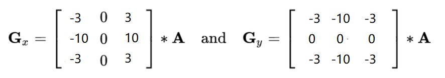
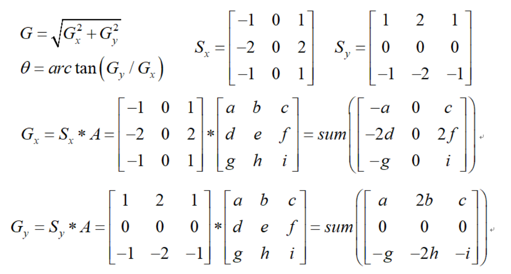

## 安装

```py
# 版本号要一致，不一致会导致函数出错
pip install opencv-python
pip install opencv-contrib-python	# 额外的扩展包。如：特征提取的算法
```

## 读取-写入-展示

1. 图像格式：BGR
2. 图像数据类型：uint8(0-255)

### imread()-读取图片

```py
img = cv2.imread(文件名,读取模式)
"""
params（读取模式）：
	- 灰度图像：cv2.IMREAD_GRAYSCALE    
    - 彩色图像：cv2.IMREAD_COLOR
    - 加载图像，包括alpha通道：cv.IMREAD UNCHANGED
return：
	图像数据
"""
```

### ViderCapture()-读取视频

```py
vc = cv2.VideoCapture(视频文件名/摄像头编号)

# 检查是否打开正确
if vc.isOpened(): 
    oepn, frame = vc.read()
else:
    open = False
    
while open:
    ret, frame = vc.read()
    if frame is None:
        break
    if ret == True:
        # cvtColor：颜色空间转换函数
        gray = cv2.cvtColor(frame,  cv2.COLOR_BGR2GRAY)
        cv2.imshow('result', gray)
        if cv2.waitKey(10) & 0xFF == 27:
            break
vc.release()    # 释放读取视频对象
cv2.destroyAllWindows()
```

### imwrite()-写入

```py
imwrite(文件名,图像数据)
"""
return:
	是否保存成功
"""
```

### imshow()-展示

```py
cv2.imshow(窗口名,图像数据)	# 如果不加waitkey，则无法刷新窗口
cv2.waitKey(毫秒或0)	# 0表示任意键终止
cv2.destroyAllWindows()	# 如果不加销毁窗口函数，则卡死

def cv_show(data,gui_name):
    cv2.imshow(gui_name,data)
    cv2.waitKey(0)
    cv2.destroyAllWindows()
```

## 基本操作

### 颜色空间转换

```py
cv2.cvtColor(图像,模式)
"""
模式：
 - 方式：cv2.COLOR_{当前颜色编码}2{目标颜色编码}
 - HSV RGB RGBA BGR GRAY Lab Luv YCrCb YUV
"""
```

### 截取部分图像

```py
img_data = cv2.imread('cat.jpg')
cut_img_data = img_data[0:200,0:200]
cv_show('cut_img_data',cut_img_data)
```

### 改变图像大小

- resize函数：按照`指定大小`缩放

```py
res_dog = cv2.resize(img_dog, (500, 414))
plt.imshow(res_dog)
```

- resize函数：按照`x、y轴倍数`缩放

```py
res_dog = cv2.resize(img_dog, (0, 0), fx=3, fy=1)
plt.imshow(res_dog)
```

### 颜色通道：提取-合并

```py
b,g,r = cv2.split(img_data)		# 提取颜色通道
img_data = cv2.merge((b,g,r))	# 合并颜色通道
```

```py
# 把图像的一个通道拿出来组建新图
import numpy as np
img1 = np.zeros([414,500,3],dtype = np.uint8)
b,g,img1[:,:,2] = cv2.split(img)
img1[:,:,0:2] = 0
cv_show('R',img1)
```

### 边界填充

**填充方法：**

- BORDER_REPLICATE：复制法，也就是复制最边缘像素。
- BORDER_REFLECT：反射法，对感兴趣的图像中的像素在两边进行复制例如：fedcba|abcdefgh|hgfedcb   
- BORDER_REFLECT_101：反射法，也就是以最边缘像素为轴，对称，gfedcb|abcdefgh|gfedcba
- BORDER_WRAP：外包装法cdefgh|abcdefgh|abcdefg  
- BORDER_CONSTANT：常量法，常数值填充。

```py
# 设定边界填充大小
top_size,bottom_size,left_size,right_size = (50,50,50,50)
# 填充方式1：
replicate = cv2.copyMakeBorder(img, top_size, bottom_size, left_size, right_size, borderType=cv2.BORDER_REPLICATE)
# 填充方式2：
reflect = cv2.copyMakeBorder(img, top_size, bottom_size, left_size, right_size,cv2.BORDER_REFLECT)
# 填充方式3：
reflect101 = cv2.copyMakeBorder(img, top_size, bottom_size, left_size, right_size, cv2.BORDER_REFLECT_101)
# 填充方式4：
wrap = cv2.copyMakeBorder(img, top_size, bottom_size, left_size, right_size, cv2.BORDER_WRAP)
# 填充方式5：
constant = cv2.copyMakeBorder(img, top_size, bottom_size, left_size, right_size,cv2.BORDER_CONSTANT, value=0)

# 拿过来看看
import matplotlib.pyplot as plt
plt.subplot(231), plt.imshow(img, 'gray'), plt.title('ORIGINAL')
plt.subplot(232), plt.imshow(replicate, 'gray'), plt.title('REPLICATE')
plt.subplot(233), plt.imshow(reflect, 'gray'), plt.title('REFLECT')
plt.subplot(234), plt.imshow(reflect101, 'gray'),plt.title('REFLECT_101')
plt.subplot(235), plt.imshow(wrap, 'gray'), plt.title('WRAP')
plt.subplot(236), plt.imshow(constant, 'gray'), plt.title('CONSTANT')

plt.show()
```

### 图像融合

`数值相加，由于uint8（0-255），所以对256取余`

**公式融合：**
$$
R = \alpha x_1 + \beta x_2 + b
$$

```py
cat=cv2.imread('cat.jpg')
dog=cv2.imread('dog.jpg')
# 缩放到相同大小
res_cat = cv2.resize(cat, (500, 414))
res_dog = cv2.resize(dog, (500, 414))
# 1.数值计算直接融合
new_fusion1 = res_cat + res_dog
# 2.公式融合
new_fusion2 = cv2.addWeighted(res_cat, 0.6, res_dog, 0.4, 0)

plt.subplot(121),plt.imshow(cv2.cvtColor(new_fusion1, cv2.COLOR_BGR2RGB)), plt.title('Numerical calculation')
plt.subplot(122),plt.imshow(cv2.cvtColor(new_fusion2, cv2.COLOR_BGR2RGB)), plt.title('Formulae')
plt.show()
```

## 阈值与平滑处理

### 阈值化

```py
ret, thresh = cv2.threshold(src, thresh, maxval, type)
"""
ret：阈值
thresh：输出图
"""
```

- src：输入图（只能输入单通道图像，如灰度图）
- thresh：`阈值`
- maxval：当像素值超过/小于阈值所赋予的值【由type决定】
- type：二值化操作的类型
  - cv2.THRESH_BINARY[_INV]：大于阈值部分取maxval（最大值），小于等于设为0
  - cv2.THRESH_TRUNC：大于阈值设为阈值，小于等于不变
  - cv2.THRESH_TOZERO[_INV]：大于阈值不改变，小于等于设为0

```py
ret, thresh1 = cv2.threshold(img_gray, 200, 250, cv2.THRESH_BINARY)
ret, thresh2 = cv2.threshold(img_gray, 127, 255, cv2.THRESH_BINARY_INV)
ret, thresh3 = cv2.threshold(img_gray, 127, 255, cv2.THRESH_TRUNC)
ret, thresh4 = cv2.threshold(img_gray, 127, 255, cv2.THRESH_TOZERO)
ret, thresh5 = cv2.threshold(img_gray, 127, 255, cv2.THRESH_TOZERO_INV)

titles = ['Original Image', 'BINARY', 'BINARY_INV', 'TRUNC', 'TOZERO', 'TOZERO_INV']
images = [img, thresh1, thresh2, thresh3, thresh4, thresh5]

for i in range(6):
    plt.subplot(2, 3, i + 1), plt.imshow(images[i], 'gray')
    plt.title(titles[i])
    plt.xticks([]), plt.yticks([])
plt.show()
```

### 平滑处理：去噪

- 均值滤波：滤波器权重矩阵全为1

```py
blur = cv2.blur(img, (3, 3))
```

- 方框滤波：均值滤波 + 是否归一化

```py
box = cv2.boxFilter(img,-1,(3,3), normalize=True)
"""
如果不归一化，则像素点加起来并大于255设为255，小于等于不变
"""
```

- 高斯滤波：滤波器权重矩阵离中心越近值越接近1【更重视中间的】

```py
aussian = cv2.GaussianBlur(img, (5, 5), 1) 
```

- 中值滤波

```py
median = cv2.medianBlur(img, 5)
```

==展示所有滤波图像：==

```py
# 水平堆叠：np.hstack
# 垂直堆叠：np.vstack
res = np.hstack((blur,aussian,median))	# 均值、高斯、中值滤波
cv2.imshow('blur-aussian-median', res)
cv2.waitKey(0)
cv2.destroyAllWindows()
```

## 图像形态学

### 腐蚀-膨胀

- 腐蚀

```py
kernel = np.ones((3,3),np.uint8)
erosion = cv2.erode(img,kernel,iterations = 1)
"""
iterations：迭代数量（腐蚀多少次）
"""
```

- 膨胀

```py
kernel = np.ones((3,3),np.uint8) 
dilate = cv2.dilate(img,kernel,iterations = 1)
"""
iterations：迭代数量（腐蚀多少次）
"""
```

### 开运算/闭运算

- 开运算：1.腐蚀 2.膨胀

```py
# 作用：去除小的物体、断开狭窄的连接以及平滑较大物体的边界
kernel = np.ones((5,5),np.uint8) 
opening = cv2.morphologyEx(img, cv2.MORPH_OPEN, kernel)
```

- 闭运算：1.膨胀 2.腐蚀

```py
# 作用：填充小孔洞、连接邻近物体以及平滑图像边界
kernel = np.ones((5,5),np.uint8) 
closing = cv2.morphologyEx(img, cv2.MORPH_CLOSE, kernel)
```

### 梯度运算

- 梯度运算：膨胀图像-腐蚀图像

```py
# 作用：检测图像边缘
kernel = np.ones((7,7),np.uint8) 
gradient = cv2.morphologyEx(img, cv2.MORPH_GRADIENT, kernel)
```

### 礼帽/黑帽

- 礼帽：原始输入-开运算结果

```py
# 作用：求毛边
kernel = np.ones((7,7),np.uint8) 
tophat = cv2.morphologyEx(img, cv2.MORPH_TOPHAT, kernel)
```

- 黑帽：闭运算-原始输入

```py
# 作用：求原始轮廓
kernel = np.ones((7,7),np.uint8) 
blackhat  = cv2.morphologyEx(img,cv2.MORPH_BLACKHAT, kernel)
```

## 图像梯度计算

### Sobel算子


`cv2.Sobel(src, ddepth, dx, dy, ksize)`

- `ddepth`:图像的深度
- `dx`和`dy`分别表示水平和竖直方向
- `ksize`:Sobel算子的大小

```py
"""
问：为什么要取绝对值？
答：白到黑是正数，黑到白就是负数了，所有的负数会被截断成0，所以要取绝对值
问：为什么使用cv2.CV_64F而不是cv2.uint8？
答：默认的uint8只有0-255，无法表示负数，而CV_64F可表示正负数，小数

问：dx、dy？
答：x/y方向的导数阶数，如果为正数，则表示求x方向的一阶导数；如果为负数，则表示求x方向的负一阶导数；如果为0，则表示不沿x方向求导数

问：ksize？
答：Sobel算子大小（正奇数）
"""
sobelx = cv2.Sobel(img,cv2.CV_64F,1,0,ksize=3)
sobelx = cv2.convertScaleAbs(sobelx)
sobely = cv2.Sobel(img,cv2.CV_64F,0,1,ksize=3)
sobely = cv2.convertScaleAbs(sobely)
```

```py
# 法1：直接计算梯度
sobelxy=cv2.Sobel(img,cv2.CV_64F,1,1,ksize=3)
sobelxy = cv2.convertScaleAbs(sobelxy)
# 法2：[推荐，更清晰]反别计算x、y方向梯度再相加
sobelx = cv2.Sobel(img,cv2.CV_64F,1,0,ksize=3)
sobelx = cv2.convertScaleAbs(sobelx)

sobely = cv2.Sobel(img,cv2.CV_64F,0,1,ksize=3)
sobely = cv2.convertScaleAbs(sobely)

sobelxy = cv2.addWeighted(sobelx,0.5,sobely,0.5,0)
```

### schaar算子

`对结果的差异更敏感`



```py
scharrx = cv2.Scharr(img,cv2.CV_64F,1,0)
scharry = cv2.Scharr(img,cv2.CV_64F,0,1)
scharrx = cv2.convertScaleAbs(scharrx)   
scharry = cv2.convertScaleAbs(scharry)  
scharrxy =  cv2.addWeighted(scharrx,0.5,scharry,0.5,0) 
```

### laplacian算子

`使用二阶导`

`对结果的差异更敏感，一般和其他东西一起用`

缺点：对噪音敏感


```py
laplacian = cv2.Laplacian(img,cv2.CV_64F)
laplacian = cv2.convertScaleAbs(laplacian)  
```

## Canny边缘检测

1. 高斯滤波器：平滑图像，消除噪声
2. 计算图像中每个像素点的梯度大小和方向
3. 非极大值抑制（Non-Maximum Suppression）：消除边缘检测带来的杂散响应
   `比较当前像素和边缘点的梯度幅值，如果当前>所有边缘，则放开，否则抑制`

   法一：
   法二：
4. 双阈值（Doube-Threshold）检测：确定真实的和潜在的边缘
5. 抑制孤立的弱边缘最终完成边缘检测

```py
# minval/maxval的选值：越小，显示的边界越多，噪声点越多
v1 = cv2.Canny(img,100,200)
v2 = cv2.Canny(img,80,150)
v3 = cv2.Canny(img,50,100)
```

## 图像金字塔


### 高斯金字塔

- 向下采样（缩小）


- 向上采样（放大）


```py
up = cv2.pyrUp(img)		# 上采样
down = cv2.pyrDown(img)	# 下采样
# 采样可执行多次
res = cv2.pyrDown(cv2.pyrUp(img))		# 上采样 + 下采样：变糊
res = img - cv2.pyrDown(cv2.pyrUp(img))	# 原图 - (上采样 + 下采样)：求细微边界
```

### 拉普拉斯金字塔


```py
# 原图-（下采样 + 上采样）：精准边界
res = img-cv2.pyrUp(cv2.pyrDown(img))
```

## 图像轮廓

### 求所有轮廓

```py
contours, hierarchy = cv2.findContours(img,mode,method)
"""
参数：
mode：轮廓检索模式
- RETR_EXTERNAL ：只检索最外面的轮廓；
- RETR_LIST：检索所有的轮廓，并将其保存到一条链表当中；
- RETR_CCOMP：检索所有的轮廓，并将他们组织为两层：顶层是各部分的外部边界，第二层是空洞的边界;
- RETR_TREE：检索所有的轮廓，并重构嵌套轮廓的整个层次;
method：轮廓逼近方法
- CHAIN_APPROX_NONE：以Freeman链码的方式输出轮廓，所有其他方法输出多边形（顶点的序列）
- CHAIN_APPROX_SIMPLE：压缩水平的、垂直的和斜的部分，也就是，函数只保留他们的终点部分

返回值：
contours：检测到轮廓的列表
hierarchy：轮廓层级信息（如：父轮廓、子轮廓等）
"""
```

### 将轮廓贴到原图

```py
res = cv2.drawContours(img.copy(), contours, -1, (0, 0, 255), 1)
"""
参数：原始图、轮廓、轮廓索引、绘制颜色（rgb）、线条宽度
"""
```

### 轮廓属性

```py
cnt = contours[0]
cv2.contourArea(cnt)	# 求面积
cv2.arcLength(cnt,True)	# 求周长。True表示闭合的
```

### 轮廓近似

```py
# 周长的0.15倍作为阈值来求近似值
epsilon = 0.15*cv2.arcLength(cnt,True)
approx = cv2.approxPolyDP(cnt,epsilon,True)
```

### 外接矩形、圆

```py
cnt = contours[0]
# 外接矩形
x,y,w,h = cv2.boundingRect(cnt)
img_rec = cv2.rectangle(img.copy(),(x,y),(x+w,y+h),(0,255,0),2)
# 外接圆
(x,y),radius = cv2.minEnclosingCircle(cnt) 
img_cir = cv2.circle(img.copy(),(int(x),int(y)),int(radius),(0,255,0),2)
# 展示一下
cv_show(np.hstack((img_rec,img_cir)),'img')
# 求面积比
area = cv2.contourArea(cnt)
x, y, w, h = cv2.boundingRect(cnt)
print('轮廓面积与边界矩形比',float(area) / w * h)
```

## 模板匹配

[Opencv图像匹配算法](https://docs.opencv.org/3.3.1/df/dfb/group__imgproc__object.html#ga3a7850640f1fe1f58fe91a2d7583695d)

```py
res = cv2.matchTemplate(img, 模板, cv2.匹配算法)
"""
匹配算法：
- TM_SQDIFF：计算平方不同，计算出来的值越小，越相关        
- TM_CCORR：计算相关性，计算出来的值越大，越相关
- TM_CCOEFF：计算相关系数，计算出来的值越大，越相关
- TM_SQDIFF_NORMED：计算归一化平方不同，计算出来的值越接近0，越相关
- TM_CCORR_NORMED：计算归一化相关性，计算出来的值越接近1，越相关
- TM_CCOEFF_NORMED：计算归一化相关系数，计算出来的值越接近1，越相关
返回值：
	结果矩阵，其中每个元素的值表示模板与图像该位置的匹配程度
"""
```

```py
minval,maxval,minloc,maxloc = cv2.minMaxLoc(res)	# 求矩阵最小值、最大值及其位置
```

==模板匹配算法比较==

```py
methods = ['cv2.TM_CCOEFF', 'cv2.TM_CCOEFF_NORMED', 'cv2.TM_CCORR',
           'cv2.TM_CCORR_NORMED', 'cv2.TM_SQDIFF', 'cv2.TM_SQDIFF_NORMED']
for meth in methods:
    img2 = img.copy()

    # 匹配方法的字符串转为匹配方法对象
    method = eval(meth)
    print (method)
    res = cv2.matchTemplate(img, face, method)
    min_val, max_val, min_loc, max_loc = cv2.minMaxLoc(res)

    # 如果是平方差匹配TM_SQDIFF、归一化平方差匹配TM_SQDIFF_NORMED，取最小值
    if method in [cv2.TM_SQDIFF, cv2.TM_SQDIFF_NORMED]:
        top_left = min_loc
    else:
        top_left = max_loc
    h, w = face.shape[:2]
    bottom_right = (top_left[0] + w, top_left[1] + h)

    # 画矩形
    cv2.rectangle(img2, top_left, bottom_right, 255, 2)

    plt.subplot(121), plt.imshow(res, cmap='gray')
    plt.xticks([]), plt.yticks([])  # 隐藏坐标轴
    plt.subplot(122), plt.imshow(img2, cmap='gray')
    plt.xticks([]), plt.yticks([])
    # plt.suptitle(meth)
    plt.show()
```

