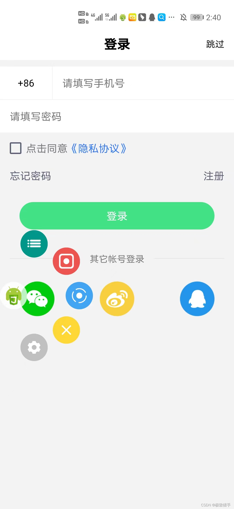
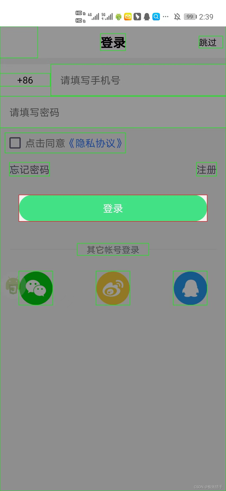
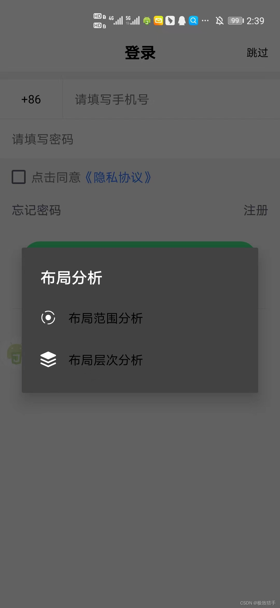
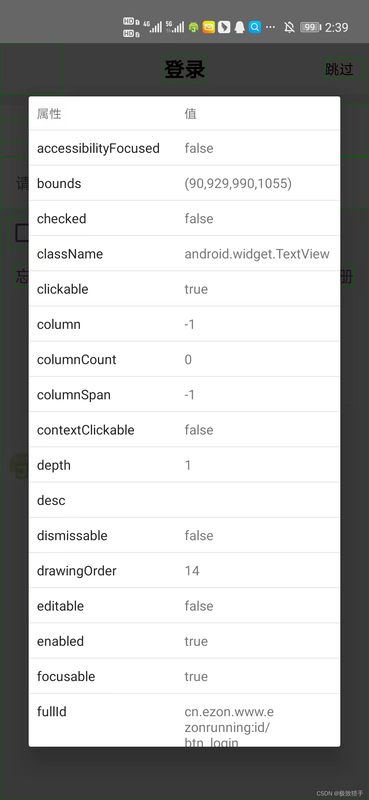

## 致-我的来时路


> 控件点击是autojs特有的一项功能，基于安卓的无障碍功能的，在软件上有很好的支持，常用于办公软件等......

## 前言

### 软件选择：

auto.js 8.0pro版本（对比4.0版本有阉割，wx和zfb不能点）

- 客户端模式
- 服务器模式
auto.js 4.0版本有一种模式：
- 客户端模式

### 设备和电脑连接：

#### android

**服务器模式：**手机和电脑在同一局域网下相互连接。（手机电脑同wifi远程连接，稳定）
**客户端模式：**电脑连接以太网（不是虚拟机的wlan端口（wifi）），cmd输入ipconfig查看ipv4地址和手机ip地址比对，前面的192.168.31一样就行，说明在一个ip地址上，就可以连接（推荐4.0版本手机连接）(直接输入电脑ipv4地址即可)

#### 模拟器

**客户端模式：**直接模拟器打开客户端模式，输入cmd命令行ipconfig查看的ipv4地址，进行连接，简单快速（模拟器极为推荐）（推荐逍遥模拟器）
桥接模式：模拟器打开桥接模式连接，比如雷电模拟器无法和电脑在同一局域网下，只能使用桥接模式（没有搞成）
**模拟器桥接模式的目的：**为了模拟器和电脑在同一个虚拟网桥下。
桥接模式就是将主机网卡与虚拟机虚拟的网卡利用虚拟网桥进行通信。

### vs.code的配置和使用

基础配置不用说，也就一个汉化插件。
需要加入的插件有两个：

- auto.js （4.0版本适用）
**在使用时要先start，然后connect**
- auto.js.pro （pro的8.0版本）
**不需要start，直接连接设备**

在使用时如果两个插件同时打开，运行程序时，两个插件同时占有’F5‘运行键，会冲突，所以一般打开一个。
在上方任务栏的帮助栏里可以切换开发者工具，打开看日志

### Vscode快捷键：

ctrl+shift+p：**打开命令面板**
save on device：**保存到指定设备**

## 学习教程

### Auto.js的API文档

[Auto.js Pro文档](https://pro.autojs.org/docs/#/zh-cn/?id=%E7%BB%BC%E8%BF%B0)

### Bilibili学习教程

[初级教程](https://www.bilibili.com/video/BV1w44y157VE?spm_id_from=333.337.search-card.all.click&vd_source=5e9ba28b96bd6fe04be4fb86a4612e4a) 
[中级教程](https://www.bilibili.com/video/BV1vr4y1n7g6?spm_id_from=333.999.0.0&vd_source=5e9ba28b96bd6fe04be4fb86a4612e4a)

## 获取并分析查找控件属性

#### 使用方法如图



#### 阻塞机制

> 用findOne()、waitFor()、exists()等方法寻找控件会引起线程阻塞，导致脚本莫名卡死。故转而使用findOne(timeout)、findonce(i)方法。

示例：findOne(3000)：在3秒内寻找控件。
findOnce(2)：寻找筛选出来符合要求的第三个控件。

在findOne找不到指定控件时不妨使用findOne()进行深度搜索。

#### 属性选取的方法

> className，text，desc，id等进行查找控件

**单属性查找：**
`className("android.view.View").findOne(5000);`

**多属性查找：**
`className("android.widget.EditText").depth(9).drawingOrder(0).indexInParent(2).findOne(5000);`

**text包含：**
`textContains("大家都在搜")`

**text开头：**
`textStartsWith("QQ")`

**text结尾：**
`textEndsWith("QQ")`

**text正则：**
`textMatches("\d+")`

```javascript
关于正则表达式：https://www.runoob.com/regexp/regexp-syntax.html
```

**desc属性类似使用**

**注意：**
软件中id会经常改变的，使用text，desc比id靠谱

## UI的使用

#### 指定UI模式

**带有ui的脚本的的最前面必须使用`"ui";`指定ui模式，否则脚本将不会以ui模式运行。**

```js
ui";
```

#### 垂直布局与水平布局

垂直布局

```js
"ui"; 
ui.layout( 
    <vertical> 
        <button text="第一个按钮"/> 
        <button text="第二个按钮"/> 
    </vertical> 
);
```

水平布局

```js
"ui"; 
ui.layout( 
    <horizontal> 
        <button text="第一个按钮"/> 
        <button text="第二个按钮"/> 
    </horizontal> 
);
```

#### 文字框控件

```js
<text textSize="16sp" textColor="black" text="请输入名称：" />
```

#### 输入框控件

```js
<input id="name" />
```

#### 按钮控件

```js
<button id="ok1" text="确定" />
```

#### 图片控件

```js

```

## 多线程的使用

### 1.子线程开启函数

```js
var 子线程 = threads.start(function(){
    while(true){
        log("子线程");
    }
});

12345
```

### 2.子线程停止函数

```js
子线程.interrupt();
threads.shutDownAll();
//停止所有通过threads.start()启动的子线程。
```

### 3.等待线程执行完成

```js
子线程.join([timeout]);
//等待线程执行完成。如果timeout为0，则会一直等待直至该线程执行完成；否则最多等待timeout毫秒的时间。
```

### 4.返回线程是否存活

```js
子线程.isAlive()
//返回线程是否存活。
```

### 5.等待线程开始执行

```js
子线程.waitFor()
//等待线程开始执行。调用threads.start()以后线程仍然需要一定时间才能开始执行
```

### 5.单次定时器

```js
var 子线程 = threads.start(function(){
    setTimeout(function(){
        //do something
    }, 1000);
});
子线程.setTimeout(function(){
    //do something
}, 1000);
```

### 6.循环定时器

```js
var 子线程 = threads.start(function(){
    setInterval(function(){
        //do something
    }, 1000);
});
子线程.setInterval(function(){
    //do something
}, 1000);
```

### 7.多线程里的定时器

```js
var thread = threads.start(function () {
    log("先运行这一句，然后开启定时器，1s后输出\"子线程:\"，开启定时器后就继续运行，开启单次定时器，运行主线程");
    //在子线程执行的定时器
    setInterval(function () {
        log("子线程:");
    }, 1000);
});//只能放在前面，不然运行到主线程，若有死循环就没法开启子线程

//等待子线程启动
thread.waitFor();
//在子线程执行的定时器
thread.setTimeout(function () {//单次定时器
    //在子线程执行的定时器
    log("运行到此定时器后，2s后输出此行");
}, 2000);

for(i=0;i<5;i++) {
    log("当前线程为主线程-"+i);
    sleep(3000)
}

sleep(5000);
thread.interrupt();
exit()
```

### 8.弹窗检测

```js
var 弹窗检测 = threads.start(function () {
    //在子线程执行的定时器
    setInterval(function () {
        log("弹窗检测中");
        if(){
            toastLog("弹窗出现");
        }
    }, 2000);
});
```

**注意：**
子线程用完记得关闭`thread.interrupt();`

## 成品源码

### 脚本体验卡

```js
function IntTime() {
    try {
        var recode_suning = http.get("http://quan.suning.com/getSysTime.do");
        var suningTime = recode_suning.body.json();
        return suningTime.sysTime1;
    } catch (e) {}
}
let ntime = 20220817210627;//设置截至时间

if (toTime() < ntime || IntTime() < ntime) {
    toastLog("正常");
    //代码放这里运行
} else {
    toastLog("已过期");
    engines.stopAll();
}

function toTime() {
    return new java.text.SimpleDateFormat("yyyyMMddHHmmss").format(new Date());
}
```

### 屏幕解锁

```js
setScreenMetrics(1080, 2340);
var { password } = hamibot.env;
var { select } = hamibot.env;
var { slide_time } = hamibot.env;

function number_click(num) {
    var number = text(num).findOne().bounds();
    click(number.centerX(), number.centerY());
}

function scroll() {
    if (select == 'a') {
        swipe(device.width / 2, device.height * 12 / 15, device.width / 2, device.height * 6 / 15, Number(slide_time));
    } else {
        swipe(device.width / 2, device.height * 6 / 15, device.width / 2, device.height * 12 / 15, Number(slide_time));
    }
}

function input_password() {
    for (var i = 0; i < password.length; i++) {
        switch(password[i]) {
            case '1': number_click('1'); break;
            case '2': number_click('2'); break;
            case '3': number_click('3'); break;
            case '4': number_click('4'); break;
            case '5': number_click('5'); break;
            case '6': number_click('6'); break;
            case '7': number_click('7'); break;
            case '8': number_click('8'); break;
            case '9': number_click('9'); break;
            case '0': number_click('0'); break;
            default: toast("密码输入错误");
                exit();
        }
    }
}

while (!device.isScreenOn()) {
  device.wakeUpIfNeeded();
  sleep(1000);
  scroll();
  if (password) {
    while (!text('1').exists()) scroll();
    input_password();
  }
}

home();
```

### 屏幕解锁（json）

```js
[
    {
      "name": "password",
      "type": "text",
      "label": "开屏密码",
      "help": "开屏密码只能是数字形式，比如:123456，如果无密码不需要填写"
    },
    {
      "name": "select",
      "type": "select",
      "label": "亮屏后是上滑开锁还是下滑",
      "options": {
        "a": "上滑",
        "b": "下滑"
      },
      "validation": "required",
      "help": "如果不需要滑动就选择默认上滑"
    },
    {
      "name": "slide_time",
      "type": "number",
      "label": "滑动时间(以毫秒ms为单位)",
      "validation": "required",
      "help": "默认为10ms，因不同手机而异，如果解锁不成功可以尝试其他数值"
    }
  ]
```

### 联众接码

```js
// 读取图片
var imgPath = '/sdcard/1.png'
var img = images.read(imgPath)
// 配置文件, 如果要使用以下代码, 请更改username和password
var config = {
  baseUrl: 'https://v2-api.jsdama.com/upload',
  headers: {
    "Host": 'v2-api.jsdama.com',
    "Connection": 'keep-alive',
    "Accept": 'application/json, text/javascript, */*; q=0.01',
    "Content-Type": 'text/json',
    "User-Agent": "Mozilla/5.0 (iPhone; U; CPU iPhone OS 4_3_2 like Mac OS X; en-us) AppleWebKit/533.17.9 (KHTML, like Gecko) Version/5.0.2 Mobile/8H7 Safari/6533.18.5 Quark/2.4.2.986"
  },
  softwareSecret: 'FjXYcWGeVRaReAuW92PrsTKnkG9HuLoy3DXhJc5H',
  softwareId: '12330',
  username: 'autojs',
  password: 'lianzhong',
  captchaData: images.toBase64(img, format = "png"),
  captchaType: '1001',
  captchaMinLength: '4',
  captchaMaxLength: '4'
}
// 配置参数中有三个参数需要注意一下:

// captchaType:图像类型, 图像类型有很多种,比如汉字,中英文,车牌号,箭头等,
// 具体请查看 图像类型
// captchaMinLength:验证码最小长度
// captchaMaxLength:验证码最大长度
// 识别图片
var url = config.baseUrl
var data = {
  softwareSecret: config.softwareSecret,
  softwareId: config.softwareId,
  username: config.username,
  password: config.password,
  captchaData: config.captchaData,
  captchaType: config.captchaType,
  captchaMinLength: config.captchaMinLength,
  captchaMaxLength: config.captchaMaxLength,
}
var options = {
  headers: config.headers
}
try {
  http.__okhttp__.setTimeout(3e4);
  var res = http.postJson(url, data, options);
  log('请求开始')
  var html = res.body.json();
  log('请求结束')
  log(html)
  if (html.code === '0') {
    console.log('联众识别结果=', html.data.recognition)
    // return html.data.recognition
  } else {
    log("识别图片出现错误,请检查账号信息是否正确")
  }
} catch (e) {
  log(e)
}
```

### dy达人广场采集

```js
device.keepScreenOn(3600 * 1000)
while (1) {
    //第一
    var 粉丝数 = className("android.view.View").textContains("粉丝").boundsInside(0, 1/5*device.height,device.width, device.height).findOne(5000)
    if (粉丝数) {
        click(粉丝数.bounds().centerX(), 粉丝数.bounds().centerY())
        // press(粉丝数.bounds().centerX() - 200, 粉丝数.bounds(), 500);
        sleep(2000)
        var 昵称 = className("android.widget.TextView").id("lem").findOne(5000)
        if (昵称) {
            log(昵称.text())
            files.append("/sdcard/抖音数据.txt", '\n' + 昵称.text(), [encoding = "utf-8"]);
            sleep(200);
            var 抖音号 = className("android.widget.TextView").textContains("抖音号").findOne(5000)
            if (抖音号) {
                log(抖音号.text())
                files.append("/sdcard/抖音数据.txt", '\n' + 抖音号.text(), [encoding = "utf-8"]);
                var 更多 = className("android.widget.ImageView").desc("更多").findOne(5000)
                if (更多) {
                    click(更多.bounds().centerX(), 更多.bounds().centerY())
                    sleep(500)
                    var 发私信 = className("android.widget.TextView").text("发私信").findOne(5000)
                    if (发私信) {
                        click(发私信.bounds().centerX(), 发私信.bounds().centerY())
                        sleep(2000)
                        var 文字按钮 = className("android.widget.ImageView").boundsInside(0, 5 / 6 * device.height, device.width, device.height).findOne(2000)
                        if (文字按钮) {
                            click(文字按钮.bounds().centerX(), 文字按钮.bounds().centerY())
                        }
                        sleep(1000)
                        setText("你好");
                        sleep(500)
                        var 发送 = className("android.widget.ImageView").desc("发送").findOne(5000)
                        if (发送) {
                            click(发送.bounds().centerX(), 发送.bounds().centerY())
                            back()
                            sleep(500)
                            back()
                        }


                    }
                }
            }
        }
    }
    //第一个
    var 粉丝数 = className("android.view.View").textContains("粉丝").boundsInside(0, 1 / 5 * device.height, device.width, device.height).findOne(5000)
    if (粉丝数) {
        log(粉丝数.text())
        files.append("/sdcard/抖音数据.txt", '\n' + 粉丝数.text(), [encoding = "utf-8"]);
    }

    // var 带货等级 = className("android.view.View").textContains("带货等级").boundsInside(0, 1 / 5 * device.height, device.width, device.height).findOne(5000)
    var 带货等级 = className("android.widget.TextView").textContains("带货等级").boundsInside(0, 1 / 5 * device.height, device.width, device.height).findOne(5000)
    if (带货等级) {
        log(带货等级.text())
        files.append("/sdcard/抖音数据.txt", '\n' + 带货等级.text(), [encoding = "utf-8"]);
    }
    files.append("/sdcard/抖音数据.txt", '\n------------------------------');
    swipe(device.width / 2, device.height * 5 / 8, device.width / 2, device.height * 3 / 8, 500);
    sleep(3000)
}
```

### 百度文字识别

```js
//截图当前屏幕并识别截图中的文字
auto()
//请求截图
if(!requestScreenCapture()){
  toast("请求截图失败");
  exit();
}
log("识别开始")
requestUrl="https://aip.baidubce.com/rest/2.0/ocr/v1/general_basic"
accessToken = '24.45e9e852ec0cc0f41a268e11ce7b2f3f.2592000.1535634423.282335-10386148'
requestUrl = requestUrl + "?access_token=" + accessToken
imgFile="/sdcard/test.jpg"
function img64(imgFile){
  var img = captureScreen();
  let img64=images.toBase64(img)
  return img64
}
imageBase64=img64(imgFile)
imageBase64=encodeURI(imageBase64)
console.show();
var res = http.post(requestUrl, {
    headers: {
        'Content-Type': 'application/x-www-form-urlencoded'
    },
    image:imageBase64,
    image_type:"BASE64",
});
var html = res.body.string();
log(html)
log("识别结束")
```

### auto.jspro商店整蛊脚本

```js
/*
* @Author: 旭阳
* @QQ:1912452912
* @versioin: 1.0
* @Date: 2022-09-06 15:46:30
*/
"ui";
var resources = context.getResources();
var statusBarHeight = resources.getDimensionPixelSize(resources.getIdentifier('status_bar_height', 'dimen', 'android'));//通知栏高度
var navigationBarHeight = getNavigationBarHeight()//导航栏高度
var deviceheight = device.height - statusBarHeight - navigationBarHeight
var rect = new android.graphics.Rect
ui.layout(
    <frame w="*" h="*" >
        <vertical id="main" w="450px" h="200px" layout_gravity="center" bg="#00ffff">
            <text h="100px" text="你愿意给我10元红包吗" textColor="#000000" gravity="center"/>
            <frame>
                <text id="touch" w="200px" h="100px" text="愿意" bg="#363636" gravity="center" textColor="#ffffff" />
                <text id="fake" w="200px" h="100px" layout_gravity="right|bootom"/>
            </frame>
        </vertical>
        <text id="untouch" w="200px" h="100px" text="不愿意" bg="#363636" textColor="#ffffff" gravity="center"/>
    </frame>
)
setTimeout(function() {
    ui.fake.getBoundsOnScreen(rect)
    ui.untouch.x = rect.left
    ui.untouch.y = rect.top - statusBarHeight
}, 50) 
ui.touch.on("click", () => {
    app.startActivity({
        data: "mqqapi://card/show_pslcard?src_type=internal&source=sharecard&version=1&uin=1912452912"
    });
    toast("请加QQ1912452912并发10元红包")
})
ui.untouch.on("touch_down", () => {
    ui.untouch.getBoundsOnScreen(rect)
    let l = rect.left
    let t = rect.top - statusBarHeight
    let r = rect.right
    let b = rect.bottom - statusBarHeight
    let w = rect.width()
    let h = rect.height()
    //以下if-else语句是为了保持按钮在屏幕内并尽量随机变换按钮位置
    if (l < w) {
        ui.untouch.x = random(l + w, device.width - w)
        if (t < h || new Date().getTime % 2)
            ui.untouch.y = random(t + h, deviceheight - h)
        else
            ui.untouch.y = random(0, b - h)
    } else if ((device.width - r) < w) {
        ui.untouch.x = random(0, r - w)
        if ((deviceheight - b) < h || new Date().getTime % 2)
            ui.untouch.y = random(0, b - h)
        else
            ui.untouch.y = random(t + h, deviceheight - h)
    } else if (new Date().getTime % 2) {
        ui.untouch.x = random(l + w, device.width - w)
        if (t < h || new Date().getTime % 2)
            ui.untouch.y = random(t + h, deviceheight - h)
        else
            ui.untouch.y = random(0, b - h)
    } else {
        ui.untouch.x = random(0, r - w)
        if ((deviceheight - b) < h || new Date().getTime % 2)
            ui.untouch.y = random(0, b - h)
        else
            ui.untouch.y = random(t + h, deviceheight - h)
    }
})

function getNavigationBarHeight() {
    var navigationBarHeight = 0;
    var rid = context.getResources().getIdentifier("config_showNavigationBar", "bool", "android");
    if (rid != 0) {
        var resourceId = context.getResources().getIdentifier("navigation_bar_height", "dimen", "android");
        navigationBarHeight = context.getResources().getDimensionPixelSize(resourceId);
    }
    return navigationBarHeight;
}
```