## 分支和循环语句

C语句可分为以下五类：
`表达式语句、函数调用语句、控制语句、符合语句、空语句`

### 选择语句

#### if语句

- 如果表达式的结果为真，则语句执行。（0为假，非0为真）
- else的匹配：else是和它离的最近的if匹配的。

```c
语法结构：
if(表达式)
{
    语句;
}
if(表达式)
{
    语句1;
}
else
{
    语句2;
}
//多分支  
if(表达式1)
{   
    语句1;
}
else if(表达式2)
{
    语句2;
}
else
{
    语句3;
}
```

例：

```c
#include <stdio.h>
//代码1
int main()
{
 int age = 0;
    scanf("%d", &age);
    if(age<18)
    {
        printf("未成年\n");
    }
}
//代码2
#include <stdio.h>
int main()
{
 int age = 0;
    scanf("%d", &age);
    if(age<18)
    {
        printf("未成年\n");
    }
    else
    {
        printf("成年\n");
    }
}
//代码3
#include <stdio.h>
int main()
{
 int age = 0;
    scanf("%d", &age);
    if(age<18)
   {
        printf("少年\n");
   }
    else if(age>=18 && age<30)
   {
        printf("青年\n");
   }
    else if(age>=30 && age<50)
   {
           printf("中年\n");
   }
    else if(age>=50 && age<80)
   {
        printf("老年\n");
   }
    else
   {
        printf("老寿星\n");
   }
  
}
```

#### switch语句

- 用于多分支的情况
- ==当switch（n）中n得出几，则使用case几，如果case之后没有break进行跳出，则执行下一条case==
- break：把语句列表划分为不同的分支部分。
- default：switch 表达式的值并不匹配所有 case 标签的值， default 子句后面的语句就会执行。（只能出现一条dafault子句；可以放在任意位置）

```c
switch(整型表达式)
{
    case 整形常量表达式:
       语句;
       break; /* 可选的 */
    case 整形常量表达式:
       语句;
       break; /* 可选的 */
  
    /* 您可以有任意数量的 case 语句 */
  
    default : /* 可选的 */
       语句;
}
```

例：

```c
#include <stdio.h>
int main()
{
    int n = 1;
    int m = 2;
    switch (n)
    {
    case 1:
        m++;
    case 2:
        n++;
    case 3:
        switch (n)
        { // switch允许嵌套使用
        case 1:
            n++;
        case 2:
            m++;
            n++;
            break;
        }
    case 4:
        m++;
        break;
    default:
        break;
    }
    printf("m = %d, n = %d\n", m, n);
    return 0;
}
```

### 循环执行语句

#### while语句

- C语言的switch中case只支持单个值，不支持范围【例如：case 1...10:】
- break：**跳出**（终止）循环
- continue：**跳过本次**循环

```c
while(表达式){
 循环语句;
}
```

示例：

```c
#include <stdio.h>
int main()
{
    char ch = '\0';
 while ((ch = getchar()) != EOF)
 {
     if (ch < ‘0’ || ch > ‘9’)
        continue;
     putchar(ch);
 }
 return 0;
}
//这个代码的作用是：只打印数字字符，跳过其他字符的、
```

#### for语句

- 建议for语句的循环控制变量的取值采用“前闭后开区间”写法。

```c
for(表达式1; 表达式2; 表达式3){
 循环语句;
}
/*
表达式1
表达式1为初始化部分，用于初始化循环变量的。
表达式2
表达式2为条件判断部分，用于判断循环时候终止。
表达式3
表达式3为调整部分，用于循环条件的调整。
*/
```

示例：

```c
#include <stdio.h>
int main()
{
  int i = 0;
 //for(i=1/*初始化*/; i<=10/*判断部分*/; i++/*调整部分*/)
 for(i=1; i<10; i++)//”前闭后开“写法
 {
  printf("%d ", i);
 }
  return 0;
}
```

#### do ... w hile

```c
do
{
  循环语句;
}while(表达式);
```

练习：

```c
1. 计算 n的阶乘。
2. 计算 1!+2!+3!+……+10!
3. 在一个有序数组中查找具体的某个数字n。（讲解二分查找）
4. 编写代码，演示多个字符从两端移动，向中间汇聚。
5. 编写代码实现，模拟用户登录情景，并且只能登录三次。（只允许输入三次密码，如果密码正确则
提示登录成，如果三次均输入错误，则退出程序。
```

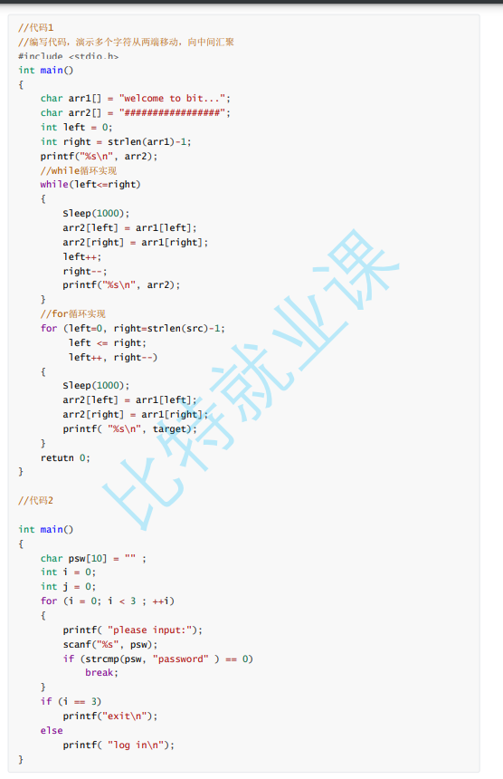

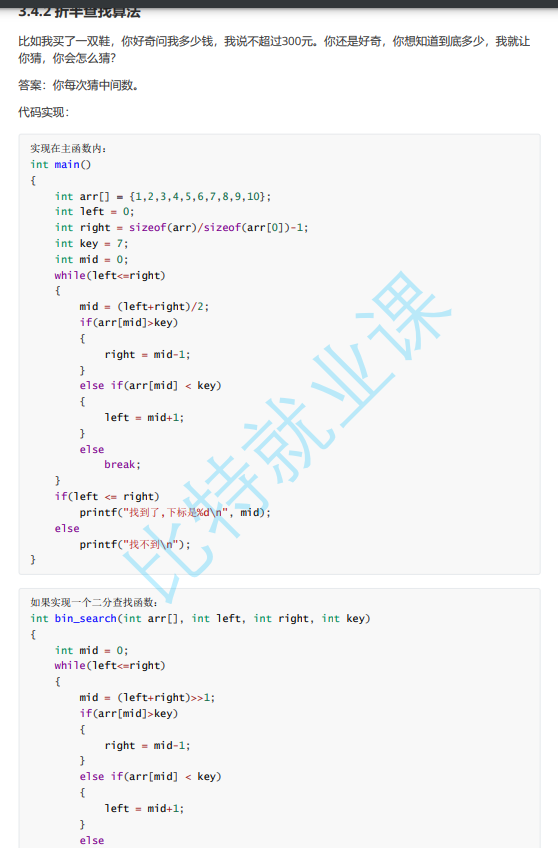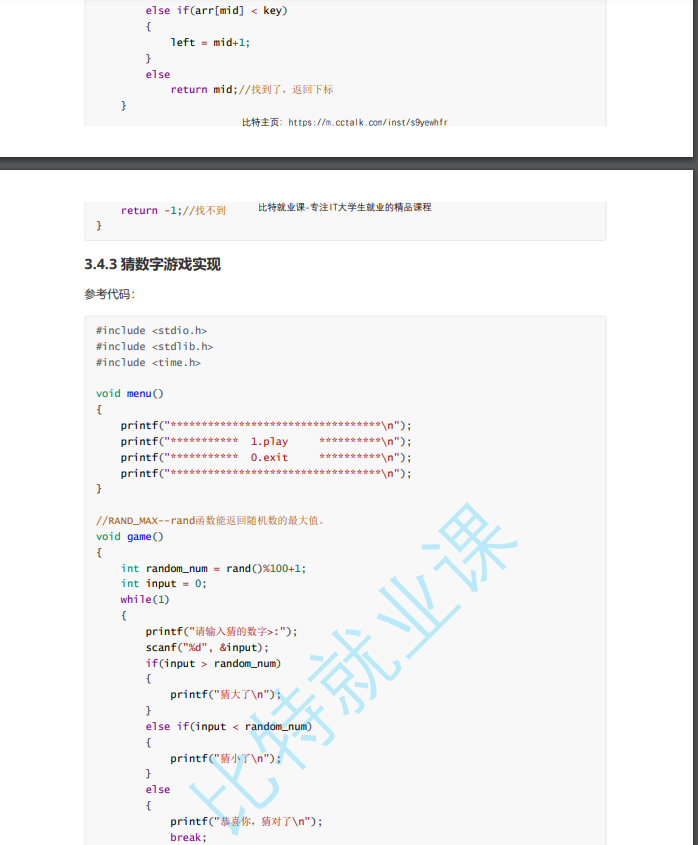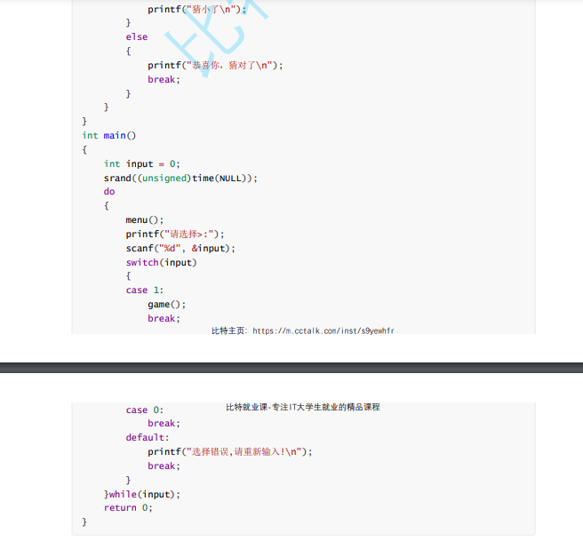

#### goto

- 终止程序在某些深度嵌套的结构的处理过
  程（例如：一次跳出两层或多层循环）。

示例：

```c
for(...)
    for(...)
   {
        for(...)
       {
            if(disaster)
                goto error;
       }
   }
    …
error:
 if(disaster)
         // 处理错误情况
```

- continue
- return

## 函数

- 函数就是：子程序。
- 是一个大型程序中的某部分代码， 由一个或多个语句块组 成。它负责完成某项特定任务，而且相较于其他代 码，具备相对的独立性。
- 一般会有输入参数并有返回值，提供对过程的封装和细节的隐藏。这些代码通常被集成为软 件库。

### 库函数

- 使用：include<库函数名>
- 学习库函数：MSDN(Microsoft Developer Network)
  - <www.cplusplus.com>
  - [http://en.cppreference.com（英文版）](http://en.cppreference.com%EF%BC%88%E8%8B%B1%E6%96%87%E7%89%88%EF%BC%89)
  - [http://zh.cppreference.com（中文版）](http://zh.cppreference.com%EF%BC%88%E4%B8%AD%E6%96%87%E7%89%88%EF%BC%89)

### 自定义函数

```c
返回类型 函数名(函数参数,函数参数)
{
 语句项；
}
```

示例：交换两个整型变量的内容

```c
//正确的版本
void Swap2(int* px, int* py)
{
    int tmp = 0;
    tmp = *px;
    *px = *py;
    *py = tmp;
}
int main()
{
    int num1 = 1;
    int num2 = 2;
    //Swap1(num1, num2);
    //printf("Swap1::num1 = %d num2 = %d\n", num1, num2);
    Swap2(&num1, &num2);
    printf("Swap2::num1 = %d num2 = %d\n", num1, num2);
    return 0;
}
```

## 数组

### 定义数组

```c
int arr[10]={1,2,3,4,5,6,7,8,9,10};//定义一个10个元素的整形数组

```

### 数组的访问及下标

- 下标：从0开始

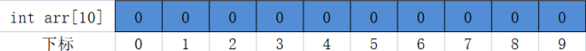

- 访问数组元素

```c
arr[0]=50;//将50赋值给下标为0的数组元素
```

### 数组的使用

```c
#include <stdio.h>
int main()
{
 int i = 0;
 int arr[10] = {1,2,3,4,5,6,7,8,9,10};
 for(i=0; i<10; i++)
{
    printf("%d ", arr[i]);
}
 printf("\n");
    return 0;
}
```

## 操作符详解

### 算术操作符（四则运算）

```c
+ //加
- //减
* //乘
/ //除
% //取模（取整）
```

### 移位操作符

```c
<< 左移
>> 右移
```

### 位操作符

**位与运算符** &

- 表示为 x & y 
- 按照表格计算，四种情况

通过这个表，我们得出一些结论：
1）无论是 0 或 1，只要位与上 1，还是它本身；
2）无论是 0 或 1，只要位与上 0，就变成 0；
**只要这一位上有一个 0，这一位的结果就会变成 0。**

```c
#include <stdio.h>
int main() {
    int a = 0b1010;           // (1)
    int b = 0b0110;           // (2)
    printf("%d\n", (a & b) ); // (3)
    return 0;
}

结果为2
```

**异或运算符** ^

1）两个相同的数异或结果为0
2）任何一个数和0异或结果为它本身
3）异或满足交换律和结合律
4 )  ==double类型无法进行异或运算==

### 赋值操作符

```c
a=50 //“左值=右值”讲50赋值给a
+=
-+
*=
/=
&=
^=
|=
>>=
<<=
```

### 单目操作符

```c
!           //逻辑反操作
-           //负值
+           //正值
&           //取地址
sizeof      //操作数的类型长度（以字节为单位）
~           //对一个数的二进制按位取反
--          //前置、后置--
++          //前置、后置++
*           //间接访问操作符(解引用操作符)
(typedef)       //强制类型转换
```

==单目运算符：一个操作数==
==双目运算符：两个操作数==
==三目运算符（也称三元运算符）：表达式1? 表达式2:表达式3==

### 关系操作符

```c
>
>=
<
<=
!=    //用于测试“不相等”
==      //用于测试“相等”
```

### 逻辑操作符

```c
&&       //逻辑与
||          //逻辑或
“ && ”的短路特性：左边为假，右边不算
“ || ”的短路特性：左边为真，右边不算
  
#include <stdio.h>
int main()
{
    int i = 0,a=1,b=2,c =3,d=4;
    //i = a++ && ++b && d++;
    i = a++ || ++b || d++;
    printf("a = %d\n b = %d\n c = %d\nd = %d\n", a, b, c, d);
    return 0;
}
```

### 条件操作符

```c
exp1 ? exp2 : exp3
```

### 逗号表达式

先执行逗号前再执行逗号后；整个表达式的结果为最后一个表达式的值。

```c
example1, example2, example3, …exampleN
```

### 下标引用、函数调用和结构成员

```c
[] () . ->
```

## 指针

- 地址：计算机程序在内存中运行，内存划分为一个个单元，每个内存单元都有编号，称为地址（0x开头的）。一个内存单元大小为1个字节
- 指针是内存中一个最小单元的编号，也就是地址
- 平时口语中说的指针，通常指的是指针变量，是用来存放内存地址的变量

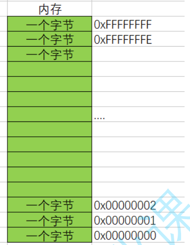

### 取地址符和取值符

#### 取地址符（&）【通过变量访问地址】

```c
# //取出的为num占内存中四个字节的第一个字节的地址
```

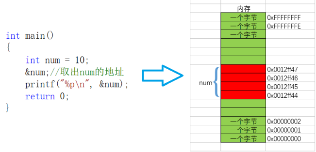

#### 解引用（间接）符（*）【通过地址访问变量】

```c
*p；//取出指针变量p内所存地址对应的值
/*
“*”的作用是引用指针指向的变量值，引用就是取地址(&)。
 “解"就是把该地址对应的东西解开，解出来，就像打开一个包裹一样，那就是该变量的值了，所以称为"解引用”。
    也就是说，解引用是返回内存地址中保存的值。
*/
```

### 指针类型

- 指针类型决定了指针在被解引用的时候有多大权限（能操作几个字节）。

```c
int* pa=&a;
/*
例: 
 如果是char*的指针，解引用访问1个字节
    如果是int*的指针，解引用访问4个字节
    如果是double*的指针，解引用访问8个字节
推广到其他类型*/
```

### 定义指针变量

- **指针是一种复合类型**，比如int*是指向int的指针，对每个指针变量名，都需要使用一个*

```c
int num = 10;//type * pa= &variable //定义一个type类型的指针指向一个名为variable的变量。
int* p;  //p为一个整形指针变量
p = #
```

### 野指针

- 指针指向的位置是不可知的（随机的、不正确的、没有明确限制的）

#### 野指针成因

- 声明指针变量但未初始化

```c
#include <stdio.h>
int main()
{
 	int* p;		//局部变量指针未初始化，默认为随机值
    *p = 20;	//将野指针指向的元素赋值20
 	return 0;
}
```

- 指针越界访问

```c
#include <stdio.h>
int main()
{
    int arr[10] = {0};
    int *p = arr;
    int i = 0;
    for(i=0; i<=11; i++)
   {
        //当指针指向的范围超出数组arr的范围时，p就是野指针
        *(p++) = i;
   }
    return 0;
}
```

- 指针指向的空间释放（为了避免使其置于NULL）

```c
#include <stdio.h>
int main()
{
    int *p = NULL;
    //....
    int a = 10;
    p = &a;
    if(p != NULL)
   {
        *p = 20;
   }
    return 0;
}
```

### 指针运算

#### 指针变量加减整数

- 指针的类型决定了指针向前或者向后走一步有多大（距离）

例一：

```c
#include <stdio.h>
int main()
{
 int n = 10;
 char *pc = (char*)&n;
 int *pi = &n;

 printf("%p\n", &n);
 printf("%p\n", pc);
 printf("%p\n", pc+1);
 printf("%p\n", pi);
 printf("%p\n", pi+1);
 return  0;
}
//结果：
000000900257F6C4  &n
000000900257F6C4  pc
000000900257F6C5  pc+1 pc地址加了一个字节的大小
000000900257F6C4  pi
000000900257F6C8  pi+1 pi地址加了一个字节的大小
```

例二：

```c
#define N_VALUES 5
float values[N_VALUES];
float* vp;
//指针+-整数；指针的关系运算
for (vp = &values[0]; vp < &values[N_VALUES];)
{
    *vp++ = 0;
}

//两种形式：
//第一种形式：vp指向的地址自增1个字节
*vp++=0； vp++为先使用vp，再vp自增
解析：
*vp=0；  第一步，对vp解引用，并把0赋值给指针变量vp指向地址的参数。
vp++；  第二步，指针变量vp指向的地址自增1一个字节
//第二种形式：vp指向地址所在的值自增1个数值
(*vp)++  
解析：
*vp   第一步，取出指针变量vp指向地址的值
(*vp)++  第二步，这个值自增一个数值
```

### 指针数组

```c
int* arr[5];
```

### 指针变量的大小

- 指针大小在32位平台是4个字节，64位平台是8个字节。

```c
#include <stdio.h>
/*
指针变量的大小取决于地址的大小
32位平台下地址是32个bit位（即4个字节）
64位平台下地址是64个bit位（即8个字节）
一个字节=8bit
*/
int main()
{
    printf("%d\n", sizeof(char *));
    printf("%d\n", sizeof(short *));
    printf("%d\n", sizeof(int *));
    printf("%d\n", sizeof(double *));
    return 0;
}
```

## 结构体

- 目的：描述复杂类型（如描述学生包含：`名字+年龄+性别+学号`这几项信息。）
- struct、结构体类型名、变量列表。结构体类型名和变量列表至少要有一个。

```c
struct Stu//stu为结构体类型名，可替换
{
    char name[20];//名字
    int age;      //年龄
    char sex[5];  //性别
    char id[15]； //学号
}s1,s2,s3;//变量列表（在main外创建则为全局变量）
```

### 结构体初始化

```c
/*
为了减少开销：结构体传参的时候，要传结构体的地址。
    函数传参的时候，参数是需要压栈的。
    如果传递一个结构体对象的时候，结构体过大，参数压栈的的系统开销比较大，所以会导致性能的下降。
*/
#include<stdio.h>
struct book
{
    //结构体的成员（变量）
    char name[20];
    char id[20];
    int price;
}s1,s2;

int main(){
    struct book philosophy={"C语言","C12682378",20};
    //结构体变量名.成员名
    printf("书名：%s\n",philosophy.name);
    printf("书号：%s\n",philosophy.id);
    printf("定价：%d\n",philosophy.price);
    return 0;
}
```

## -----------------------

## 宏定义和定义常量

```c
#define MAX 1000 //define定义标识符常量

#define AA sturct aa//通过#define这个指令将“struct aa”这个结果体类型命名为AA；以后直接在代码中使用AA代替struct aa

#define ADD(x, y) ((x)+(y)) //define定义宏

#include <stdio.h>
int main()
{
    int sum = ADD(2, 3);
    printf("sum = %d\n", sum);
  
    sum = 10*ADD(2, 3);
    printf("sum = %d\n", sum);
  
    return 0;
}
/*
结果：
sum = 5
sum = 50 
*/
```

## 文件

```sh
#include <stdio.h>

int main() {
    FILE* f = fopen("E:\\Code\\C\\test\\src/test.txt","r");

    if(f== NULL){
        printf("不用读了，啥也没读到");
        return 0;
    }

//    char ch;
//    // 逐个字符读
//    while ((ch = fgetc(f)) != EOF) { // EOF 表示文件结束
//        printf("%c",ch);
//    }


    // 逐行读取
    char line[200];
    while (fgets(line, sizeof(line), f) != NULL) { // 读取一行，直到文件结束
        printf("%s", line); // 打印读取到的行
    }


    // 关闭文件
    fclose(f);
    return 0;
}
```

```c
/*
 * fputc函数：向文件中写入一个字符。
 * fputs函数：向文件中写入一个字符串。
 * fprintf函数：向文件中写入多种数据。返回值：EOF、正整数（成功写入的字符个数）
 * fwrite函数：向文件中写入一个数据块。fwrite(元素首地址，元素大小，元素个数，文件指针)
 *
 * 例1.在D盘的f01文件夹创建一个名为a01.txt的文件，然后从键盘上输入20个整数，并写入该文件中
 * 1.因为要创建一个原来不存在的文件，故应该采用“w”方式打开文件。
 * 2.先用scanf函数输入一个整数。
 * 3.接着用fprintf函数写入到文件中。
 * 4.循环执行第2到3步20次。
 * 例2.在D盘的f01文件夹中创建一个名为a02.txt的文件，然后从键盘上输入一批成绩（保留1位小数，以任意负数作为结束标记)，并写入该文件中。
 */
#include<stdio.h>
#include <string.h>
int main()
{
    FILE* fp;
    if((fp=fopen("E:\\Code\\C\\test\\src\\a01.txt","w"))==NULL){
        printf("没打开文件");
        return 0;
    }
    char a[100];
    scanf("%s",a);
//    fprintf(fp,"%s",a);
    fwrite(a,sizeof(char),strlen(a),fp);

    fclose(fp);

    return 0;
}=
```

### 进制

#### 介绍

- 二进制 B (binary)

【0、1】组成（逢二进一）

- 八进制 O (octal)

【0-7】组成（逢八进一）
【0开头】

- 十进制 D (decimal)

【0-9】组成（逢十进一）
【1-9开头】

- 十六进制 H (hexadecimal)

【0-9、A-F】组成（逢十六进一）（A-F表示10-15）
【0X开头】

1 十六进制数字=4 *二进制位
1 byte=2*十六进制数字

#### 进制转换方法

##### 2、8、16进制->10进制

- 2进制->10进制

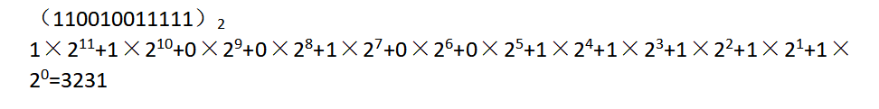

- 8进制->10进制

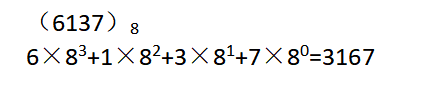

- 16进制->10进制

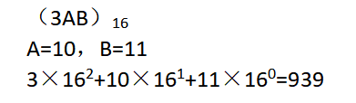

##### 10进制->2、8、16进制

- 10进制->2进制

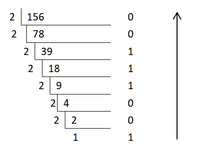

- 10进制->8进制

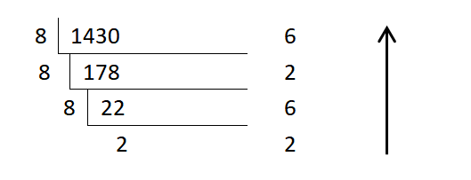

- 10进制->16进制

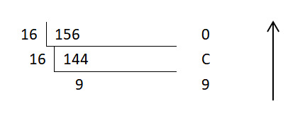

##### 2进制->8、16进制；8进制->16进制

- 2进制(100010)->8进制

**方法：**将每3个二进制数分为一组（从左至右），不够时补0

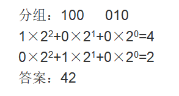

- 2进制(100111010)->16进制

**方法：**将每4个二进制数分为一组（从左至右），不够时补0

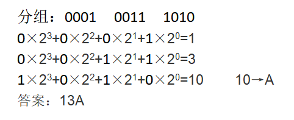

- 8进制(1325)->16进制

**方法：**
  八进制数无法直接转换为十六进制，
需2进制->10进制->16进制。
答案：2D5

##### 特殊情况：小数点的处理

例：十进制（23.76）如何转换？

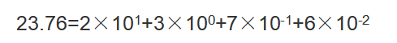

#### 进制转换快速查表

​    不同数制之间的对应及转换关系

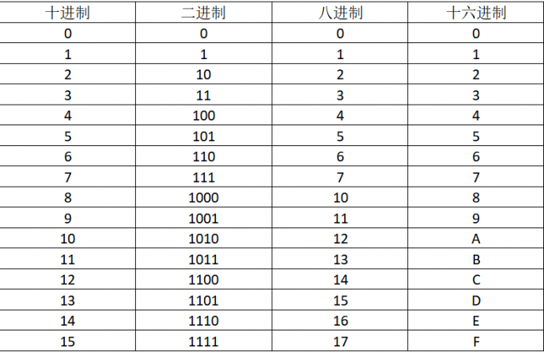

### 编辑器、编译器、链接器

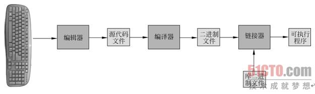

编辑器：敲代码
编译器：编译源代码文件为01机器语言（二进制）
链接器：链接库文件（二进制）并生成可执行文件

### 变量名

- 变量名只能是英文字母(A-Z,a-Z)和数字(0-9)或者下划线()组成。
- 第一个字母必须是字母或者下划线开头。
- 变量名区分大小写。
- 不能使用关键字命名

### 数据类型

| 类型              | 存储大小    | 值范围                                               |
| :---------------- | :---------- | :--------------------------------------------------- |
| char              | 1 字节      | -128 到 127 或 0 到 255                              |
| unsigned char     | 1 字节      | 0 到 255                                             |
| signed char       | 1 字节      | -128 到 127                                          |
| int               | 2 或 4 字节 | -32,768 到 32,767 或 -2,147,483,648 到 2,147,483,647 |
| unsigned int      | 2 或 4 字节 | 0 到 65,535 或 0 到 4,294,967,295                    |
| short             | 2 字节      | -32,768 到 32,767                                    |
| unsigned short    | 2 字节      | 0 到 65,535                                          |
| long              | 4 字节      | -2,147,483,648 到 2,147,483,647                      |
| unsigned long int | 4 字节      | 0 到 4,294,967,295                                   |

```c
int a;
char b;
float c;
double d;
a=520;
b=F';
c=3.14;
d=3.141592653;
printf("鱼C工作室创办于2010年的%d\n",a):
rintf("I Love %cishC.com!\n",b);
printf("圆周率是：%.2f\n",c);
//%.2f表示小数点之后有两位
printf("精确到小数点后9位的圆周率是：%11.9f\n",d);
//%11.9f表示小数点之后有9位，双精度浮点型变量一共有11位

&6d：整数输出，宽度是6位，不足左边补空格
%06d：整数输出，宽度是6位，不足左边补数字0
%-6d：整数输出，宽度是6位，不足右边补空格
  
printf("%03s,%7.2s,%.4s,%-5.3s\n","CHINA","CHINA","CHINA","CHINA"); 
%3s,       格式输出字符串，右对齐，超出3个长度的，就全部输出;不够三位数，左补0；
%7.2s,     输出字符串占7个位置，右对齐，左补空格，输出2个字符；
%.4s,      仅输出4个字符，占位4个位置，右对齐；
%-5.3s:    输出3个字符，占位5个位置，左对齐右补空格。
```

### 常量：是不变的（比如：圆周率，性别，身份证号码，血型等等）

- 字面常量
- const修饰的常变量
- #define定义的标识符常量
- 枚举常量

```c
#include <stdio.h>

enum Sex
{
 MALE,
 FEMALE,
 SECRET
};
//括号中的MALE,FEMALE,SECRET是枚举常量

int main()
{
    3.14;//字面常量
    1000;//字面常量
  
    //const 修饰的常变量
    const float pai = 3.14f;   //这里的pai是const修饰的常变量
    pai = 5.14;//是不能直接修改的！
  
#define MAX 100//#define的标识符常量
    printf("max = %d\n", MAX);
  
    //枚举常量
    printf("%d\n", MALE);
    printf("%d\n", FEMALE);
    printf("%d\n", SECRET);
    //结果：
     0
     1 
     2
    //注：枚举常量的默认是从0开始，依次向下递增1的
 
    return 0;
}

```

### 局部变量和全局变量：可变的（比如：年龄，体重，薪资）

- 局部变量：{}**内**部定义的变量

  作用域：变量所在的局部范围；

  生命周期：进入作用域生命周期开始，出作用域生命周期结束。
- 全局变量：{}**外**部定义的变量

  作用域：整个工程

  生命周期：整个程序的生命周期

```c
#include<stdio.h>
int b=20;//全局变量

int main(){
 //short age=20;//年龄
 //int high=180;//身高
 //f1oat weight=88.5;/体重
    int a=10;//局部变量
 return 0;
}
```

---

当全局变量和局部变量冲突（变量名相同）时：**优先局部**

```c
#include<stdio.h>
int a=100;

int main(){
 printf("a=%d\n",a);//当全局变量和局部变量名字相同的情况下，局部优先
 return 0;
}
```

### 形参和实参

```c
int add(x,y){//此处x和y为形参
    return x+y;
}
int main(){
    int a=1；
    int b=2;
    int c=3;
    int n=add(a,(b+c);//此处a和表达式(b+c)为实参
    return 0;
}
```

### 声明**全局**变量和函数

- 当前extern链接其他源文件的全局变量：

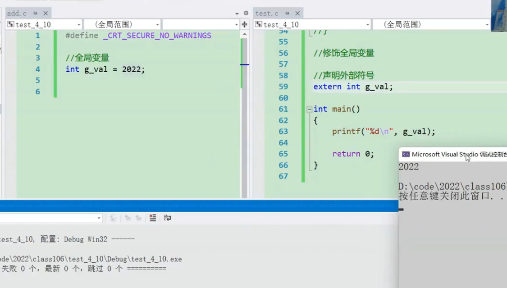

- 当前extern链接其他源文件的函数：


### 字符

用单引号括起来

```c
'a' //字符常量a
```

### 字符串

默认以转义字符"\0"为结束标志【"\0"不为字符串内容】

```c
"hello world\n"
```

### 转义字符

| 转义字符 | 释义                                                                               |
| -------- | ---------------------------------------------------------------------------------- |
| \?       | 表示问号，防止他们被解析成三字母词                                                 |
| \0       | 表示NULL                                                                           |
| \\'      | 用于单引号'                                                                        |
| \\''     | 表示双引号（"）                                                                    |
| \\\      | 用于表示一个反斜杠，防止它被解释为一个转义序列符                                   |
| \a       | 响铃（BEL）                                                                        |
| \b       | 退格（BS），将当前位置移到前一列                                                   |
| \f       | 换页（FF），将当前位置移到下页开头                                                 |
| \n       | 换行（LF），将当前位置移到本行开头                                                 |
| \r       | 回车（CR），将当前位置移到本行开头                                                 |
| \t       | 水平制表符（T）                                                                    |
| \v       | 垂直制表符（VT）                                                                   |
| \ddd     | ddd表示1~3个八进制（0-7）的数字（计算时转换为十进制按照ASCII表输出）如： \130表示X |
| \xdd     | dd表示2个十六进制数字（计算时转换为十进制，按照ASCII表输出） 如： \x30表示0        |

注意：

- 三字母词：为了在一些特定的字符集中，比如一些七位代码集中，解决一些特定字符的输入问题。【如：??= --> ]、??( --> [】

### 注释

- ### C语言风格的注释

```c
/*xx
xxx
x*/
```

缺陷：不能嵌套注释。`*/`与 `/*`为一个注释

```c
/*da
nw/*id
n*/io*/
```

- ### C++风格的注释

```c
//admwodnow大王大王的daw
```

优点：可以注释一行或多行

### 自增运算符a++与++a

- a++：先使用，再自增
- ++a：先自增，再使用

```c
#include <stdio.h>
#include <string.h>

int main()
{
    int a=0,b=0;
    b=a++;
    printf("%d\n", b);
    return 0;
}
//结果：0
#include <stdio.h>

int main()
{
    int a=0,b=0;
    b=++a;
    printf("%d\n", b);
    return 0;
}
//结果：1
```

### .和->

运算符    名称或含义                使用形式

.                成员选择（对象）   对象.成员名 --

->             成员选择（指针）   对象指针->成员名

### 电脑上的存储设备

- 硬盘-->内存-->高速缓存（cache）-->寄存器（集成在cpu）
- 造价越来越高，空间越来越小

### 变量分配空间：堆区，栈区，静态区

堆区，栈区，静态区

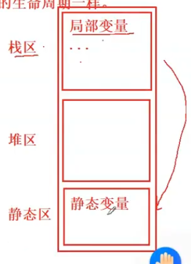

### 代码块

一对 `{ }`就是一个代码块。

### NULL（0）

null就是0

### EOF（-1）

ASCII代码值的范围是0~255，不可能出现-1，因此可以用EOF作为文件结束标志。

### 标准输入、标准输出

键盘输入、屏幕输出

### 输入缓冲区

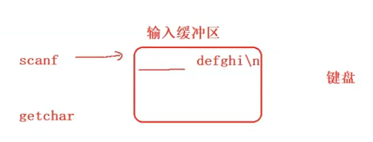

清理缓冲区：**fflush(stdin)** 清空缓存区

## 常见关键字

```c
auto  break   case  char  const   continue  default  do   double else  enum  
extern float  for   goto  if   int   long  register    return   short  signed
sizeof   static struct  switch  typedef union  unsigned   void  volatile  while
```

### void

声明函数无返回值或无参数，声明无类型指针，显式丢弃运算结果

### char

字符型类型数据，属于整型数据的一种

### int

整型数据，通常为编译器指定的机器字长

### float

单精度浮点型数据，属于浮点数据的一种

### double

双精度浮点型数据，属于浮点数据的一

### short

修饰int，短整型数据，可省略被修饰的int。

### long

修饰int，长整形数据，可省略被修饰的int。

### signed

修饰**整型数据**，有符号数据类型

### unsigned

修饰**整型数据**，无符号数据类型

### struct

结构体声明

### union

共用体声明

### enum

枚举声明

### typedef

顾名思义是类型定义，也就是**类型重命名**。

```c
typedef struct {
    char name[MAX_NAME_LENGTH];
    char gender[MAX_GENDER_LENGTH];
    char address[MAX_ADDRESS_LENGTH];
    char phone[MAX_PHONE_LENGTH];
} User;
typedef unsigned int uint_32;//将unsigned int 重命名为uint_32, 所以uint_32也是一个类型名
int main()
{
    User a;
    //观察num1和num2,这两个变量的类型是一样的
    unsigned int num1 = 0;
    uint_32 num2 = 0;
    return 0;
}
```

### sizeof

得到特定类型（int、float、struct）或特定类型变量（自己定义的变量：a、b、c）的大小

### auto

指定为自动变量，由编译器自动分配及释放。通常在栈上分配

### static

用来修饰变量和函数。

1. 修饰局部变量-称为静态局部变量
2. 修饰全局变量-称为静态全局变量
3. 修饰函数-称为静态函数

#### 修饰局部变量

- static修饰局部变量使其出了作用域不销毁
- static修饰局部变量改变了变量的生命周期，变成和程序的生命周期一样

原代码：

```c
#include <stdio.h>
void test()
{
    int i = 0;
    i++;
    printf("%d ", i);
}
int main()
{
 int i = 0;
    for(i=0; i<10; i++)
   {
        test();
   }
    return 0;
}
//结果：1 1 1 1 1 1 1 1 1 1 
```

static修饰后：

```c
#include <stdio.h>
void test()
{
    static int i = 0;// static修饰局部变量
    i++;
    printf("%d ", i);
}
int main()
{
    int i = 0;
    for (i = 0; i < 10; i++)
    {
        test();
    }
    return 0;
}
//结果：1 2 3 4 5 6 7 8 9 10 
```

#### 修饰全局变量

- static修饰全局变量，使得全局变量的外部链接属性变为内部链接属性。---生命周期变小
- 外部链接属性：可被其他源文件(.c)声明（如：extern int g_val;）后使用。
- 内部链接属性：其他源文件(.c)不能再使用到这个全局变量。

只声明不修饰：

static修饰后：

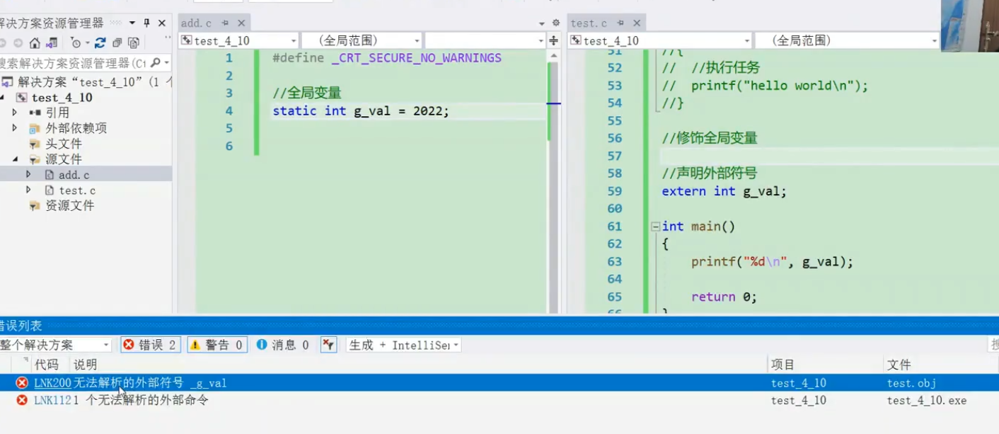)

#### 修饰函数

- static修饰函数，使得函数的外部链接属性变为内部链接属性。---生命周期变小
- 外部链接属性：可被其他源文件(.c)声明（如：extern int g_val;）后使用。
- 内部链接属性：其他源文件(.c)不能再使用到这个全局变量。

只声明，不修饰【√】：

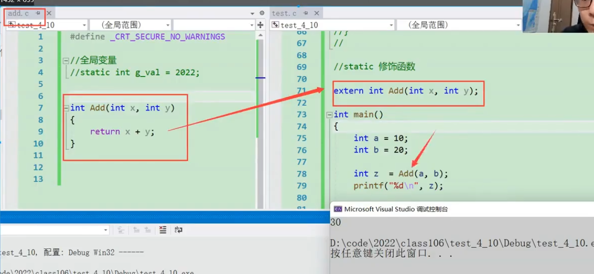

static修饰后：

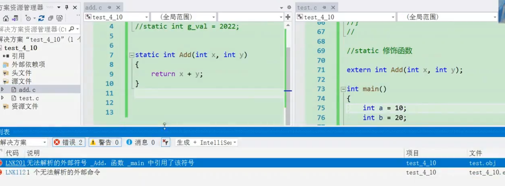

### register

- 修饰变量，表示建议将变量优先放到寄存器中（实际由编译器决定）

```c
int main(){
 //寄存器变量
 register int num=3;//建议：3存放在寄存中
 return 0;
}
```

### extern

指定对应变量为外部变量，即在另外的目标文件中定义，可以认为是约定由另外文件声明的对象的一个“引用“

### const

与volatile合称“cv特性”，指定变量**不可被当前线程/进程改变**（**但有可能被系统或其他线程/进程改变**）

### volatile

与const合称“cv特性”，指定变量的值**有可能**会**被**系统或其他进程/线程**改变**，**强制编译器每次从内存中取得该变量的值**

### return

用在函数体中，返回特定值（或者是void值，即不返回值）

### continue

结束当前循环，开始下一轮循环

### break

跳出当前循环或switch结构

### goto

无条件跳转语句

### if

条件语句

### else

条件语句否定分支（与if连用）

### switch

开关语句（多重分支语句）

### case

开关语句中的分支标记

### default

开关语句中的“其他”分治，可选。

### for

循环结构，for(1;2;3)4;的执行顺序为1->2->4->3->2...循环，其中2为循环条件

### do

循环结构，do 1 while(2);的执行顺序是1->2->1...循环，2为循环条件

### while

循环结构，while(1) 2;的执行顺序是1->2->1...循环，1为循环条件

## 库函数

### <assert.h>

### <ctype.h>

#### getchar()

实际上是int getchar(void)，返回ASCII码，所以只要是ASCII码表里有的字符它都能读取出来。在调用getchar()函数时，编译器会依次读取用户键入缓存区的一个字符(注意这里只读取一个字符，如果缓存区有多个字符，那么将会读取上一次被读取字符的下一个字符)，如果缓存区没有用户键入的字符，那么编译器会等待用户键入并回车后再执行下一步 (注意键入后的回车键也算一个字符，输出时直接换行)。

```
int main()
{
	char ch;
	printf("请输入字符："); //1 2 回车
	scanf("%c", &ch); // 读取 1
	printf("%c", getchar()); //输出 2
}
```

### <errno.h≥

### <float.h>

### <limits.h≥

### <locale.h>

### <math.h>

### <setjmp.h>

### <signal.h>

### <stdarg.h>

### <stddef.h>

### <stdio.h>

#### printf()

- 格式化【f=format】输出函数

```c
int ch=123;
printf("%d",ch);
```

#### scanf()

- 读取**字符串**
- 读取数字时会跳过**空格**、**制表符**和**换行符**。（回车符会残留在缓冲区）

```c
char a,b,c;
printf("请输入三个字符：");
scanf("%c%c%c",&a,&b,&c); 
```

#### getchar()

- 读取**一个无符号**字符
- 只能输入字符型,输入时遇到回车键才从缓冲区依次提取字符。
- 返回值为用户输入的ASCⅡ码，出错返回-1（如何出错：ctrl+z）

### <stdlib.h>

### <math.h>

#### sin(弧度)

- 角度转弧度：用角度乘以π/180

#### abs() 

-  **int abs(int x)** 
- 返回值：==整数== **x** 的绝对值。
- 目标：只适用于整数

#### fabs()

- **double fabs(double x)**
- 参数：x--要计算绝对值的==浮点数==
- 返回值：
  如果 x 是正数，则返回 x；
  如果 x 是负数，则返回它的相反数，即 -x；
  如果 x 是 0，则返回 0。

### <string.h>

#### strlen()

计算字符串 **str** 的**长度**，直到空结束字符，**包括转义字符（\0），但不包括空结束字符**。

```c
#include <stdio.h>
#include <string.h>

int main ()
{
   char str[50];
   int len;

   strcpy(str, "This is runoob.com");

   len = strlen(str);
   printf("|%s| 的长度是 |%d|\n", str, len);
   
   return(0);
}
结果：
    |This is runoob.com| 的长度是 |18|
```

#### strcmp(str1，str2)

**参数：**

- **str1** -- 要进行比较的第一个字符串。
- **str2** -- 要进行比较的第二个字符串。

**比较方法：**

- 通过比较两个字符串首字母的ascll码值来排序

**返回值：**

- 如果返回值==<== 0，则表示 str1 小于 str2。 如果返回值小于 0，则表示 str1 小于 str2。
- 如果返回值==>== 0，则表示 str1 大于 str2。 如果返回值大于 0，则表示 str1 大于 str2。
- 如果返回值===== 0，则表示 str1 等于 str2。 如果返回值等于 0，则表示 str1 等于 str2。

### <time.h>

## ASCII码表（十进制数字 对应 字符）

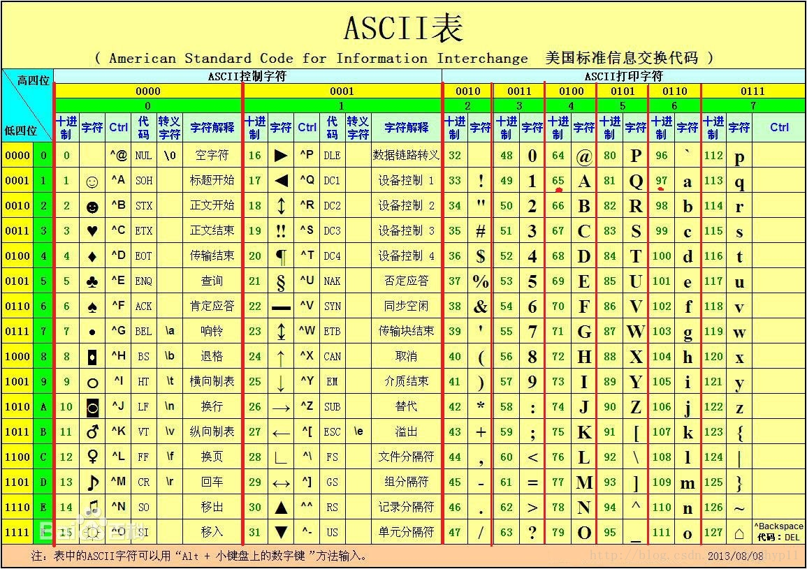

## 例子

- 定义：常量、宏、局部变量、全局变量、重命名变量名、枚举类型

```c
#include <stdio.h>
#include <string.h>
#include <malloc.h>

#define x 5
#define add(x,y) (x+y) //define定义宏，宏是有参数的，可被替换

typedef unsigned int u_int;

int z = 7;

enum SEX
{
 male,
 female,
 secret
};

int main()
{
 int y = 3;
 u_int d=4;
 enum SEX s = female;

 printf("%d", s); //枚举常量
 printf("%d", x); //自定义标识符
 printf("%d", z); //全局变量
 printf("%d", y); //局部变量
 printf("%d", d); //类型重命名

 return 0;
}
```

# 笔记本

==输入5个字符串，从中找出最大的字符串并输出。==
要求：
 用二位字符数组存放着5个字符串
 用指针数组元素分别指向这5个字符串
 用一个二级指针变量指向这个指针数组

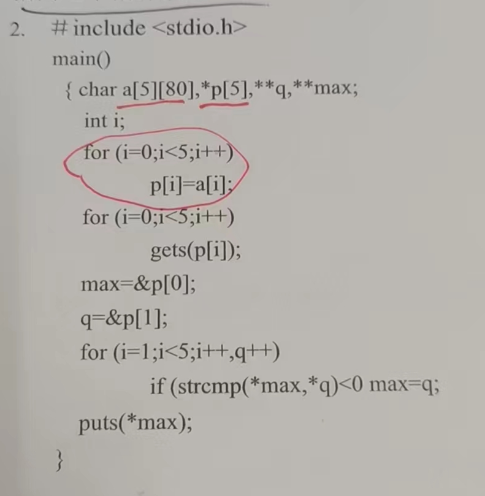

## 判断100以内的素数

```c
int main() {
 for (int a = 2; a < 100;a++) {
  bool isprime = true;
  for (int i = 2; i < a; i++) {
   if (a % i == 0) {
    isprime = false;//如果能被a整除，就是false
    break;
   }
  }
  if (isprime) {
   printf("%d\n", a);
  }
 }
    return 0;
}
```

## 判断是否为闰年

```c
int main() {
 int year;
 while (1) {
  scanf_s("%d", &year);
  if ((year % 4 == 0 && year % 100 != 0) || year % 400 == 0) {
   printf("%d为闰年\n", year);
  }
  else {
   printf("%d不为闰年\n", year);
  }
 }
    return 0;
}
```

### 1000以内的闰年

```c
int main() {
 for (int year = 1; year < 1000; year++) {

  
   if ((year % 4 == 0 && year % 100 != 0) || year % 400 == 0) {
    printf("%d为闰年\n", year);
   }
   else {
    printf("%d不为闰年\n", year);
   }

 }
 return 0;
}
```

## 有1、2、3、4个数字，能组成多少个互不相同且无重复数字的三位数？都是多少？

```c
int main() {
 int count = 0;//计数器
 for (int i = 1; i <= 4;i++) {
  for (int j = 1; j <= 4; j++) {
   for (int k = 1; k <= 4; k++) {
    if (i != j && i != k && j != k) {
     printf("%d\n", i * 100 + j * 10 + k);
     count++;
    }
   }
  }
 }
 printf("%d", count);
 return 0;
}
```

# 易错

## 整类型及浮点型除法问题

- 整型（int）变量做除法，如果出现了小数，那么，C只会取整数部分。
- ==浮点数(float、double)整除还是浮点数==
- ==浮点数 / 整数 = 浮点数==
- ==整数 / 浮点数 = 浮点数==

## 二维数组下标：array [行] [列]

- 可以省略行，无法省略列
- why？二维数组是**按行存储**的 因此**确定了列之后才能存储一行一行的数据**

## 函数scanf( )的返回值

- 所输入的数据与格式字符串中匹配次数（已成功赋值的数据项数）
- 出错时则返回EOF【End Of File是一个预定义的常量，等于-1】.

```c
[6]
[6]
[6]


#include<stdio.h>
/*证实函数scanf()的返回值*/
int main()
{
    int a,b; 
    int input;

    /*获取scanf函数的返回值*/
    input = scanf("%d %d",&a,&b);
    printf("input = %d",input);
}
```

## 整个单个结构体无法直接互换，可举中间变量进行互换

```c
struct student S[200] = { 0 }, temp = { 0 };
for (int i = 0; i < 200; i++) {
	if (S[i].grade < S[i + 1].grade) {
		temp=S[i];
		S[i] = S[i + 1];
		S[i] = S[i];
	}
}
```

## ==二维数组存储并输出汉字字符串==

```c
    char array[][4] = {"零", "一", "二", "三", "四", "五", "六", "七", "八", "九"};
    for(int i=0;i<10;i++){
        printf("%s",array[i]);
    }
```


## ==#define N 10 后面不加分号==

## ==double类型无法进行异或运算==

## ==int a=pow（10，0）；a=0；==

- 为什么a为0？在计算机中，pow后为0.9999999996，进行类型转换成int型时，不足1，于是为0。所以最好用double类型【统一类型】
- ==double pow(double x,double y);==

## ==sqrt()的返回值为小数==

- double sqrt(double x);

## ==double类型无法进行异或^运算==

## ==system("pause")==

- 头文件：stdlib.h
- 必须用双引号包起来pause

## 结构体本身为地址，传参要用点

例子：

```c
struct a{
	char name[20];
	char phone[100];
}
scanf("%s %s",&a.name,&a.phone);
```

## 结构体中数组的输入和输出

- 输入：scanf中结构体的数组地址要精确到第一位。

- ```
  如：scanf("%ld %s %d",&S[i].id,&S[i].name[0],&S[i].score);
  ```

- 输出：printf中结构体的数组直接写数字名。

- ```
  printf("学号：%ld\n姓名：%s\n分数：%d\n",S[i].id,S[i].name,S[i].score);
  ```

  

## ==传递数组给函数==

- 传递的是一个指针（地址）
- 注意：function(array);这里的array为数组首元素的地址

```
#include <stdio.h>
#include<stdlib.h>
#include <math.h>
int function(int array[]){

}
int main(){
    int array[10]={0};
    function(array);
    system("pause");
}

```

