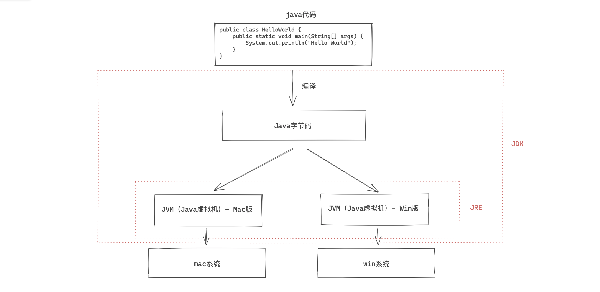
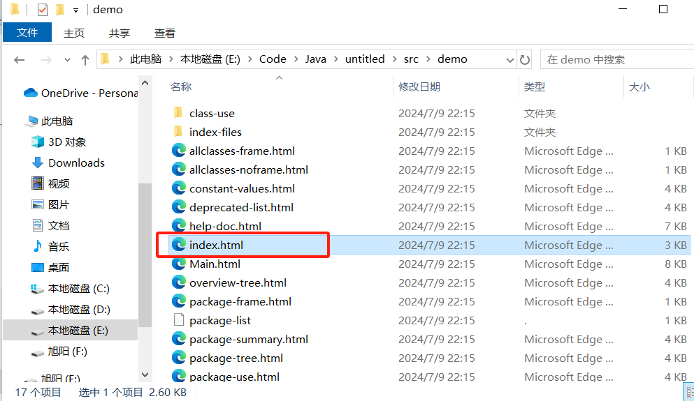
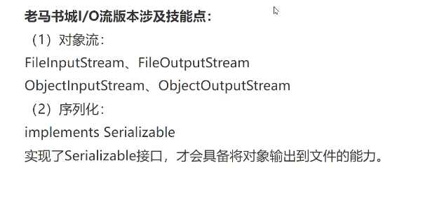

## 环境配置

### 安装

1. 网站下载jdk1.8a安装
   `https://www.oracle.com/java/technologies/downloads/#java8`
2. 配置jdk环境变量（JAVA_HOME-jdk安装目录，path->%JAVA_HOME%\bin）
3. 下载idea配置

### JDK、JRE原理



- **JDK（ Java Development Kit ）**：Java开发工具。
  `JRE + 开发必备的工具（编译工具javac.exe 和 运行工具java.exe等）`
- **JRE（ Java Runtime Envrionment ）**：Java 运行环境。
  `JVM + 运行必备的类库`

## 语法解析

### 编译、运行

```bash
# 编译java文件为class（类、字节码）文件【若java代码中有多个类则生成多个class文件】
>> javac Main.java
# 运行Main类
>> java Main	
```

### javadoc

`注释内容可以被JDK提供的工具javadoc所解析，生成一套以网页文件形式体现的该程序的说明文档。（一般写在类，方法中）`

```java
// dos窗口命令
javadoc -d 文件夹名 -xx -yy 文件名.java
javadoc -d E:\Code\Java\untitled\src\demo -author -version Main.java
// idea中可使用：工具->生成javadoc—>生成
```

==注意==：中文要转换编码格式为gbk编码，不然会报错（编码GBK的不可映射字符）



| 标签         | 描述                                                         | 标签类型                            |
| ------------ | ------------------------------------------------------------ | ----------------------------------- |
| @author      | 作者标识                                                     | 包、 类、接口                       |
| @deprecated  | 标识当前API已经过期，仅为了保证兼容性依然存在，以此告之开发者不应再用这个API | 包、类、接口、值域、构造函数、 方法 |
|              | 指明当前文档根目录的路径                                     |                                     |
| @exception   | 标志一个类抛出的异常                                         | 构造函数、 方法                     |
|              | 从直接父类继承的注释                                         |                                     |
|              | 链接到某个特定的成员对应的文档中                             | 包、类、接口、值域、构造函数、 方法 |
|              | 插入一个到另一个主题的链接，但是该链接显示纯文本字体         | 包、类、接口、值域、构造函数、 方法 |
| @param       | 方法的入参名及描述信息，如入参有特别要求，可在此注释         | 构造函数、方法                      |
| @return      | 对函数返回值的注释                                           | 方法                                |
| @see         | 引用,查看相关内容，如类、方法、变量等                        | 包、类、接口、值域、构造函数、 方法 |
| @serial      | 说明一个序列化属性                                           |                                     |
| @serialData  | 说明通过writeObject( ) 和 writeExternal( )方法写的数据       |                                     |
| @serialField | 说明一个ObjectStreamField组件                                | @                                   |
| @since       | 描述文本,API在什么程序的什么版本后开发支持                   | 包、类、接口、值域、构造函数、 方法 |
| @throws      | 构造函数或方法所会抛出的异常                                 | 构造函数、 方法                     |
|              | 显示常量的值，该常量必须是static属性                         | 静态值域                            |
| @version     | 版本号                                                       | 包、 类、接口                       |

### 注释

```java
//单行标签

/*
	多行标签
	多行标签
*/

/**
 * javadoc标签 
 * @author 旭阳
 * @version 1.0
 */
```

### 快捷键

```java
/* 
	快捷键：psvm、sout
*/

// psvm:
public static void main(String[] args) {
    
}
// sout:
System.out.println();
```

### 数据类型


| 数据类型 | 范围/注意点                                       |
| -------- | ------------------------------------------------- |
| byte     | -128-127                                          |
| short    | 正负三万                                          |
| int      | 正负21亿                                          |
| long     | 很大很大。<br />书写时范围超过int需要==结尾加 L== |
| float    | ==末尾加 f==                                      |
| double   | ==末尾加 f==                                      |
| char     | ==单引号==                                        |
| String   |                                                   |
| boolean  |                                                   |

> 数据类型自动转换：只要 + 左右两侧任意一侧是字符串，结果一定是字符串

### 运算符

略

### 判断

略

### 循环

```
集合.size()
部分略
```

**for循环-遍历：**

```java
// 遍历arr中每个元素交给num，并输出
int[] arr = {5, 4, 3, 2, 1};
for(int num:arr){
	System.out.println(num);
}
```

### 函数/方法

```java
[修饰符1 修饰符2 ...] 返回值类型 方法名(形参){
	Java语句;... ... ...
}
// 示例
public static double add(double a, double b) {
    return a+b;
}
```

### ==重载==

`函数名相同，参数不同。目的：创造兼容性强的函数，防止报错（通过不同类型或数量的参数来选择合适函数）`

```java
public class testtype {
    /*
    * 定义两个同名（参数不同的）方法，适配多种场景
    */
    public static double add(double a, double b) {
        return a+b;
    }
    public static double add(int a, int b) {
        return a+b;
    }
    public static double add(double a, double b,double c) {
        return a+b+c;
    }
    public static void main(String[] args) {
        System.out.println(add(5.3, 2.3));  // 浮点 + 浮点
        System.out.println(add(5, 2.5));    // 整型 + 浮点
        System.out.println(add(5, 2));      // 整型 + 整型
        System.out.println(add(5, 2,7.3));  // 三数相加，且浮点型自动兼容整型
    }
}
```

### 数组

#### 声明-创建

```java
int[] arr = new int[5];
/*
分解写法：
int[] arr;  		// 声明 整型数组arr
arr = new int[5];    // 创建 含有5个元素的arr整型数组
*/
```

#### 赋值

`不初始化元素，元素默认为0`

```java
for(int i=0;i<arr.length;i++){
    arr[i]=arr.length-i;
}
```

#### 声明-创建-赋值

```java
int[] array = {5, 4, 3, 2, 1};
```

### 集合

```java
package demo;

import java.util.ArrayList;

public class test01 {
    public static void main(String[] args) {
        ArrayList<String> arr = new ArrayList<String>();
        // 增
        arr.add("Google");
        arr.add("Runoob");
        arr.add("Taobao");
        arr.add("Weibo");
        System.out.println(arr);
        // 删
        arr.remove(3);
        // 改
        arr.set(2, "Wiki");
        // 查
        System.out.println(arr.get(0));
        // 计算大小
        System.out.println(arr.size());
        // 迭代列表1
        for (int i = 0; i < arr.size(); i++) {
            System.out.println(arr.get(i));
        }
        // 迭代列表2
        for (String element : arr) {
            System.out.println(element);
        }

    }
}
```

### 类与对象

#### 定义类

```java
/**
 * 类名：首字母大写，驼峰命名
 */
public class Person {
    // 定义属性
    String name;
    int age;
    double height;

    // 定义方法
    public void eat(String food) {
        System.out.println(name+" is eating "+food+" !");
    }
    public double calculate_add(double a, double b) {
        return a+b;
    }

}
```

#### 构造器

`对象的初始化操作`

- 构造器方法名与类名一致
- 构造器不能定义返回值类型：不能在构造器里使用return关键字来返回某个值。

```java
/**
 * 空构造器：
 *     （快捷键：alt+insert -> 构造器 -> 选择属性）
 *      尽量保证存在空构造器：某些框架底层需要空构造器
 * 带参构造器：
 *      属性赋值：使用this.属性来修饰
 */
public 类名(){
    System.out.println("已使用空构造器");
}
public 类名(String 属性1,int 属性2, double 属性3){
    this.属性1=属性1;
    this.属性1=属性1;
    this.属性1=属性1;
    System.out.println("构造器初始化：属性1："+属性1+",属性2："+属性2+",属性3："+属性3);
}
// 示例
public class Person {
    // 定义属性
    String name;
    int age;
    double height;

    // 定义方法
    public void eat(String food) {
        System.out.println(name+" is eating "+food+" !");
    }
    public double calculate_add(double a, double b) {
        return a+b;
    }
    // 构造器：
    public Person(){
        System.out.println("已使用构造器");
    }
    public Person(String name,int age, double height){
        this.name=name;
        this.age=age;
        this.height=height;
        System.out.println("已使用构造器，姓名："+name+",年龄："+age+",身高："+height);
    }

}
```

#### 调用方法

```java
/**
 * 创建对象：类名 对象名 = new 类名();
 * 赋值：对象名.属性名 = 值；
 * 调用：[返回值类型 名字 =]对象名.方法名(参数列表);
 */
public class test {
    public static void main(String[] args) {
        Person p1 = new Person();
        p1.name = "Robert";
        p1.eat("strawberry");
        System.out.println(p1.calculate_add(13.9,14));
    }
}
```

#### 封装（private、public）

`隐藏对象内部的复杂性，只对外公开简单的接口。便于外界调用，从而提高系统的可扩展性、可维护性，提高程序的安全性。通俗的说，把该隐藏的隐藏起来，该暴露的暴露出来。这就是封装性的设计思想。`

- 高内聚：类的内部数据操作细节自己完成，不允许外部干涉；
- 低耦合：仅对外暴露少量的方法用于使用

##### 案例

`private：权限修饰符，将属性私有化`
`public：权限修饰符，别人可以访问/使用`
`快捷键：alt+insert -> Getter and Setter -> 选择属性`

girl.java

```java
public class girl {
    // age属性私有化
    private int age;
    // 给age提供一个赋值方法
    public void setAge(int age){
        if(age>30){
            this.age=18;
        }else{
            this.age=age;
        }
    }
    // 给age提供一个读取值方法
    public int getAge(){
        return age;
    }
}
```

test.java

```java
public class test
{
    public static void main(String[] args) {
        girl g1 = new girl();
        g1.setAge(18);
        System.out.println(g1.getAge());
    }
}
```

#### 继承

`对父类的扩展。`
`格式：子类 extends 父类`

Person.java

```java
public class Person {
    // 父类公共属性
    private int age;
    private String name;
    private double height;
    // 父类公共方法
    public int getAge() {
        return age;
    }

    public void setAge(int age) {
        this.age = age;
    }

    public String getName() {
        return name;
    }

    public void setName(String name) {
        this.name = name;
    }

    public double getHeight() {
        return height;
    }

    public void setHeight(double height) {
        this.height = height;
    }

    // 吃饭
    public void eat() {
        System.out.println("人类可以吃饭");
    }
    // 睡觉
    public void sleep() {
        System.out.println("人类可以睡觉");
    }
    // 喊叫
    public void shout() {
        System.out.println("人类可以狗叫");
    }

}
```

student.java

```java
/**
 * 继承格式：子类 extends 父类
 */
public class student extends Person {
    // 定义子类额外的、扩展的属性
    private int stuId;
    // 定义子类额外的、扩展的方法

    public int getStuId() {
        return stuId;
    }

    public void setStuId(int stuId) {
        this.stuId = stuId;
    }
    
    // 学习
    public void study() {
        System.out.println("学生可学习");
    }
}
```

test.java

```java
package com.msb.study.sad;

public class test
{
    public static void main(String[] args) {
        student p1 = new student();
        p1.setStuId(23213123);
        p1.setAge(18);
        p1.setName("小明");
        p1.setHeight(1.8);

        p1.eat();
        p1.sleep();
        p1.shout();

        p1.study();

    }
}
```

##### 重写

`当子类对父类提供的方法不满意的时候，要对父类进行重写`
`格式要求：方法名一直，参数列表一致`

重载和重写的区别：

- 重载：在同一个类中，当方法名相同，形参列表不同的时候，多个方法构成了重载
- 重写：在不同的类中，子类对父类提供的方法不满意，对父类的方法进行重写

Person.java

```java
public class Person {
    // 吃饭
    public void eat() {
        System.out.println("人类可以吃饭");
    }
    // 睡觉
    public void sleep() {
        System.out.println("人类可以睡觉");
    }
    // 喊叫
    public void shout() {
        System.out.println("人类可以狗叫");
    }

}
```

student.java

```java
package com.msb.study.sad;

/**
 * 重写：吃饭行为
 */
public class student extends Person {
    public void eat() {
        System.out.println("吃nm");
    }
}
```

test.java

```java
package com.msb.study.sad;

public class test
{
    public static void main(String[] args) {
        student p1 = new student();

        p1.eat();

    }
}
```

##### ==多态==

`继承中的写法，继承父类，重写形成子类`

Animal.java

```java
public class Animal {
    public void shout(){
        System.out.println("shout");
    }
}
```

Dog.java

```java
public class Dog extends Animal {
    public void shout(){
        System.out.println("211");
    }
    public void guard() {
        System.out.println("看家护院");
    }
}
```

Cat.java

```java
public class Cat extends Animal {
    // 狗叫
    public void shout() {
        System.out.println("666，你也叼呢");
    }
    // 挠人
    public void scratcch() {
        System.out.println("cnm");
    }

}
```

Girl.java

```java
public class Girl {
    // 玩猫
    public void playwith(Animal animal) {
        animal.shout();
    }
}
```

test.java

```java
public class test
{
    public static void main(String[] args) {
        Girl g1 = new Girl();
        
        Animal animal = new Animal();
        Cat cat = new Cat();
        Dog dog = new Dog();

        animal=cat;
        g1.playwith(animal);
        animal=dog;
        g1.playwith(animal);
    }
}
```

### 异常处理

#### 预防异常

```java
try{
    ...
}catch(Exception e){	// Exception：异常的父类
    System.out.println(e.getMessage())
}finally{
    无论异常均执行
}
```

#### 抛出异常

`throw/throws`

1. 位置不同
   - throws：方法内部
   - throws：方法的签名处，方法的声明处
2. 内容不同
   - throw + 异常对象
   - throws + 一场类似
3. 作用不同
   - throw：异常出现的源头，制造异常
   - throws：在方法的声明处，告诉方法的调用者可能出现异常（方便调用者自己处理或抛向上层）

```java
// 主动抛出异常
try{
    throw new Exception();
}catch(Exception e){
    System.out.println("自己处理异常");
}
```

```java
// 异常抛给上层
public class test01 {
    public static void main(String[] args) {
        int a=12,b=0;
        try{
            devide(a,b);
        }catch(Exception e){
            throw new RuntimeException(e);
        }
    }

    public static void devide(int a,int b) throws Exception{
        if(b==0){
            throw new Exception();
        }else{
            System.out.println(a/b);
        }

    }
}
```

### 文件操作

#### 读取文件

```java
public static void main(String[] args) throws IOException { // 抛出的异常合并为IOException
    // 初始化文件对象
    File f = new File("C:\\Users\\19124\\Desktop\\新建文本文档.txt");

    // 初始化读取字符流对象
    FileReader fr = new FileReader(f);
    // 读取文件内容并输出
    int rc = fr.read();
    while(rc != -1){
        System.out.print((char)rc);
        rc = fr.read();
    }
    // 读取流关闭
    fr.close();
}
```

#### 写入文件

```java
public static void main(String[] args) throws IOException { // 抛出的异常合并为IOException
    // 初始化文件对象
    File f = new File("C:\\Users\\19124\\Desktop\\新建文本文档.txt");

    // 初始化写入字符流对象
    FileWriter fw = new FileWriter(f);
    // 写入文件内容
    fw.write("dwdwd");
    // 写入流关闭
    fw.close();
}
```



## 细节

### 软件包平铺显示


## 笔记本

### 老马书城

```java
package demo;
import java.util.Scanner;
import java.util.ArrayList;

public class test01 {
    public static void main(String[] args) {
        System.out.println("------欢迎来到【老马书城】------");
        ArrayList bList = new ArrayList();
        Scanner sc = new Scanner(System.in);
        while(true){
            System.out.println("请录入要执行的功能序号【1.展示书籍；2.上新书籍；3.下架书籍；4.退出应用】:");
            int mode = sc.nextInt();
            switch (mode) {
                case 1:
                    System.out.println("【老马书城】》》》------1.展示书籍");
                    for(Object o : bList){
                        Book book = (Book)o;
                        System.out.println(book.getbId()+"---"+book.getbTitle()+"---"+book.getbAuthor());
                    }
                    break;
                case 2:
                    System.out.println("【老马书城】》》》------2.上新书籍");
                    System.out.println("请输入编号");String bId = sc.next();
                    System.out.println("请输入书名");String bTitle = sc.next();
                    System.out.println("请输入作者");String bAuthor = sc.next();
                    Book book = new Book(bId,bTitle,bAuthor);
                    bList.add(book);
                    break;
                case 3:
                    System.out.println("【老马书城】》》》------3.下架书籍");
                    System.out.println("请输入要下架的书名：");
                    String bTitle1 = sc.next();
                    for(int i=0;i<bList.size();i++){
                        Book book1 = (Book)(bList.get(i));
                        if(book1.getbTitle().equals(bTitle1)){
                            bList.remove(book1);
                            System.out.println("已经下架"+book1.getbTitle());break;
                        }
                    }
                    break;
                case 4:
                    System.out.println("【老马书城】》》》------4.退出书城");
                    break;
            }
            if(mode == 4){
                break;
            }
        }


    }
}
```

```java
package demo;

public class Book {
    /**
     * 编号 名称 作者
     */
    private String bId;
    private String bTitle;
    private String bAuthor;

    public String getbId() {
        return bId;
    }

    public void setbId(String bId) {
        this.bId = bId;
    }

    public String getbTitle() {
        return bTitle;
    }

    public void setbTitle(String bTitle) {
        this.bTitle = bTitle;
    }

    public String getbAuthor() {
        return bAuthor;
    }

    public void setbAuthor(String bAuthor) {
        this.bAuthor = bAuthor;
    }

    // 构造器
    public Book() {
    }

    public Book(String bId, String bTitle, String bAuthor) {
        this.bId = bId;
        this.bTitle = bTitle;
        this.bAuthor = bAuthor;
    }
}
```

