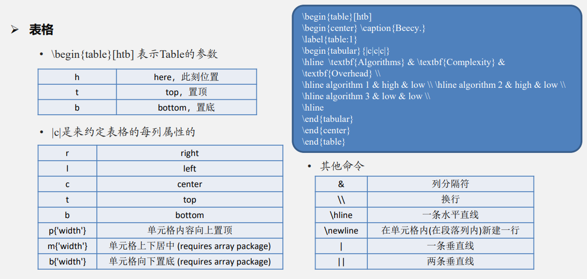

[大佬LaTeX 进阶教程 (lierhua.top)](https://latex.lierhua.top/zh/)

[LaTeX公式手册(全网最全) - 樱花赞 - 博客园 (cnblogs.com)](https://www.cnblogs.com/1024th/p/11623258.html)

## 格式设置

[latex常用宏包](https://zhuanlan.zhihu.com/p/43981639)

```tex
\documentclass{…}	% 格式
\usepackage{…}	% 依赖包
```

## 章节

```tex
\chapter		% 章(一般写书使用)
\section		% 节
\subsection		% 小节
\subsubsection	% 小小节
```

## 正文

```tex
\begin
	文字，图表，公式等。。。
\end
```

## 数学公式

1. 短公式

   ```tex
   $公式$
   ```

2. 单行公式
   `\usepackage{hyperref}`

   ```tex
   \autoref{eq1}	% 公式引用
   \begin{equation}\label{eq1}
       公式
       % 如：\alpha^2+\beta^2=\gamma^2
   \end{equation}
   ```

3. 多行公式
   `\usepackage{amsmath}`

   ```tex
   \begin{equation}\label{eq1}
       \begin{split}
       	公式
       	% 如（左对齐【&】+换行符【\\】）：
           %	&\alpha^2+\\
           %	&\beta^2=\\
           %	&\gamma^2\\
       \end{split}
   \end{equation}
   ```

4. 分情况讨论
   `\usepackage{amsmath}`

   ```tex
   \begin{equation}\label{eq3}
       F(x)=
       \begin{cases}
       	公式
           % 如（左对齐【&】+换行符【\\】）：
           % 0&,\text{if $x<0$}\\
           % x+1&,\text{if $x>0$}\\
           % 1&,\text{oteherwise.}
       \end{cases}
   \end{equation}
   ```

5. 无编号公式

   - 法一

     ```tex
     \[
         公式   
     \]
     ```

   - 法二

     ```tex
     $$公式$$
     ```

## 图片

`\usepackage{graphicx}【有的环境可能自带】`

最好用矢量图【eps、pdf】

```tex
\begin{figure}[htbp] 
	\centering
	\includegraphics[图片大小][图片相对路径]
	\caption{图片标题、说明}
	\label{图片标签}
\end{figure}
% 如：
% \begin{figure}[htbp]
%     \centering
%     \includegraphics[width=12cm]{屏幕截图 2024-05-30 011301.png}
%     \caption{狐狸}
%     \label{fig:aa}
% \end{figure}

% htbp解释（默认tbp）：
% h：当前位置（here）
% t：页面顶部（top）
% b：页面底部（bottom）
% p：单独页面（page）
```

## 表格

[LaTeX Tables Editor (可导入excel)](https://www.latex-tables.com/)

[在线创建 LaTeX 表格](https://www.tablesgenerator.com/)



## 参考文献

1. 直接引用

   ```tex
   文本1\cite{lable1}
   文本2\cite{lable2}
   \begin{thebibliography}{99}%99表示引用上限
       \bibitem{lable1} Anita G ,V. B V ,John P .Hybrid model with optimal features for non-invasive blood 
       glucose monitoring from breath biomarkers[J].Biomedical Signal Processing and Control,2024,88(PC):
       \bibitem{lable2}Zhining C ,Jianzhou W ,Li Y , et al.A hybrid electricity load prediction system based 
       onweighted fuzzy time series and multi-objective differential evolution[J].Applied Soft 
       Computing,2023,149(PB):
   \end{thebibliography}
   ```

2. 多文献引用
   `\bibliographystyle{unsrt}`

   ```tex
   \cite{文献名}
   \bibliographystyle{文献格式}
   \bibliography{bib文件名}
   右上角引用方法：
   \newcommand{\upcite}[1]{\textsuperscript{\cite{#1}}}	% 加在格式那
   \upcite{}
   ```

## 特殊符号

- %：注释 

  ```tex
  % 这里
  ```

- &：对齐（表格、数学公式）

  ```tex
  $&\alpha^2+\\&\beta^2=\\&\gamma^2\\$
  ```

- \\\\：换行

  ```tex
  \\
  ```

- $：数学公式

  ```tex
  $公式$
  ```

- ~：保留强制空格，非常古老的用法

- ^和_：上下标标记 

- #：编写宏包使用

## 友链

[vscode 配置 Latex 编译后自动清理多余文件(.log .out等文件)_latex运行一次就自动日志文件-CSDN博客](https://blog.csdn.net/weixin_35757704/article/details/90597405)