# Linux学习记录

## 环境搭建

### linux环境

1. 虚拟机（vmware）安装linux环境
2. unbuntu（windows） + wsl技术
3. 云服务器

### 连接linux环境

1. wsl技术 + windows terminal
2. xshell远程连接

### 虚拟机快照

`独属于虚拟机，类似于windows的还原点操作`

## 基础命令

### Linux目录结构

`linux只有一个根目录（顶级盘符），如：“/”；windows可以有多个顶级目录，如：“C:”、“D:”`

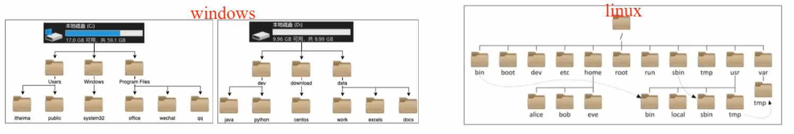

```
linux  路径间的层次关系：使用 / 来表示。如：/user/local/hello.txt
windows路径间的层次关系：使用 \ 来表示。如：D:\data\work\hello.txt
```

### Home目录和工作目录

####  Home目录

`每个Linux操作用户在Linux系统的个人账户目录，路径在：/home/用户名`

- 如：图中的Linux用户是itheima，其Home目录是：/home/itheima
- Windows系统和Linux系统，均设有用户的Home目录，如图：
  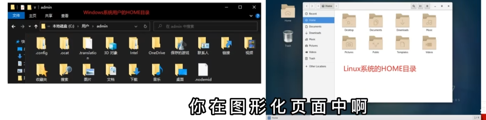

#### 工作目录

Linux命令行在执行命令的时候，需要一个工作目录，打开命令行程序(终端)默认设置工作目录在用户的HOME目录

### Linux命令入门

```sh
command [-options] [parameter]
# 示例
ls -l /home/itheima	
# 以列表的形式，显示/home/itheima目录内的内容
cp -r test1 test2
# 复制文件夹text1成为text2
```

- command：命令本身
- -options：[可选，非必填]命令的一些选项，可以通过选项控制命令的行为细节
- parameter：[可选，非必填]命令的参数，多数用于命令的指向目标等
- 语法中的[]，表示可选的意思

#### ls（list directory）

`直接使用命令：显示当前目录下的内容（平铺形式）`

```sh
ls [-a -l -h] [Linux路径]
# 混合示例
ls -a -l -h
ls -alh
ls -lha
```

| 选项 | 解释                                           |
| ---- | ---------------------------------------------- |
| -a   | 显示隐藏文件                                   |
| -l   | 呈现方式（平铺 -> 列表）                       |
| -h   | 列表呈现格式加上数据单位【需要和 -l 搭配使用】 |

#### cd（change directory）

`直接使用命令：切换到用户的Home目录，再次使用返回到工作目录`

```sh
cd [Linux路径]
```

#### pwd（print work directory）

`查看当前所在的工作目录`

```sh
pwd
```

#### ~

`特殊路径符，表示HOME目录，比如：cd ~，即可切换到HOME目录或cd ~/Desktop，切换到HOME内的Desktop目录`

```sh
~
# 示例
cd ~
```

#### mkdir（make directory）

`创建文件夹`

```sh
mkdir [-p] Linux路径
# 示例
mkdir -p itcast/good/666
```

| 选项 | 解释                                             |
| ---- | ------------------------------------------------ |
| -p   | 自动创建不存在的父目录，适用于连续创建多层级目录 |

==注意==：仅当前文件夹在home目录中时可以创建成功，home外需要修改权限才能成功

#### touch

`创建文件`

```sh
touch Linux路径
# 示例
touch test.txt
```

#### cat

`查看文件内容`

```sh
cat Linux路径
# 示例
cat test.txt
```

#### more

`查看文件内容（支持 空格 翻页，支持 q 退出查看）`

```sh
more Linux路径
# 示例
more etc/services
```

#### cp（copy）

`复制文件、文件夹`

```sh
cp [-r] 原路径 新路径
# 示例
cp text.txt text1.txt
cp -r itheima itheima1
```

| 选项 | 解释                           |
| ---- | ------------------------------ |
| -r   | 表示递归（当复制文件夹时使用） |

#### mv（move）

`移动文件、文件夹。如果目标不存在，则进行改名`

```sh
mv 原路径 新路径
# 示例
mv test.txt Desktop/
mv test.txt test1.txt
```

#### rm（remove）

`删除文件、文件夹`

```sh
rm [-r -f] 参数1 参数2 ..... 参数N
```

| 选项                  | 解释                                                         |
| --------------------- | ------------------------------------------------------------ |
| -r                    | 表示递归（当删除文件夹时使用）                               |
| -f                    | 强制删除（不会弹出提示确认信息）<br />普通用户删除内容不会弹出提示，只有0ot管理员用户删除内容会有提示所以一般普通用户用不到-f选项 |
| 参数1 参数2 ... 参数N | 要删除的文件或文件夹路径，空格隔开                           |

#### *

`通配符，即匹配任意内容（包含空）`

- test* 表示匹配test开头的内容
- *test 表示匹配任何test结尾的内容
- *test * 表示匹配任何包含test的内容

#### which

`查找命令（一个个二进制可执行程序，相当于windows中的.exe文件）`

```sh
which 要查找的命令
# cd是内置命令，无法被which到
```

#### find

`查找文件`

```sh
# 通过文件名查找
find 起始路径 -name "被查找文件名"
# 通过文件大小查找
find 起始路径 -size +|-n[kMG]
# 示例（注意命令中的k小写，M和G均大写）
find / -size -10k	# 查找小于 10 kb的文件
find / -size +100M	# 查找大于 100 mb的文件
find / -size +1G	# 查找小于 1 gb的文件
```

| 选项 | 解释                               |
| ---- | ---------------------------------- |
| +、- | 大于和小于                         |
| n    | 大小数字                           |
| kMG  | 大小单位【K：kb；MG：mb；G：gb】。 |

#### grep

`查找文件中的关键字`

```sh
grep [-n] [-v] 关键字 文件路径
# 示例
grep -n "hello w" /home/jzls/test.txt
```

| 选项     | 解释                                               |
| -------- | -------------------------------------------------- |
| -n       | 在结果中显示匹配的行的行号                         |
| -v       | 反向过滤（过滤掉）                                 |
| 关键字   | 过滤的关键字【若带有空格或其他符号，使用""括起来】 |
| 文件路径 | 要过滤内容的文件路径，可作为内容输入端口           |

#### wc

`统计文件的行数、单词数量、字节数`

```sh
wc [-c -m -l -w] 文件路径
# 示例
wc test.txt
```

| 选项     | 解释                             |
| -------- | -------------------------------- |
| -c       | 统计bytes数量                    |
| -m       | 统计字符数量                     |
| -l       | 统计行数                         |
| -w       | 统计单词数量                     |
| 内容路径 | 被统计的文件，可作为内容输入端口 |

#### 管道符

`| 左边命令的返回值交给右边处理`

```sh
|
# 示例：
ls -l /bin/ | wc -l	# 统计文件数量
```

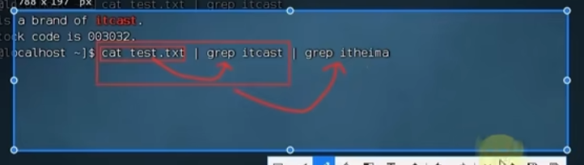

#### echo [文本/代码] >

```sh
echo "文本"	# 输出文本
echo `代码`	# 执行代码（反引号中）
echo "文本" > 文件路径	# 覆盖写入文件文本
echo "文本" >> 文件路径	# 追加写入文件文本
# 示例
ls > test.txt
```

| 选项 | 解释             |
| ---- | ---------------- |
| `    | 反引号，执行代码 |
| >    | 重定向符，覆盖   |
| >>   | 重定向符，写入   |

#### tail

`查看文件尾部内容，跟踪文件的最新更改`

```sh
tail [-f -num] Linux路径
# 示例
tail -f test.txt
```

| 选项      | 解释                         |
| --------- | ---------------------------- |
| -f        | 持续跟踪                     |
| -name     | 查看尾部多少行，不填默认10行 |
| Linux路径 | 被跟踪的文件路径             |

#### vi/vim

##### 三种工作模式

- 命令模式（Command mode）
  `所敲的按键编辑器都理解为命令，以命令驱动执行不同的功能`
  `此模式下，不能自由进行文本编辑`
- 输入模式（Insert mode）
  `编辑模式、插入模式`
  `此模式下，可以对文本内容进行自由编辑`
- 底线命令模式（Last line mode）
  `以:开始，通常用于文件的保存、退出`

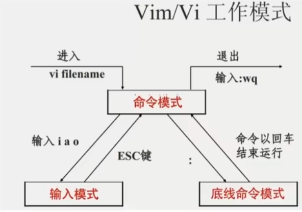

| 模式         | 命令       | 描述                                |
| ------------ | ---------- | ----------------------------------- |
| 命令模式     | i          | 当前光标位置 `输入模式`             |
| 命令模式     | a          | 当前光标位置之后 `输入模式`         |
| 命令模式     | I          | 当前行的开头 `输入模式`             |
| 命令模式     | A          | 当前行的结尾 `输入模式`             |
| 命令模式     | o          | 当前光标下一行 `输入模式`           |
| 命令模式     | O          | 当前光标上一行 `输入模式`           |
| 命令模式     | dd         | 删除当前行                          |
| 命令模式     | u          | 撤销上个操作                        |
| 输入模式     | Esc        | 任何情况下输入`Esc`都能回到命令模式 |
| 底线命令模式 | :wq        | 保存并退出                          |
| 底线命令模式 | :q         | 仅退出                              |
| 底线命令模式 | :q!        | 强制退出                            |
| 底线命令模式 | :w         | 仅保存                              |
| 底线命令模式 | :set nu    | 显示行号                            |
| 底线命令模式 | :set paste | 设置粘贴模式                        |

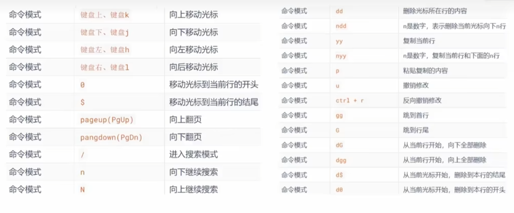

#### 用户


##### root用户

`超级管理员账户【权限最大】。windows、macos、linux均采用多用户的管理模式`

```sh
# ubuntu系统激活root用户
sudo passwd root
```

##### 切换和退出账户

```sh
# 切换账户
su [-] [用户名]
# 退回上一个账户
exit 或 ctrl + d
```

| 选项   | 解释                                   |
| ------ | -------------------------------------- |
| -      | 是否在切换用户后加载环境变量，建议带上 |
| 用户名 | 不带此选项默认切换到root用户           |

##### 为其他账户配置root权限（sudo时不需要输入密码）

```sh
# 法一：
su - root						# 进入管理员身份
vim /etc/sudoers				 # visudo 也行
[账户名] ALL=(ALL)	NOPASSWD: ALL	# 最后一句输入，添加权限
:wq!							# 退出，因为我们更改的时只读文件，需要强制执行
# 法二：
usermod -a -G sudo username		# 将用户追加到sudo组
```

```sh
# 测试
mkdir /jzll
sudo mkdir /jzll
```

##### 用户管理

```sh
useradd [-g -d] 用户名		   # 创建用户
userdel [-r] 用户名		  # 删除用户
id [用户名]			      # 查看用户所属组
usermod -aG 用户组 用户名		# 修改用户所属组，将指定用户加入指定用户组
usermod -s /bin/bash username	# 更改用户新登录shell
getent passwd	# 查看所有用户	# 信息介绍 -> 用户名:密码(X):用户ID:组ID:描述信息(无用):HOME目录:执行终端(默认bash)
```

| 选项 | 解释                                                         |
| ---- | ------------------------------------------------------------ |
| -g   | 指定用户的组（需要组已存在，如已存在同名组，并须使用-g）<br />不指定：创建同名组并加入 |
| -d   | 指定用户Home路径<br />不指定：Home目录默认在：/home/用户名   |
| -r   | 删除用户的Home目录<br />不使用-r，删除用户时，Home目录保留   |
| -aG  | 修改用户所属组                                               |

##### 用户组管理

`root账户下使用`

```sh
groupadd 用户组名	# 创建用户组
groupdel 用户组名	# 删除用户组
getent group	# 查看所有用户组	# 信息介绍 -> 组名称:组认证(显示为x):组ID
```

#### 权限

##### rwx解析

- r：读取

  > 文件：查看文件内容
  > 文件夹：可以查看文件夹内容，如ls命令

- w：写入

  > 文件：修改此文件
  > 文件夹：创建、除、改名等操作

- x：执行

  > 文件：将文件作为程序执行
  > 文件夹：可以更改工作目录到此文件夹，即cd进入

##### 权限信息解读

1. 文件、文件夹的权限控制信息
2. 文件、文件夹所属用户
3. 文件、文件夹所属用户组

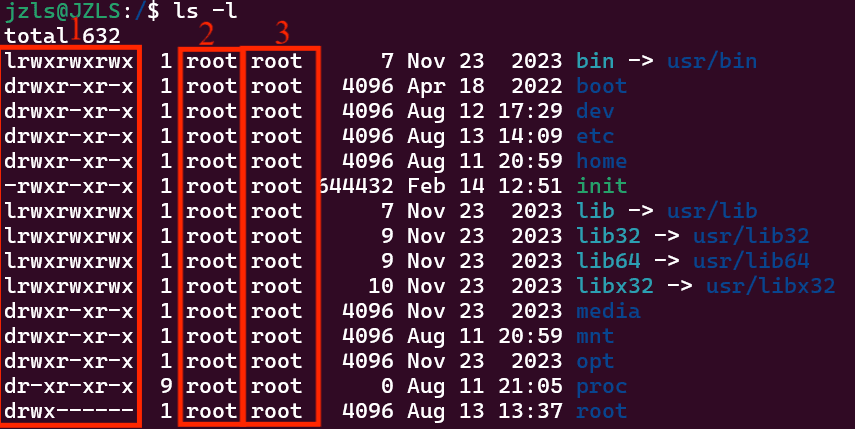

##### 权限细节解读


举例：drwxr-xr-x，表示：

- 首字母d：文件夹
- 所属用户权限：rwx
- 所属用户组权限：r-x
- 其他用户权限：r-x

##### chmod

`修改文件、文件夹的权限信息，只有文件、文件夹的所属用户或root用户可以修改`

```sh
chmod [-R] 权限 文件或文件夹
# 示例
chmod u=rwx,g=rx,o=x hello.txt	# 将文件权限修改为：rwxr-x--x
chmod -R u=rwx,g=rx,o=x test	# 将文件夹test以及文件夹内全部内容权限设置为：rwxr-x--x
```

| 选项 | 解释                               |
| ---- | ---------------------------------- |
| -R   | 对文件夹内的全部内容应用同样的操作 |
| u    | 所属用户权限                       |
| g    | 用户组权限                         |
| o    | 其他用户权限                       |

快捷修改权限方法

```sh
chmod 751 hello.txt
# 数字解析
第一位：用户权限
第二位：用户组权限
第三位：其他用户权限
751：rwx(7)r-x(5)--x(1)
```

| 数字 | 解释       | 示例 |
| ---- | ---------- | ---- |
| 0    | 无任何权限 | ---  |
| 1    | 仅有x权限  | --x  |
| 2    | 仅有w权限  | -w-  |
| 3    | 有w和x权限 | -wx  |
| 4    | 仅有r权限  | r--  |
| 5    | 有r和x权限 | r-x  |
| 6    | 有r和w权限 | rw-  |
| 7    | 有全部权限 | rwx  |

##### chown

`修改文件、文件夹的所属用户、用户组`

```sh
chown [-R] [用户][:][用户组] 文件或文件夹
# 示例
chown root hello.txt 将hello.txt所属用户修改为root
chown :root hello.txt 将hello.txt所属用户组修改为root
chown root:itheima hello.txt 将hello.txt所属用户修改为root，用户组修改为itheima
chown -R root test 将文件夹test所属用户修改为root并对文件夹内全部内容应用同样规则
```

| 选项   | 解释                           |
| ------ | ------------------------------ |
| -R     | 对文件夹内全部内容应用相同规则 |
| 用户   | 修改所属用户                   |
| 用户组 | 修改所属用户组                 |
| :      | 分隔用户和用户组               |

## 使用操作

### 小技巧（快捷键）

```sh
ctrl + c	# 强制停止命令运行/退出当前命令的输入
ctrl + d	# 退出账户登录/退出特定程序的专属页面（如python3，不能退出vi/vim）
```

```sh
# 历史命令
history		# 查看历史输入过的命令
history | grep ch	# 查看历史输入过的开头为ch的命令
!命令前缀	# 自动执行上一次匹配的命令（仅仅是前几个比较好用，如 !py ）
ctrl + r	# 匹配历史命令
```

```sh
# 光标移动快捷键
ctrl + a	# 跳到命令开头
ctrl + e	# 跳到命令结尾
ctrl + 键盘左键	# 向左跳一个单词
ctrl + 键盘右键	# 向右跳一个单词
```

```sh
# 清屏
ctrl + l	# 清空终端内容
clear		# 清空终端内容
```

### 软件安装

`需要root权限`

1. 下载安装包自行安装
   - windows：exe、msi文件
   - mac：dmg、pkg文件
   - linux：rpm（Centos）、deb（Ubuntu）文件
2. 系统的应用商店内安装
   - windows：Microsoft Store商店
   - mac：AppStore商店
   - linux：yum（Centos）、apt（Ubuntu）命令

#### yum

`RPM包软件管理器，用于自动化安装配置Linux软件，并可以自动解决依赖问题`

```sh
yum [-y] [install | remove | search] 软件名称	# 需要root权限
# 示例
yum search wget		# 搜索一下wget安装包
yum -y install wget	# 安装wget
yum -y remove wget	# 卸载wget
```

| 选项    | 解释                                 |
| ------- | ------------------------------------ |
| -y      | 自动安装，无需手动确认安装或卸载过程 |
| install | 安装                                 |
| remove  | 卸载                                 |
| search  | 搜索                                 |

更改阿里云源：

```sh
mv /etc/yum.repos.d/CentOS-Base.repo /etc/yum.repos.d/CentOS-Base.repo.backup	# 备份原始yum源配置文件
curl -o /etc/yum.repos.d/CentOS-Base.repo http://mirrors.aliyun.com/repo/Centos-7.repo	# 阿里云yum源
yum clean all	# 清除yum缓存
yum makecache	# 生成新缓存
```

#### apt

```sh
apt update		# 用于更新本地软件包列表
apt upgrade		# 根据更新后的列表升级软件包
```

```sh
apt [-y] [install | remove | search] 软件名称	# 需要root权限
```

### systemctl

`linux很多软件（内置或第三方）均支持使用systemctl命令控制：启动、停止、开机自启。能够被systemctl管理的软件，一般称为：服务`

```sh
systemctl start | stop | status | enable | disable 服务名
# 示例
systemctl status firewalld	# 查看防火墙状态
```

| 选项    | 解释         |
| ------- | ------------ |
| start   | 启动         |
| stop    | 关闭         |
| status  | 查看状态     |
| enable  | 开启开机自启 |
| disable | 关闭开机自启 |

系统内置服务：

- NetworkManager：主网络服务
- network：副网络服务
- firewalld：防火墙服务
- sshd、ssh服务（远程登陆）

### service

`如果你是在 windows 中通过 WSL 使用的 Ubuntu 或者 Dibian 系统，默认情况下系统使用的是 SysV 而不是 systemd。`

```sh
# 查看系统使用的初始化进程，若显示输出：init 或 sysv（或类似的东西），我们应该使用Sysvinit来代替Systemd
ps -p 1 -o comm=	# 查看系统运行的第一个进程
```

```sh
service 服务名 start | stop | status | restart
chkconfig 服务名 on | off	# （打开/关闭）开启自启
```

### ln

`创建软链接，类似windows的快捷方式`

```sh
ln -s 参数1 参数2
# 示例
ln -s /etc/yum.conf ~/yum.conf
ln -s /etc/yum ~/yum
```

| 选项  | 解释                 |
| ----- | -------------------- |
| -s    | 创建软连接           |
| 参数1 | 被链接的文件或文件夹 |
| 参数2 | 要链接去的目的地     |

### date

```sh
date [-d] [+格式化字符串]
# 示例
date "+%Y-%m-%d %H:%M:%S"
date -d "+20 hour" "+%Y-%m-%d %H:%M:%S"
```

| 选项         | 解释                                                         |
| ------------ | ------------------------------------------------------------ |
| -d           | 按照给定的字符串显示日期，一般用于日期计算<br />支持：year month day hour minute second |
| 格式化字符串 | 通过特定的字符串标记，来控制显示的日期格式                   |
| %Y           | 年                                                           |
| %y           | 年份后两位数字（范围：00-99）                                |
| %m           | 月份（范围：01-12）                                          |
| %d           | 日（范围：01-31）                                            |
| %H           | 小时（范围：00-23）                                          |
| %M           | 分钟（范围：00-59）                                          |
| %S           | 秒（范围：00-60）                                            |
| %s           | 自 1970-01-01 00:00:00 UTC 到现在的秒数                      |

```sh
# 修改服务器时间为东八区
rm -f /etc/localtime
ln -s /user/zoneinfo/Asia/Shanghai /etc/localtime
ln -s ../usr/share/zoneinfo/Asia/Shanghai /etc/localtime	# 如果zoneinfo文件夹在这里，就这样写
# 联网校准
yum -y install ntp
systemctl status ntpd	# 如果没启用记得enable
ntpdate -u ntp.aliyun.com	# 按照阿里云时间校准
```

### ifconfig

`查看ip地址（v4版本、v6版本）`

ipv4地址格式：a.b.c.d，其中abcd表示0-255的数字，如192.168.88.101就是一个标准的ip地址

```sh
# 如果无法使用此命令，下载安装一下
yum -y install net-tools
```

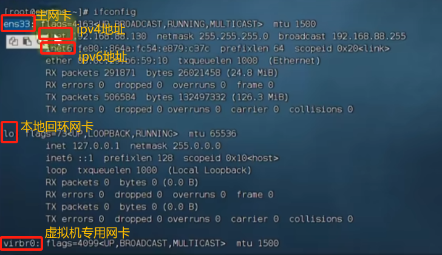

### IP地址

> 127.0.0.1 指代本机
>
> 0.0.0.0 特殊IP地址
>
> > 可以用于指代本机
> >
> > 可以在端口绑定中用来确定绑定关系
> >
> > 在一些IP地址限制中，表示所有IP的意思，如放行规则设置为0.0.0.0，表示允许任意IP访问

### hostname

`主机名`

```sh
hostname	# 查看主机名
hostnamectl set-hostname 新主机名	# 重新设置主机名
```

### 域名解析

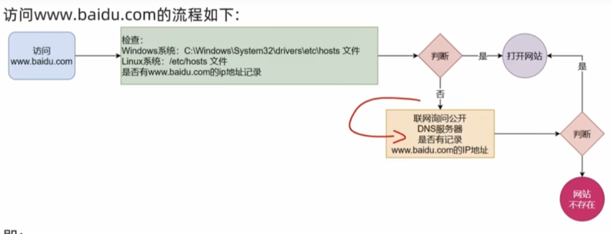

```sh
# 本机hosts文件
Windows：‪C:\Windows\System32\drivers\etc\hosts
Linux：/etc/hosts
# DNS服务器
如：114.114.114.114
```

**本地DNS解析：**

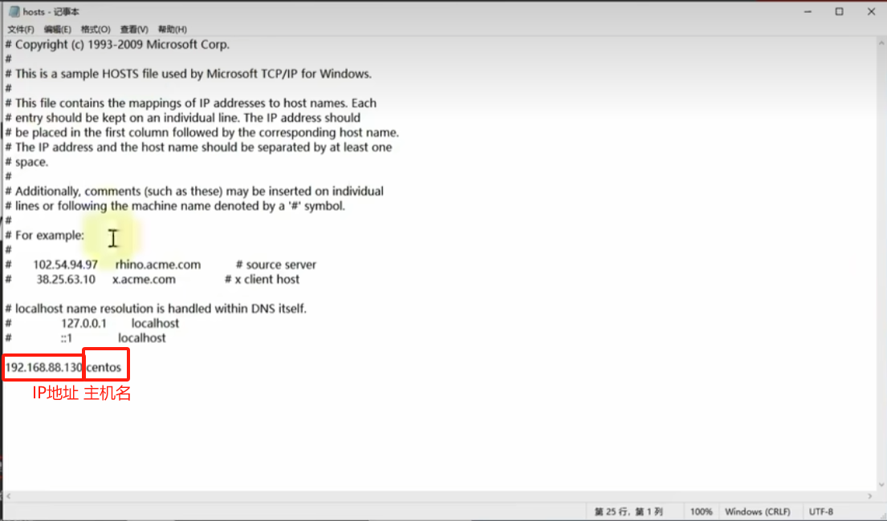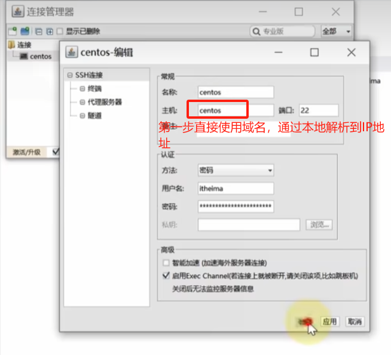

### 配置Linux固定IP

`https://www.bilibili.com/video/BV1n84y1i7td?p=35`

### ping

```sh
ping [-c num] ip或主机名
```

| 选项 | 解释                         |
| ---- | ---------------------------- |
| -c   | 检查的次数，不使用则无限检查 |

### wget

```sh
wget [-b] url
# 示例
wget -b https://archive.apache.org/dist/hadoop/common/hadoop-3.3.0/hadoop-3.3.0.tar.gz
```

| 选项 | 解释                                             |
| ---- | ------------------------------------------------ |
| -b   | 后台下载，会将日志写入当前工作目录的wget-log文件 |
| url  | 下载链接                                         |

### curl

`发送http网络请求，可用于：下载文件、获取信息等`

```sh
curl [-O] url
# 示例
curl cip.cc	# 通过此网站查看本机信息
curl -O https://archive.apache.org/dist/hadoop/common/hadoop-3.3.0/hadoop-3.3.0.tar.gz
```

| 选项 | 解释                                                    |
| ---- | ------------------------------------------------------- |
| -O   | 用于下载文件，当url是下载链接时，可以使用此选项保存文件 |
| url  | 发起请求的网络地址                                      |

### 端口

#### 类型

- 物理端口：接口，可见的端口。如USB接口，RJ45网口，HDMI端口等
- 虚拟端口：计算机内部的端口，不可见的。用来操作系统和外部进行交互使用

#### Linux端口

- 公认端口：1~1023，通常用于一些系统内置或知名程序的预留使用，如SSH服务的22端口，HTTPS服务的443端口（非特殊需要，不要占用这个范围的端口）
- 注册端口：1024~49151，用于松散绑定一些程序/服务（用户自定义）
- 动态端口：49152~65535，通常不会固定绑定程序，而是当程序对外进行网络连接时，用于临时使用
- 如：

### nmap-netstat

`查看端口占用`

```sh
yum -y install nmap
yum -t install net-tools
nmap 127.0.0.1	# 查看端口占用（利用本地回环地址）
netstat -anp	# 查看所有端口
netstat -anp | grep 端口号	# 查看指定端口占用（利用本地回环地址）
```

### 进程

每个运行的程序被操作系统注册为系统中的一个**进程**并分配一个独有的**进程ID（进程号）**

### ps

`查看Linux系统中的进程信息`

```sh
ps [-e -f]
# 示例
ps -ef
ps -ef|grep tail
ps -ef|grep "19:35"
ps -ef|grep 950
```

| 选项 | 解释               |
| ---- | ------------------ |
| -e   | 显示全部进程       |
| -f   | 格式化显示全部信息 |

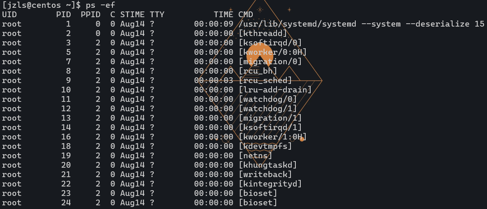

- UID：进程所属用户ID
- PID：进程的进程号ID
- PPID：进程的父ID（启动此进程的其他进程）
- C：此进程的CPU占用率（百分比）
- STIME：进程的启动时间
- TTY：启动此进程的终端序号，如显示“ ？”，表示非终端启动
- TIME：进程占用CPU的时间
- CMD：进程对应的名称或启动路径或启动命令

### kill

`关闭进程`

```sh
kill [-9] 进程号（PID）
```

### top

`主机状态监控`

```sh
top
```

| 选项 | 解释                                                         |
| ---- | ------------------------------------------------------------ |
| -p   | 只显示某个进程的信息                                         |
| -d   | 设置刷新时间，默认5s                                         |
| -c   | 显示产生进程的完整命令，默认是进程名                         |
| -n   | 指定刷新次数，比如 top -n 3，刷新输出3次后退出               |
| -b   | 以非交互非全屏模式运行，以批次的方式执行top，一般配合-n输出几次统计信息，将输出重定向到指定文件，比如 top -b -n 3 > /tmp/top.tmp |
| -i   | 不显示任何闲置（idle）或无用（zombie）的进程                 |
| -u   | 查找特定用户启动的进程                                       |

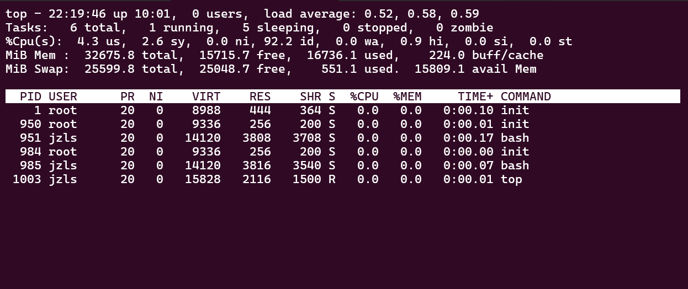

- 第一行：
  `top：命令名称；`
  `22:20:37：当前系统时间；`
  `up 10:02：启动了十小时2分；`
  `0 users：0个用户登录；`
  `load：1、5、15分钟负载。如：一分钟内单核cpu负载0.52，若输出2则表示两颗cpu 100%负载`

- 第二行：
  `Tasks：一共6个进程；`
  `1 running：1个进程在运行；`
  `5 sleeping：5个进程睡眠，0个停止进程，0个僵尸进程`

- 第三行：
  `%Cpu(s)：CPU使用率；`
  `us：用户CPU使用率；`
  `sy：系统CPU使用率；`
  `ni：空闲CPU率；`
  `wa：IO等待CPU占用率；`
  `hi：CPU硬件中断率；`
  `si：CPU软件中断率；`
  `st：强制等待占用CPU率`

- 第四、五行：
  `KiB Mem：物理内存；`
  `MiB Swap：虚拟内存（交换空间）；`
  `total：总量；`
  `free：空闲；`
  `used：使用；`
  `buff/cache：buff和cache占用；`

- 第。。。行：

  `PID：进程id；`
  `USER：进程所属用户；`
  `PR：进程优先级，越小越高；`
  `NI：负值表示高优先级，正表示低优先级；`
  `VIRT：进程使用虚拟内存，单位KB；`
  `RES：进程使用物理内存，单位KB；`
  `SHR：进程使用共享内存，单位KB；`
  `S：进程状态（S休眠,R运行,Z僵死状态,N负数优先级,I空闲状态）；`
  `%CPU：进程占用CPU率；`
  `%MEM：进程占用内存率；`
  `TIME+：进程使用CPU时间总计，单位10ms；`
  `COMMAND：进程的命名或名称或程序文件路径`

**交互式选项（非-b）**

```sh
按键	功能
h键	按下h键，会显示帮助画面
c键	按下c键，会显示产生进程的完整命令，等同于-c参数，再次按下c键，变为默认显示
f键	按下f键，可以选择需要展示的项目
M键	按下M键，根据驻留内存大小(RES)排序
P键	按下P键，根据CPU使用百分比大小进行排序
T键	按下T键，根据时间/累计时间进行排序
E键	按下E键，切换顶部内存显示单位
e键	按下e键，切换进程内存显示单位
l键	按下l键，切换显示平均负载和启动时间信息。
i键	按下i键，不显示闲置或无用的进程，等同于-1参数，再次按下，变为默认显示
t键	按下t键，切换显示CPU状态信息
m键	按下m键，切换显示内存信息
```

### df

`查看硬盘使用情况`

```sh
df [-h]
```

| 选项 | 解释                   |
| ---- | ---------------------- |
| -h   | 以更加人性化的单位显示 |

### iostat

`磁盘信息监控`

```sh
yum -y install sysstat
iostat [-x] [num1] [num2]
# 示例
iostat -x 3 4	# 显示详细信息，间隔3s，刷新4次
```

| 选项 | 解释           |
| ---- | -------------- |
| -x   | 显示更多信息   |
| num1 | 数字，刷新间隔 |
| num2 | 数字，刷新几次 |

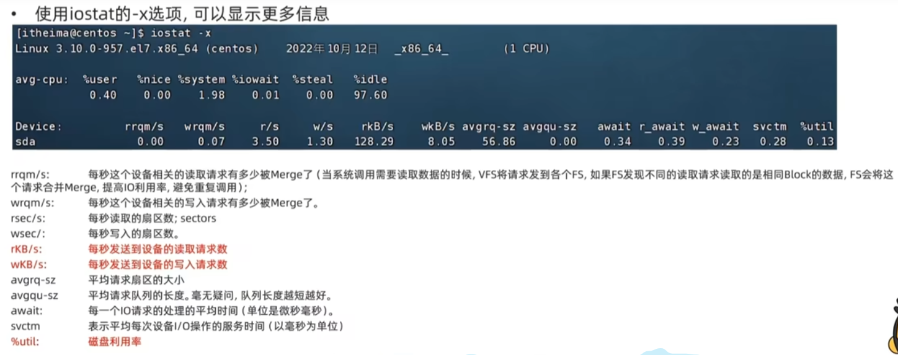

### sar

`查看网络相关统计，有点复杂的`

```sh
sar -n DEV [num1] [num2]
```

| 选项 | 解释                          |
| ---- | ----------------------------- |
| -n   | 查看网络，DEV表示查看网络接口 |
| num1 | 刷新间隔（不填查看一次结束）  |
| num2 | 查看次数（不填无限次数）      |

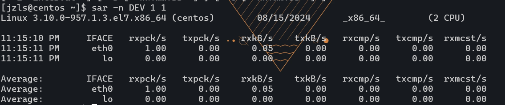
`IFACE：本地网卡接口的名称；`
 `rxpck/s：每秒接收的数据包；`
 `txpck/s：每秒发送的数据包；`
 `rxKB/S：每秒接收的数据包大小，单位KB；`
 `txKB/s：每秒发送的数据包大小，单位KB；`
 `rxcmp/s：每秒接收的压缩数据包；`
`rxcmp/s：每秒发送的压缩包；`
`rxmcst/s：每秒接收的多播数据包`

### env

`查看环境变量（以键值对形式存在）`

```sh
env	# 查看环境变量
# 示例
env | grep PATH	# 根据PATH查看对应的键值对
```

### $

`取变量的值`

```SH
echo $PATH	# 输出PATH的值
echo 环境变量: ${PATH}	# 输出PATH的值(叠加字符串)
```

### export

`自定义变量`

```sh
export 变量名=变量值
```

**永久生效**

1. 配置：
针对当前用户生效，配置在当前用户：`~/.bashrc`
针对所有用户生效，配置在系统：`/etc/profile`

2. 生效（立刻或重新ssh连接生效）：

   ```sh
   source 配置文件
   ```

**任何地方都能使用的小脚本**

```
写一个小脚本（如：echo "cnm"）
给脚本加上执行权限（chmod）
给脚本配置环境变量路径（export ${PATH}:脚本所在文件夹）（可以配置到当前用户或系统中）
从此可以在任何地方使用此脚本
```

### rz-sz

`上传、下载`

```sh
yum -y install lrzsz
```

```sh
sz 要下载到本地的文件	# 下载
rz					  # 上传，弹出文件夹，选择文件进行上传
```

### tar

`.tar	(tarball)归档文件，简易封装`
`.gz	(.tai.gz/.gz格式压缩文件)极大压缩体积`

```sh
tar [-c -v -x -f -z -C] 参数1 参数2 ... 参数N
# 示例（压缩）
tar -cvf test.tar 1.txt 2.txt 789.txt hadoop-3.3.0.tar.gz		# 简单封装
tar -zcvf test.tar.gz 1.txt 2.txt 789.txt hadoop-3.3.0.tar.gz	# 压缩【.gz也行】
# 示例（解压）
 tar -xvf test.tar -C /home/jzls/		# 简单拆封
 tar -zxvf test.tar.gz -C /home/jzls/	# 解压【.gz也行】
```

| 选项 | 解释                                                         |
| ---- | ------------------------------------------------------------ |
| -c   | 创建压缩文件，用于压缩模式                                   |
| -v   | 显示压缩、解压过程，用于查看进度                             |
| -x   | 解压模式                                                     |
| -f   | 要创建的文件 / 要解压的文件。-f选项必须在所有选项位置处于最后一个 |
| -z   | gzip模式，不使用-z就是普通的tarball格式，一般放在第一个      |
| -C   | 选择解压的目的地，用于解压模式                               |

### zip-unzip

`压缩-解压`

```sh
zip [-r] 参数 参数1 ... 参数N
# 示例
zip -r test1.zip test 1.txt 2.txt hadoop-3.3.0.tar.gz	# 带文件夹记得用-r
```

| 选项    | 解释                                   |
| ------- | -------------------------------------- |
| -r      | 被压缩的包含文件夹时使用，同rm、cp效果 |
| 参数    | 压缩包名                               |
| 参数1-N | 被压缩的文件/文件夹                    |

```sh
unzip [待解压文件] [-d [路径]]
# 示例
unzip test.zip -d test/	# 不指定路径默认解压到当前文件夹
```

| 选项 | 解释                              |
| ---- | --------------------------------- |
| -d   | 指定被解压去的位置，同tar的-C选项 |
| 路径 | 解压到指定路径                    |

## 日常维护

### uname

`查看服务器内核`

```py
uname -r	# 查看服务器内核版本号
```

### who

`查看当前活动的登录会话`

列出用户名、登录时间、登录IP地址等信息，不会显示已经注销或已断开连接的用户

### whoami

`查看当前登录的用户`

显示当前所使用的用户名

### last/lastlog

`查看登录历史日志`

- last：显示最近登录用户的列表，包括用户名、登录时间、登录IP地址等信息
- lastlog：显示所有用户的登录历史记录

### top

`查看当前运行的进程`

每个进程的详细信息，包括用户、进程ID、CPU、内存等使用情况

### netstat

`当前网络连接`

所有的网络连接，包括本地IP地址、远程IP地址、连接状态等信息

## 笔记本

### cmatrix

`黑客帝国`

```sh
cmatrix
cmatrix	[-C 颜色]	# 指定颜色
# 示例
cmatrix -C red
```


### cowsay

`会说话的牛`

```sh
cowsay -l	# 查看动物
cowsay -f bud-frogs "你好!"|lolcat
```

### bastet

`俄罗斯方块`

```sh
bastet
```

### lolcat

`将输出改变为彩色`

```sh
cmatrix |lolcat	# 使用了管道符，左边的结果给右边使用
```


## 注意

### ssh断连

[Linux SSH 连接在一段时间内没有活动时可能会自动断开，怎么办？-腾讯云开发者社区-腾讯云 (tencent.com)](https://cloud.tencent.com/developer/article/2321628)

**使用 SSH 客户端选项**

在使用 SSH 客户端连接服务器时，可以使用命令行选项来设置连接超时时间。例如，可以使用 `-o` 选项来指定 `ServerAliveInterval` 和 `ServerAliveCountMax` 的值：

```sh
ssh -o ServerAliveInterval=600 -o ServerAliveCountMax=3 user@hostname
```

这会覆盖配置文件中的相应设置，对于特定的连接非常有用。
