## 下载与安装

### 下载

1. 进入网站，选择windows版本。[MySQL :: MySQL Community Downloads](https://dev.mysql.com/downloads/)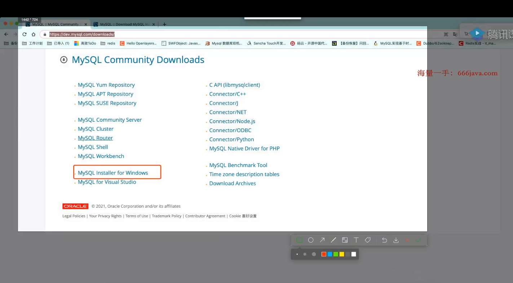

2. 点击archives【8开头的版本比较新，不推荐】
   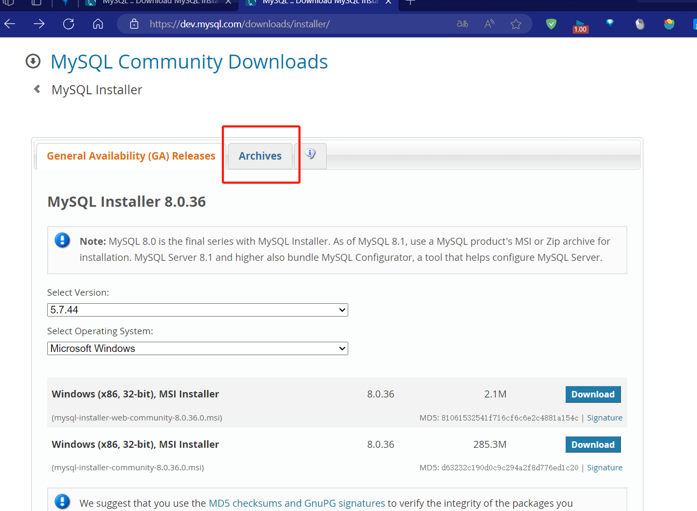

3. 选择5.7.34和windows版，然后下载完整安装包
   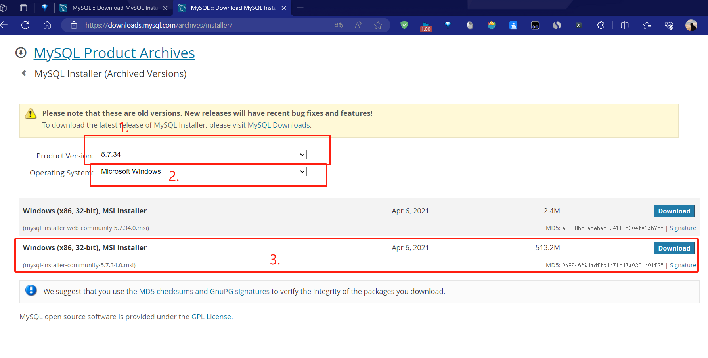

### 安装

1. 装服务端就行，不需要developer（开发者版本）和client（客户端）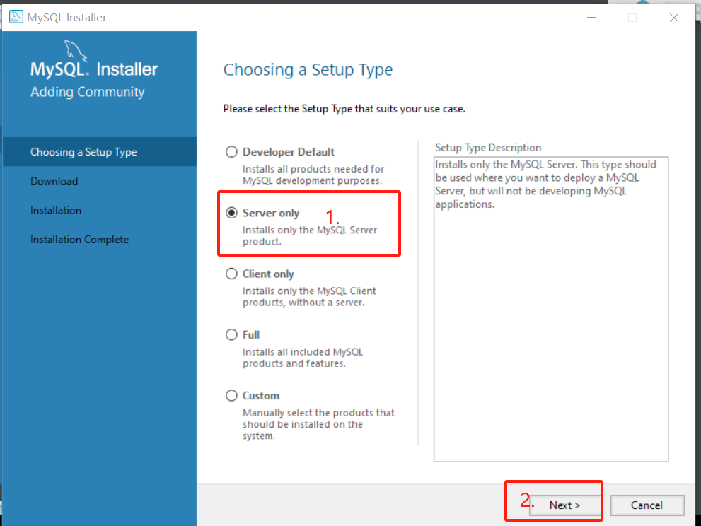

2. 点击执行，等待执行安卓程序完毕
   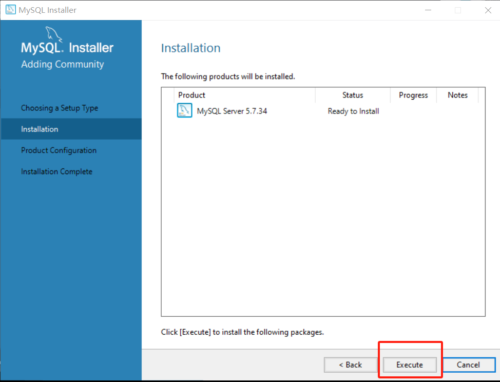

3. 点击下一步，开始配置
   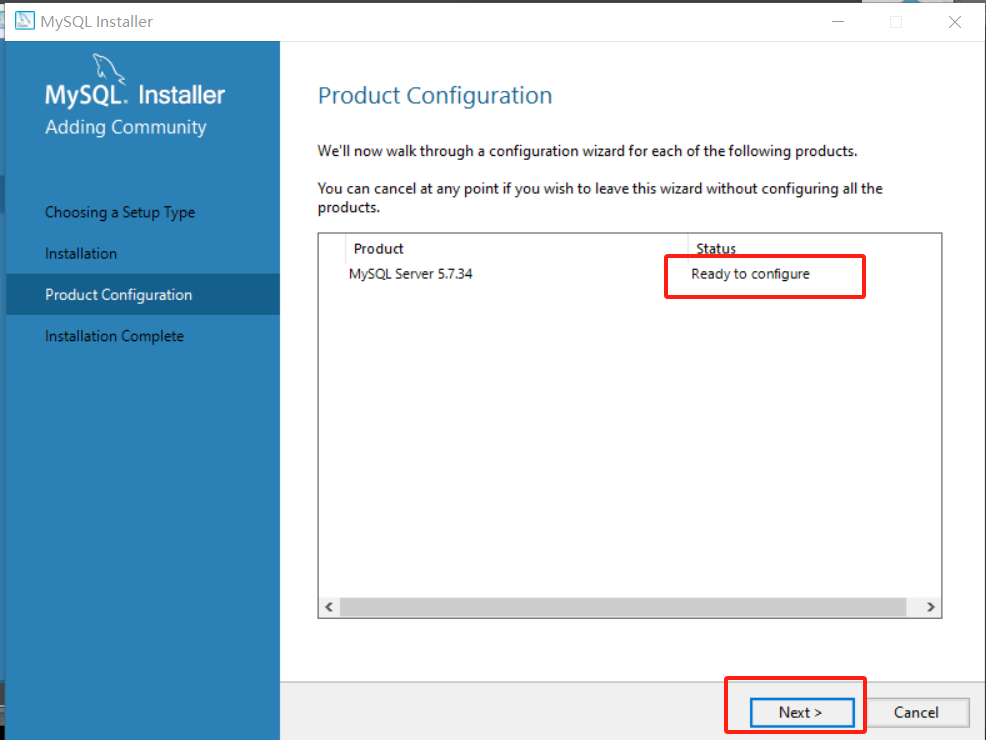

3. 选择开发计算机和端口号3306，接着下一步
   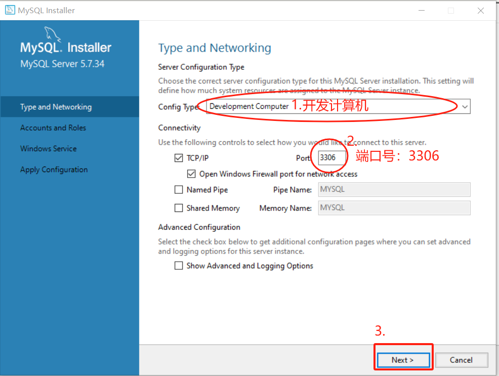

4. 输入密码，用户名默认为root，密码自己输
   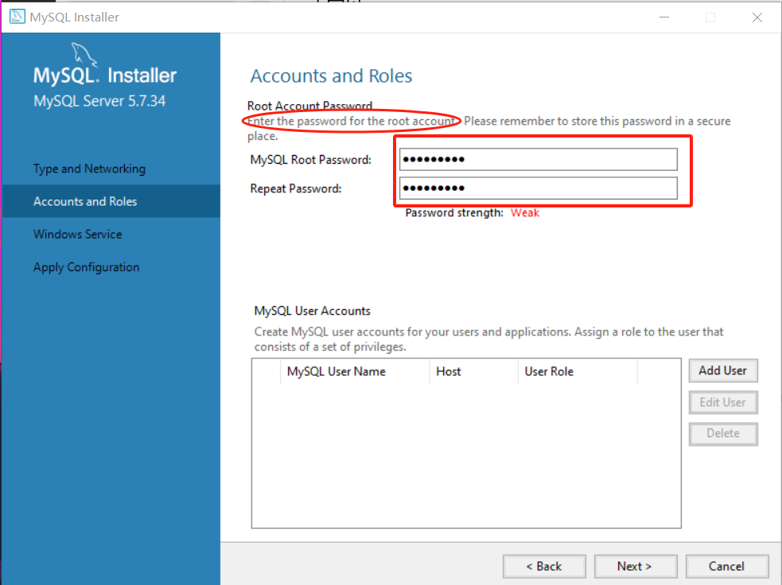

5. 配置作为服务；windows服务名称；在系统启动时开启mysql服务。然后点下一步
   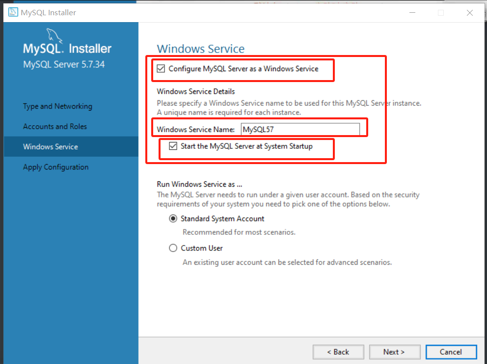

6. 点击excute执行选定配置
   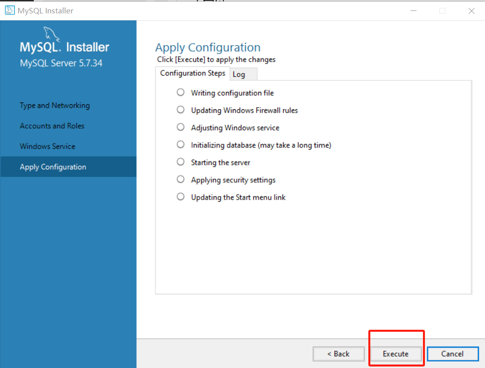

7. 等待执行完毕，点击finish。此时mysql安装成功
   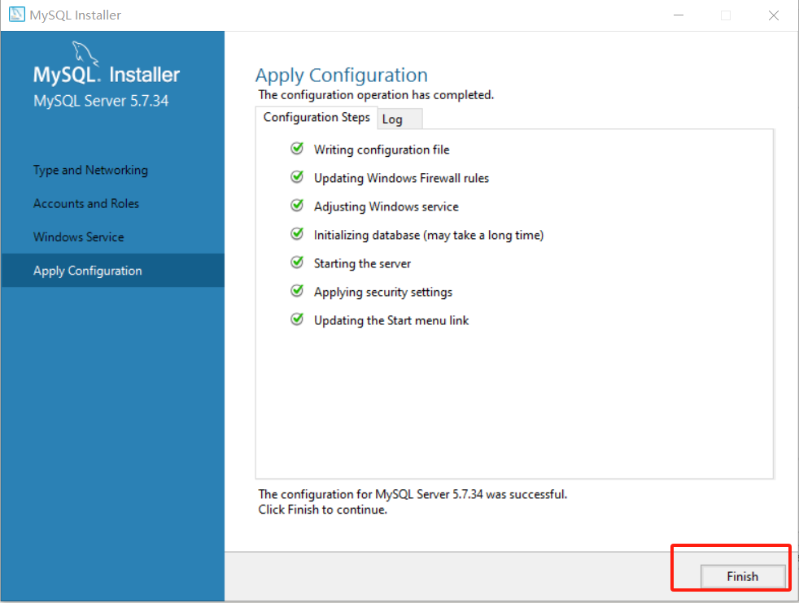

安装Navicat图形化界面并连接mysql

1. 默认已经安装好，现在点击MYSQL进行连接

   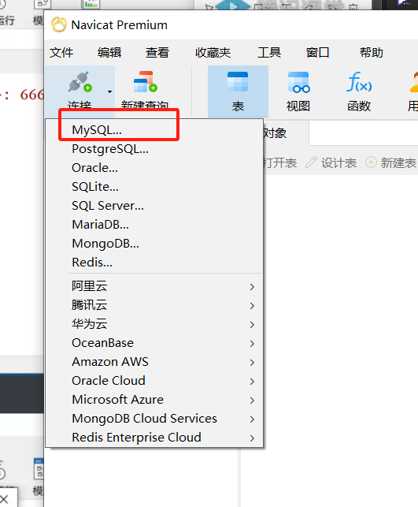

2. Connection Name：自定义，之后会出现在navicat的目录栏；host：localhost【若是本地机器，则这样填】；用户名和密码填mysql的用户名和密码（默认root为最高权限）。

   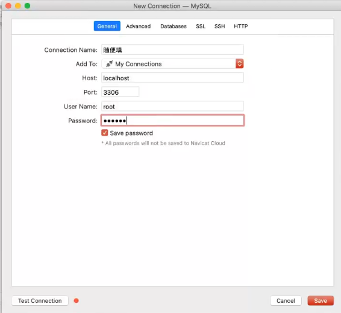

3. 测试连接成功后保存登录

## 使用

### 新建数据库

1. 右键Mysql，新建数据库
   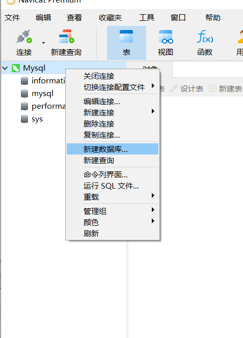

2. 填写数据库名；字符集选择utf8mb4【若选择utf8则有些字符会出错】；排序规则不用填。点确定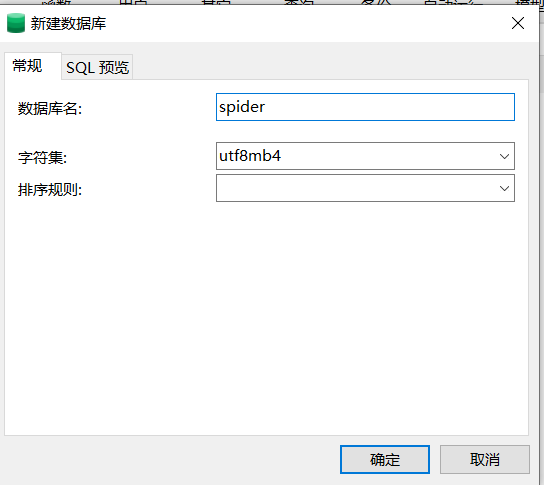

### 新建表

1. 打开名为spider的数据库，在表栏右键-新建表
   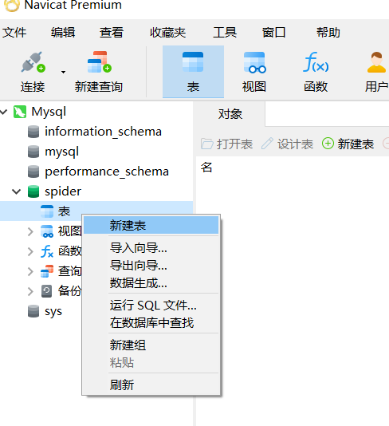

2. 填写表中一列的属性，（名；类型；长度；小数点；不是null；）。【当表中数据为str类型时，在mysql中用varchar表示；当表中数据为日期时，用date表示】【小数点属性：小数点后面的位数】
   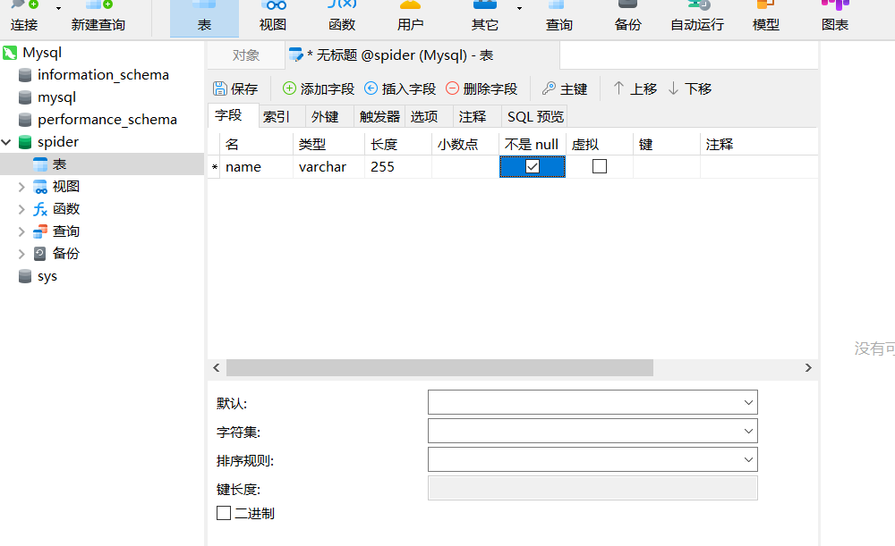

3. 添加字段（添加新一列）
   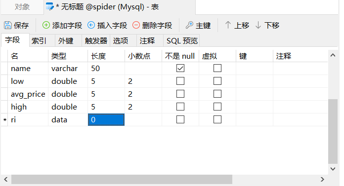

4. 保存（ctrl+s或直接点击保存）
   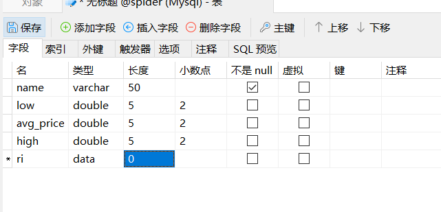