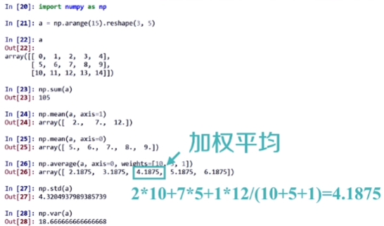
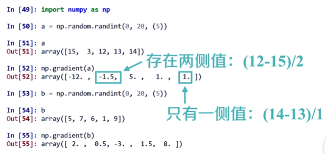
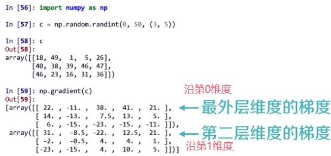
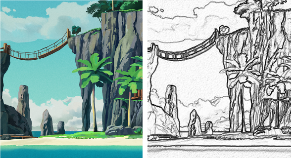
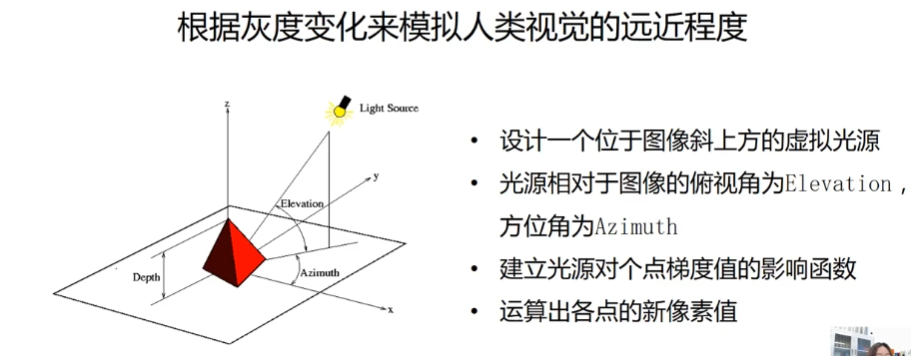
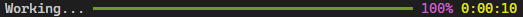
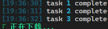

## Numpy

`开源的Python科学计算基础库，SciPy、Pandas等数据处理或科学计算库的基础`

```python
import numpy as np
```

### ndarray属性

| 属性      | 说明                                |
| --------- | ----------------------------------- |
| .ndim     | 轴数量/维度数量                     |
| .shape    | 数据规模                            |
| .size     | 总元素的个数，相当于.shape中n*m的值 |
| .dtype    | 元素类型                            |
| .itemsize | 每个元素的大小，以字节为单位        |

### 元素类型

| 数据类型             | 说明                                               |
| -------------------- | -------------------------------------------------- |
| bool                 | 布尔类型【True/False】                             |
|                      |                                                    |
| intc                 | 与C语言中的int类型一致，一般是int32或int64         |
| intp                 | 用于索引的整数，与C语言中ssize_t一致，int32或int64 |
| int8                 | 字节长度的整数，取值：[-128,127]                   |
| int16                | 16位长度的整数，取值：[-32768,32767]               |
| int32                | 32位长度的整数，取值：[-2^31^, 2^31^-1]            |
| int64                | 64位长度的整数，取值：[-2^63^,2^63^-1]             |
|                      |                                                    |
| uint8                | 8位无符号整数，取值：[0,255]                       |
| uint16               | 16位无符号整数，取值：[0,65535]                    |
| uint32               | 32位无符号整数，取值：[0,2^32^-1]                  |
| uint64               | 64位无符号整数，取值：[0,2^64^-1]                  |
|                      |                                                    |
| float16              | 16位半精度浮点数：1位符号位，5位指数，10位尾数     |
| float32              | 32位半精度浮点数：1位符号位，8位指数，23位尾数     |
| floatt64             | 64位半精度浮点数：1位符号位，11位指数，52位尾数    |
| `复数 = 实部 + 虚部` |                                                    |
| complex64            | 复数类型，实部和虚部都是32位浮点数                 |
| complex128           | 复数类型，实部和虚部都是64位浮点数                 |

### 数组操作

#### 创建数组

##### 通过元素创建

```py
# 通过列表创建
x = np.array([0,1,2,3])

# 通过元组创建
x = np.array((4,5,6,7))

# 通过列表和元组混合创建【列表和元组元素数量相同】
x = np.array([[1,2],[9,8],(1,2)])
```

##### 通过规模创建

| 函数                                          | 说明                                                | 示例                                                         |
| --------------------------------------------- | --------------------------------------------------- | ------------------------------------------------------------ |
| np.arange(n)                                  | 类似range()函数，返回ndarray类型，元元素从0到n-1    |                                                              |
| np.ones(shape)                                | 根据shape生成全1数组，shape为数组形状（元组类型）   |                                                              |
| np.zeros(shape)                               | 根据shape生成全0数组，shape为数组形状（元组类型）   |                                                              |
| np.full(shape,val)                            | 根据shape生成全val数组，shape为数组形状（元组类型） |                                                              |
| np.eye(n)                                     | 创建一个方阵（n*n），对角线为1，其余为0             |                                                              |
|                                               |                                                     |                                                              |
| np.ones_like(a)                               | 根据数组a的形状生成一个全1数组                      |                                                              |
| np.zeros_like(a)                              | 根据数组a的形状生成一个全0数组                      |                                                              |
| np.full_like(a,val)                           | 根据数组a的形状生成一个数组，每个元素值都是val      |                                                              |
|                                               |                                                     |                                                              |
| np.linspace(起始,终止,步长,endpoint=bool类型) | 根据起止数据等间距地填充数据，形成数组              | np.linspace(1,10,4,endpoint=False)<br />从1到10，间距为4<br />endpoint表示停止数据是否是数组中的一个 |
| np.concatennate(tuple类型)                    | 数组合并（两个或多个数组）                          |                                                              |

#### 维度修改

| 函数                      | 说明                                    | 示例                           |
| ------------------------- | --------------------------------------- | ------------------------------ |
| .reshape(shape)           | 新生成一个shape形状的数组（新内存位置） |                                |
| .resize(shape)            | 生成一个shape形状的数组（修改原数组）   |                                |
| .swapaxes(原数组,ax1,ax2) | 将数组n个维度中两个维度进行调换         | 新数组=np.swapaxes(原数组,0,1) |
| .flatten()                | 数组降低维度                            |                                |

#### 元素类型转换

| 函数                  | 说明                           | 示例              |
| --------------------- | ------------------------------ | ----------------- |
| .astype(新的元素类型) | 改变数组元素类型（新内存位置） | .astype(np.float) |

#### 数组->列表

| 函数      | 说明       |
| --------- | ---------- |
| .tolist() | 数组转列表 |

#### 基础运算

| 函数                                                      | 说明                                       |
| --------------------------------------------------------- | ------------------------------------------ |
| + - * / **                                                | 两个数组各元素进行对应运算                 |
| np.maximum(x,y) np.famax()<br />np.minimun(x,y) np.fmin() | 元素级的最大值/最小值计算                  |
| np.mod(x,y)                                               | 元素级的模运算                             |
| np.copysign(x,y)                                          | 将数组y中各元素值的符号赋值给数组x对应元素 |
| > < <= <= == !=                                           | 算术比较，产生布尔型数组                   |

#### 公式运算

| 函数                                                         | 说明                                                         |
| ------------------------------------------------------------ | ------------------------------------------------------------ |
| .mean()                                                      | 求数组元素的均值                                             |
| np.abs(x)<br />np.fabs(x)                                    | 计算数组各元素的绝对值<br />float类型数组元素的绝对值        |
| np.sqrt(x)                                                   | 计算数组各元素的平方根                                       |
| np.square(x)                                                 | 计算数组各元素的平方                                         |
| np.log(x)<br />np.log10(x)<br />np.log2(x)                   | 计算数组各元素的自然对数<br />10底对数<br />2底对数          |
| np.ceil(x)<br />np.floor(x)                                  | 计算数组各元素的ceiling值（不超过元素的整数值）<br />计算数组各元素的floor值（小于元素的最大整数值） |
| np.rint(x)                                                   | 计算数组各元素的四舍五入值                                   |
| np.modf(x)                                                   | 将数组各元素的小数和整数部分以两个独立数组形式返回           |
| np.cos(x) np.cosh(x)<br />np.sin(x) np.sinh(x)<br />np.tan(x) np.tanh(x) | 计算数组各元素的普通型和双曲型三角函数                       |
| np.exp(x)                                                    | 计算数组各元素的指数值                                       |
| np.sign(x)                                                   | 计算数组各元素的符号值，1(+),0,-1(-)                         |

### 数据读写

#### 一、二维

```py
np.savetxt(frame,array,fmt='%.18e',delimiter=None)
np.loadtxt(frame,dtype=np.float,delimiter=None,unpack=False)
# 举例：
np.savetxt('a.csv',a,fmt='%d',delimiter=',')
b = np.loadtxt('a.csv',dtype=np.int,delimiter=',')
```

- frame：文件、字符串或产生器，可以是.gz或.bz2的压缩文件。
- array：要存入的数组。
- fmt：写入格式。如：%d %.2f %.18e。
- delimiter：分割字符串，默认是任何空格。
- frame：文件、字符串或产生器，可以是.gz或.bz2的压缩文件。
- dtype：数据类型，可选。
- delimiter：分割字符串，默认是任何空格。
- unpack：如果True，读入属性将分别写入不同变量。

#### 多维

`读取时需要重新赋值维度规模，所以a.tofile()和np.fromfile()需要配合使用可以通过元数据文件来存储额外信息`

```py
a.tofile(frame,sep='',format='%s')
np.fromfile(frame,dtype=float,count=-1,sep='')
# 举例：
a.tofile('b.dat',sep=',',format='%d')
c = np.fromfile('b.dat',dtype=np.int，sep='').reshape(5,10,2)
```

- frame:文件、字符串。
- sep:数据分割字符串【如果不赋值sep参数，写入文件为二进制】。
- format:写入数据的格式。
- frame:文件、字符串。
- dtype:读取的数据类型。
- count:读入元素个数，-1表示读入整个文件。
- sep:数据分割字符串【如果不赋值sep参数，写入文件为二进制】。
- ==.reshape(5,10,2)==：多维数据取出来是一维数组，需要变换维度

#### 内置存取函数

`原理：存入时：元信息（数据维度信息）写入头行；数据以二进制形式写入其他行`

```py
np.save(frame,array)
np.savez(frame,array)
np.load(frame)
# 举例：
np.save('a.npy',a)
b = np.load('a.npy')
```

- frame:文件名，以.npy为扩展名，压缩扩展名为.npz
- array:数组数量
- frame:文件名，以.npy为扩展名，压缩扩展名为.npz

### 随机数

```py
np.random.*
```

**函数**

| 函数                     | 说明                                                         | 示例                                 |
| ------------------------ | ------------------------------------------------------------ | ------------------------------------ |
| rand(shape)              | [0,1)均匀分布的随机数数组                                    | a = np.random.rand(3,4,5)            |
| randn(shape)             | 标准正态分布的随机数数组                                     | a = np.random.randn(3,4,5)           |
|                          |                                                              |                                      |
| randint(low,high,shape]) | 指定范围（[low,high]）和shape创建随机整数或整数数组          | b = np.random.randint(100,200,(3,4)) |
| uniform(low,high,size)   | 均匀分布的数组。low起始值，size结束值，size形状              | u = np.random.uniform(0,10,(3,4))    |
| normal(loc,scale,size)   | 正态分布的数组。loc均值，scale标准差，size形状               | n = np.random.normal(10,5,(3,4))     |
| poisson(lam,size)        | 泊松分布的的数组。lam随机事件发生率，size形状                |                                      |
|                          |                                                              |                                      |
| seed(s)                  | ==随机数种子==，s是给定的种子值【设定种子后使用随机数函数产生的随机数数组相同】 | np.random.seed(10)                   |

**打乱数组和抽取元素**

| 函数                     | 说明                                                         | 示例                                                         |
| ------------------------ | ------------------------------------------------------------ | ------------------------------------------------------------ |
| shuffle(a)               | 随机打乱【原内存】                                           |                                                              |
| permutation(a)           | 随机打乱【新内存】                                           |                                                              |
|                          |                                                              |                                                              |
| choice(a,size,replace,p) | 从一维数组a中以概率p抽取元素，形成size形状新数组，replace表示是否允许重复选择元素（默认为True） | np.random.choice(b,(3,2),replace=False,p=b/np.sum(b))<br />（这里的概率p设定为数值越大概率越高） |

### 统计类

`能对数组中的信息进行统计运算的函数`

```py
np.*
```

#### 统计函数（1）

##### 参数解析

- axis=0：沿着第0维度

- axis=1：沿着第1维度

- weights：权重
  

##### 函数解析

| 函数                              | 说明       |
| --------------------------------- | ---------- |
| sum(a,axis=None)                  | 元素和     |
| mean(a,axis=None)                 | 期望       |
| average(a,axis=None,weights=None) | 加权平均值 |
| std(a,axis=None)                  | 标准差     |
| var(a,axis=None)                  | 方差       |

#### 统计函数（2）

| 函数                       | 说明                                           |
| -------------------------- | ---------------------------------------------- |
| .min(a)<br />.max(a)       | 最小值、最大值                                 |
| .argmin(a)<br />.argmax()  | 最小值一维化后的索引<br />最大值一维化后的索引 |
| ptp(a)                     | 求最大值与最小值的差                           |
| median(a)                  | 求中位数（中值）【浮点数】                     |
|                            |                                                |
| unravel_index(index,shape) | 根据索引和shape求多维索引                      |

**举例：**

```py
np.unravel_index(一维索引值, shape值)		# 多维索引
>> (3, 5)
```

### 求梯度

`梯度：连续值之间的变化率，即斜率`

| 函数           | 说明                                                 |
| -------------- | ---------------------------------------------------- |
| np.gradient(f) | 计算数组f中元素的梯度，当f为多维时，返回每个维度梯度 |

#### 一维数组梯度计算规律

- 只有一侧值：(后一个 - 前一个)/1
- 存在两侧值：(当前值后一个 - 当前值前一个)/2



#### 二维数组梯度计算规律

>  数组元素有多少个维度，就生成多少个梯度数组



## torch

[PyTorch 文档 — PyTorch 2.4 文档 - PyTorch 中文](https://pytorch.ac.cn/docs/2.4/)

### 导入库解析

```py
import numpy as np      # 基本运算
import pandas as pd     # 数据处理
from sklearn import preprocessing   # 预处理模块

import torch	# 基本库
import torch.nn as nn	# 序列化、线性函数、激活函数、损失函数
import torch.optim as optim		# 优化器
import torch.nn.functional as F		# 各种函数（初级使用）

from torchvision import datasets,transforms,datasets		# 1.构建数据集，内置有数据集；2.预处理操作（如：数据增强）；3.数据集构建函数
from torch.utils.data import TensorDataset	# 数据集
from torch.utils.data import DataLoader		# 数据加载器

import warnings
warnings.filterwarnings("ignore")   # 过滤因为版本不同产生的警告

import matplotlib.pyplot as plt		# 画图
%matplotlib inline
```

### list-ndarray-tensor转换

```py
# list
target.tolist()

# torch
torch.from_numpy(target)
torch.tensor(target)

# numpy
target.numpy()
target.data.numpy()		# .data：创建一个不需要梯度的tensor副本
target.detach.numpy()	# 新版本使用.detach来代替.data
```

### 模型计算顺序

0. 特征放入模型初始化
1. 梯度清零【防止梯度累积】
2. 计算损失
3. 反向传播【利用损失计算梯度】
4. 更新参数【利用梯度更新参数；参数 = 参数 - 学习率 * 梯度】

### Dataset

在PyTorch中，数据集（Dataset）可以分为两大类：可迭代式数据集（Iterable Dataset）和字典型数据集（Map-style Dataset）。这两种数据集在如何访问数据方面有所不同。

#### 字典型数据集

（Map-style Dataset）最常见的数据集类型，{索引：样本}。多数内置数据集都是这种类型，如`torchvision.datasets.MNIST`。

- 适用：可以随机访问数据集中的任何样本

#### 可迭代式数据集

（Iterable Dataset）通过迭代来访问数据。

- 适用：大型数据集、数据没有明确索引。

#### 示例

##### 字典型数据集示例

需要继承``torch.utils.data.Dataset`类，实现`__len__`和`__getitem__`方法

```python
class FlowerDataset(Dataset):
    def __init__(self, root_dir, ann_file, transform=None):
        self.root_dir = root_dir
        self.ann_file = ann_file
        # 图像名、标签
        self.filenames_labels = self.load_annotations()
        # 列表：图像全路径、标签
        self.filenames = [os.path.join(self.root_dir,filename) for filename in list(self.filenames_labels.keys())]
        self.labels = [label for label in list(self.filenames_labels.values())]
        # 定义预处理
        self.transform = transform
 
    def __len__(self):
        # 数据个数
        return len(self.filenames)
 
    def __getitem__(self, idx):
        # 每个batch会：执行batch_size次getitem函数。
        # 参数：随机传入的idx
        image = Image.open(self.filenames[idx])
        label = self.labels[idx]

        if self.transform:
            image = self.transform(image)
        label = torch.from_numpy(np.array(label))
        
        return image, label
    def load_annotations(self):
        filenames_labels = {}
        with open(self.ann_file) as f:
            items = [x.strip().split(' ') for x in f.readlines()]
            for filename, label in items:
                filenames_labels[filename] = np.array(label, dtype=np.int64)
        return filenames_labels
```

##### 可迭代式数据集示例

需要继承`torch.utils.data.IterableDataset`类，并实现`__iter__`方法。

```python
from torch.utils.data import IterableDataset

class MyIterableDataset(IterableDataset):
    def __init__(self, size):
        self.size = size

    def __iter__(self):
        for i in range(self.size):
            yield i, f'Sample {i}'

# 创建数据集实例
iterable_dataset = MyIterableDataset(size=5)

# 迭代数据集
for data in iterable_dataset:
    print(data)
```

在这个例子中，`MyIterableDataset`是一个简单的可迭代式数据集，每次迭代返回一个索引和对应的字符串。

### DataLoader

批量加载数据，可选择是否打乱数据、多线程加载。

```python
from torch.utils.data import DataLoader

# 使用DataLoader
data_loader = DataLoader(dataset, batch_size=32, shuffle=True)

# 迭代DataLoader
for images, labels in data_loader:
    print(images.shape, labels.shape)
```

==注意==：可迭代式数据集的`DataLoader`的`shuffle`参数通常没效果，因为它不能随机访问。

### 输出图片shape大小公式

- 输入大小为(H,W)
  - 滤波器大小（kernel_size）：(FH,FW)
  - 填充（padding）：P
  - 步幅（stride）：S

- 输出大小为(OH,OW)

$$
\begin{aligned}&OH=\frac{H+2P-FH}{S}+1\\&OW=\frac{W+2P-FW}{S}+1\end{aligned}
$$

==注意：==所设定的值必须使得这两个公式可以除尽（有的框架当无法除尽会进行四舍五入/向下取整不报错，但需要采取措施进行报错）

### 随机数种子

```py
np.random.seed(1)
torch.manual_seed(1)
torch.cuda.manual_seed_all(1)
torch.backends.cudnn.deterministic = True  # 保证每次结果一样
```

### 训练输出样式

```py
from rich.progress import track
from rich import print

for batch_idx,(data,labels) in track(enumerate(train_loader),description=f"💪 [green]Training：Epoch {epoch}[green]",total=len(train_loader)):

    print(f'Step:{100.*batch_idx/len(train_loader):.2f}%\tLoss: {loss.data:.6f}\tTrain_accurary: {100. * train_r[0].numpy() / train_r[1]:.2f}%\tTest_accurary: {100. * val_r[0].numpy() / val_r[1]:.2f}%')

```

## PIL

`一个具有强大图像处理能力的第三方库`
`图像值类型为 uint8`

```py
pip install pillow
from PIL import Image
# 一个Image类代表一个图像
```

### 介绍

**图像：**

`RGB三个（字节）颜色通道的变化和叠加得到各种颜色（包括了人类实例能感知的所有颜色）。R、G、B的取值范围：0-255`

| 函数                               | 说明                                   |
| ---------------------------------- | -------------------------------------- |
| Image.open(图像路径)               | 导入图片                               |
| Image.open(图像路径).convert('L')  | 转换灰度图（转换后再转数组为二维数组） |
| np.array(Image对象)                | 图像转数组                             |
| Image.fromarray(b.astype('uint8')) | 将数组转换为图像                       |
| Image对象.save(保存图像路径)       | 图像保存                               |

### **实例：**

```py
a = np.array(Image.open(r'C:\Users\19124\Desktop\微信图片_20240726180520.png').convert('L'))
print(a.shape,a.dtype)
print(a)
```

> 图像数值值变换（利用广播机制自动扩充 规模和值）

```py
# b = 255 - a   # 取补值
# b = (100/255)*a + 150   # 区间变换
b = 255 * (a/255)**2    # 像素平方
```

```py
im = Image.fromarray(b.astype('uint8')) # 还原回图像
im.save('test.png')
```

### 手绘效果示例

> 手绘效果几个特征
>
> - 黑白灰色
> - 边界线条较重
> - 相同或相近色彩趋于白色
> - 略有光源效果



**手绘风格是在对图像进行灰度化的基础上，由立体效果和明暗效果叠加而成：**

1. 明暗效果
   1. 灰度：代表图像明暗变化
   2. 梯度值：灰度变化率
2. 立体效果
   `通过添加虚拟深度值实现`



```py
from PIL import Image
import numpy as np

'''
图像手绘风格处理
手绘风格是在对图像进行灰度化的基础上，由立体效果和明暗效果叠加而成
> 明暗效果：
>> 灰度：代表图像明暗变化
>> 梯度值：灰度变化率
>> 可通过调整梯度值间接改变图像的明暗程度
> 立体效果通过添加虚拟深度值实现
'''
path = r'C:\Users\19124\Desktop\微信图片_20240726180520.png'
a = np.asarray(Image.open(path).convert('L')).astype('float')

depth = 10.  # 预设深度值为10，取值范围：(0-100)
grad = np.gradient(a)  # 取图像灰度的梯度值
grad_x, grad_y = grad  # 分别取横纵图像（x、y方向）梯度值

# 添加深度对梯度的影响因素，【depth/100. 深度值归一化】
grad_x = grad_x * depth / 100.
grad_y = grad_y * depth / 100.

A = np.sqrt(grad_x ** 2 + grad_y ** 2 + 1.)     # 构造x、y轴梯度的三维归一化单位坐标系
uni_x = grad_x / A
uni_y = grad_y / A
uni_z = 1. / A

vec_el = np.pi / 2.2  # 光源的俯视角度，弧度值
vec_az = np.pi / 4.  # 光源的方位角度，弧度值
dx = np.cos(vec_el) * np.cos(vec_az)  # 光源对 x 轴的影响程度  np.cos(vec_az)为单位光线在地平面上的投影长度
dy = np.cos(vec_el) * np.sin(vec_az)  # 光源对 y 轴的影响程度
dz = np.sin(vec_el)                   # 光源对 z 轴的影响程度

b = 255 * (dx * uni_x + dy * uni_y + dz * uni_z)  # 梯度与光源相互作用，将梯度转换为灰度。光源归一化

b = b.clip(0, 255)  # 避免改变数值后，图像数据越界，将生成的灰度值裁剪至0-255区间

im = Image.fromarray(b.astype('uint8'))  # 生成图像
im.save('test.jpg')
```

## Matplotlib

`数据可视化第三方库，由各种可视化类构成，内部结构复杂`
`官方文档：https://matplotlib.org/stable/index.html`

```py
# pyplot：绘制可视化图形的命令子库
import matplotlib.pyplot as plt
# 将画出的图嵌入到notebook
%matplotlib inline
```

### 中文-负号

**中文**

| 函数                                                         | 说明                                                         |
| ------------------------------------------------------------ | ------------------------------------------------------------ |
| matplotlib.rcParams['font.family']='SimHei'<br />matplotlib.rcParams['font.style']='normal'<br />matplotlib.rcParams['font.size']='large' | 设置显示字体名字<br />字体风格，正常'normal'或斜体'italic'<br />字体大小，整数字号或者'large'、'x-small' |

| 中文字体 | 说明     |
| -------- | -------- |
| SimHei   | 中文黑体 |
| Kaiti    | 中文楷体 |
| LiSu     | 中文隶书 |
| FangSong | 中文仿宋 |
| YouYuan  | 中文幼圆 |
| STSong   | 华文宋体 |

> 法一：
>
> 改变全局字体为中文字体
>
> ```py
> import matplotlib
> 
> matplotlib.rcParams['font.family'] = 'STSong'
> matplotlib.rcParams['font.size'] = 20
> ```
>
> 法二（推荐）：
>
> 在有中文输出的地方，增加 fontproperties 属性
>
> ```py
> plt.xlabel('横轴：时间', fontproperties='SimHei', fontsize=20)
> plt.ylabel('纵轴：振幅', fontproperties='SimHei', fontsize=20)
> ```

**负号**

```py
plt.rcParams['axes.unicode_minus'] = False
```


### 函数解析

#### plot()-画图

```py
.plot(x,y,format_string,**kwargs)
"""
- x：X轴数据，列表或数组，可选。
- y：Y轴数据，列表或数组。
- format_string：控制曲线的格式字符串，可选。
- **kwargs：第二组或更多(x,y,format_string)
""" 
```

##### 线条样式

`控制曲线的格式字符串，由 颜色字符、风格字符、标记字符 组成。`

| 颜色字符  | 说明        | 颜色字符 | 说明           |
| --------- | ----------- | -------- | -------------- |
| 'b'       | 蓝色        | 'm'      | 洋红色 magenta |
| 'g'       | 绿色        | 'y'      | 黄色           |
| 'r'       | 红色        | 'k'      | 黑色           |
| 'c'       | 青绿色 cyan | 'w'      | 白色           |
| '#008000' | RGB某颜色   | '0.8'    | 灰度值字符串   |

| 风格字符 | 说明                     |
| -------- | ------------------------ |
| '-'      | 实线                     |
| '--'     | 破折线                   |
| '-.'     | 点划线                   |
| ':'      | 虚线                     |
| '' ' '   | 无线条（空或空格来表示） |

| 标记字符 | 说明               | 标记字符 | 说明         | 标记字符 | 说明         |
| -------- | ------------------ | -------- | ------------ | -------- | ------------ |
| '.'      | 点标记             | '1'      | 下花三角标记 | 'h'      | 竖六边形标记 |
| ','      | 像素标记（极小点） | '2'      | 上花三角标记 | 'H'      | 横六边形标记 |
| 'o'      | 实心圈标记         | '3'      | 左花三角标记 | '+'      | 十字标记     |
| 'v'      | 倒三角标记         | '4'      | 右花三角标记 | 'x'      | x标记        |
| '^'      | 上三角标记         | 's'      | 实心方形标记 | 'D'      | 菱形标记     |
| '>'      | 右三角标记         | 'p'      | 实心五角标记 | 'd'      | 瘦菱形标记   |
| '<'      | 左三角标记         | '*'      | 星形标记     | '\|'     | 垂直线标记   |

##### 其他参数

- color：控制颜色，color='green'
- linestyle：线条风格，linestyle='dashed'
- marker：标记风格，marker='o'
- markerfacecolor：标记尺寸，markersize=20
- ...

#### label-轴标签

```py
.xlabel("x轴标签")
.ylabel("y轴标签")
```


#### axis-轴范围

```py
.axis([x轴范围起始,x轴范围停止,y轴范围起始,y轴范围停止])
```


#### grid-网格

```py
.grid(True)
```


#### show/savefig-展示/保存

```py
.show()
.savefig(图片名,dpi=值)		# 默认png格式，dpi：每一寸空间保存点的数量
```

#### 标题

```py
.title()
```

#### 文本

```py
.text()
```

#### 带箭头的注释

```py
.annotate(
    r'$\mu=100$',	# 公式
    xy=(2,1),		# 箭头呈现位置
    xytext=(3,1.5),	# 公式呈现位置
    arrowprops=dict(
        facecolor='black',	# 箭头颜色
        shrink=0.1,			# 箭头两端缩进
        width=12			# 箭头粗细
    ))
```

#### 子绘图区域

`设定网格，选中网格，确定选中行列区域数量，编号从0开始`

```py
"""
fig   # 控制整个图形的属性
((ax1, ax2), (ax3, ax4))  # 子图
figsize = (宽,高)     # 整个图形的大小
"""
fig, ((ax1, ax2), (ax3, ax4)) = plt.subplots(nrows=2, ncols=2, figsize = (10,10))
fig.autofmt_xdate(rotation=45)

ax1.plot(dates,dataframe['actual'])
ax1.set_xlabel(''); ax1.set_ylabel('Temperature'); ax1.set_title('Max Temp')
# 昨天
ax2.plot(dates,dataframe['temp_1'])
ax2.set_xlabel(''); ax1.set_ylabel('Temperature'); ax2.set_title('Previous Max Temp')
# 前天
ax3.plot(dates,dataframe['temp_2'])
ax3.set_xlabel('date'); ax1.set_ylabel('Temperature'); ax3.set_title('Two Days prior Max Temp')
# 朋友预测
ax4.plot(dates,dataframe['friend'])
ax4.set_xlabel('date'); ax1.set_ylabel('Temperature'); ax4.set_title('Friend Estimate')

plt.tight_layout(pad=2)
# 自动调整子图大小，使得标签和标题不会重叠
# pad：子图之间的填充量
```


```py
plt.subplot(nrows,ncols,plot_number)
# 纵向区域数,横向区域数,当前区域编号分割图像放置区域
plt.subplot(3,2,4)
```

##### 法一：

| 函数                                                   | 说明       |
| ------------------------------------------------------ | ---------- |
| plt.subplot2grid(GridSpec=,CurSpec=,colspan=,rowspan=) | 划定子区域 |

**参数解析：**

- GridSpec：区域划分
- CurSpec：当前区域位置
- colspan：向后扩列长度
- rowspan：向下扩行长度

```py
plt.subplot2grid((3, 3), (0, 0), colspan=3) 
# 当前区域绘图代码行...
plt.subplot2grid((3, 3), (1, 0), colspan=2) 
# 当前区域绘图代码行...
plt.subplot2grid((3, 3), (1, 2), rowspan=2)
# 当前区域绘图代码行...
plt.subplot2grid((3, 3), (2, 0))
# 当前区域绘图代码行...
plt.subplot2grid((3, 3), (2, 1))
# 当前区域绘图代码行...
```

##### 法二（推荐使用）：

```py
import matplotlib.gridspec as gridspec
```

```py
# 划定子区域数量
gs = gridspec.GridSpec(3, 3)
# 划分区域ax1	示例：[0, :]【0行，所有列】
ax1 = plt.subplot(gs[0, :])
# 划分区域ax2
ax2 = plt.subplot(gs[1, :-1])
# 划分区域ax3
ax3 = plt.subplot(gs[1:, -1])
# 划分区域ax4
ax4 = plt.subplot(gs[2, 0])
# 划分区域ax5
ax5 = plt.subplot(gs[2, 1])
```

### 各种图表

| 函数                                | 说明                         |
| ----------------------------------- | ---------------------------- |
| plt.plot(x,y,fmt,...)               | 绘制一个坐标图               |
| plt.boxplot(data,notch,position)    | 绘制一个箱图                 |
| plt.bar(left,height,width,bottom)   | 绘制一个条形图               |
| plt.barch(width,bottom,left,height) | 绘制一个横向条形图           |
| plt.polor(theta,r)                  | 绘制极坐标图                 |
| plt.pie(data,explode)               | 绘制饼图                     |
| plt.psd(x,NFFT=256,pad_to,Fs)       | 绘制功率谱密度图             |
| plt.specgram(x,NFFT=256,pad_to,F)   | 绘制谱图                     |
| plt.cohere(x,y,NFFT=256,Fs)         | 绘制X-Y的相关性函数          |
| plt.scatter(x,y)                    | 绘制散点图，其中x和y长度相同 |
| plt.step(x,y,where)                 | 绘制步阶图                   |
| plt.hist(x,bins,normed)             | 绘制直方图                   |
| plt.contour(X,Y,Z,N)                | 绘制等值图                   |
| plt.vlines()                        | 绘制垂直图                   |
| plt.stem(x,y,linefmt,markerfmt)     | 绘制柴火图                   |
| plt.plot_date()                     | 绘制数据日期                 |

#### 饼图

```py
import matplotlib.pyplot as plt

label = 'Frigs', 'Hogs', 'Dogs', 'Logs'
sizes = [15, 30, 45, 10]        # 标签尺寸
explode = [0, 0.1, 0, 0]        # 标签饼突出距离
plt.pie(sizes, explode=explode, labels=label, autopct='%1.1f%%',
        shadow=False, startangle=90)
# 参数解析：
# autopct：中间显示百分数的方式；
# shadow：是否饼图要带有阴影；
# startangle：饼图起始角度大小

plt.axis('equal')       # 饼图正方形显示[x、y方向尺寸相等]

plt.show()
```

#### 直方图

```py
import matplotlib.pyplot as plt
import numpy as np

np.random.seed(0)
mu, sigma = 100, 20  # 均值和标准差
a = np.random.normal(mu, sigma, 100)

# plt.hist(a, 20, normed=True, histtype='stepfilled', facecolor='b', alpha=0.75)
# (已弃用)normed：直方出现的个数归一化为出现的概率【若normed=0则为直方出现的个数】

plt.hist(a, bins=10, density=1, histtype='stepfilled', facecolor='b', alpha=0.75)
# 参数解析：
# bins：直方的个数（直方图被划分为多少个相等宽度的区间）
# density：直方出现的个数归一化为出现的概率【若density=0则为直方出现的个数】
plt.title('Histogram')
plt.show()
```

#### 极坐标

```py
import matplotlib.pyplot as plt
import numpy as np

N = 20  # 绘制极坐标图中数据的个数
theta = np.linspace(0.0, 2 * np.pi, N, endpoint=False)  # 按照个数从360°（2Π）等分出不同的角度
radii = 10 * np.random.rand(N)  # 生成每个角度对应的值
width = np.pi / 4 * np.random.rand(N)   # 生成宽度值

# 面向对象方法
ax = plt.subplot(111, projection='polar')
# 参数解析：
# projection='polar'：表示绘制极坐标图
bars = ax.bar(theta, radii, width=width, bottom=0.0)
# 参数解析（分别对应极坐标的三个参数）：
# theta：left（扇形开始绘图的位置）
# radii：height（扇形长度）
# width：width（扇形面积，单位（°））

for r, bar in zip(radii, bars):
    bar.set_facecolor(plt.cm.viridis(r / 10.))
    bar.set_alpha(0.5)

plt.show()
```

#### 散点图

> 面向对象方法
>
> ```py
> import matplotlib.pyplot as plt
> import numpy as np
> 
> 
> # 创建一个图形对象fig和一个坐标轴对象ax
> fig, ax = plt.subplots()
> # 生成100个随机数，每个数乘以10，然后绘制散点图
> # np.random.randn(100)生成100个标准正态分布的随机数
> # 'o'表示点的形状
> ax.plot(10 * np.random.randn(100), 10 * np.random.randn(100), 'o')
> ax.set_title('Simple Scatter')
> 
> plt.show()
> ```
>

#### 引力波的绘制【实例】

`引力波：由于时空弯曲对外以辐射形式传播的能量`

> **引力波文件：**
>
> http://python123.io/dv/grawave.html
> http://python123.io/dv/H1_Strain.wav
> http://python123.io/dv/L1_Strain.wav
> http://python123.io/dv/wf_template.txt

```py
import sys

import matplotlib.pyplot as plt
import numpy as np
from scipy.io import wavfile

# 1.从配置文档读取事件相关数据
rate_h, hstrain = wavfile.read(r"H1_Strain.wav", "rb")
# 来自 LPCM WAV 文件的采样率（以 samplessec 为单位）和数据
rate_l, lstrain = wavfile.read(r"L1_Strain.wav", "rb")
# reftime, ref_H1 = np.genfromtxt('GW150914_4_NR_waveform_template.txt').transpose()
reftime, ref_H1 = np.genfromtxt('wf_template.txt').transpose()
# np.genfromtxt：执行两个运算循环（1.文件的每一行转换为字符串序列2.字符串序列转换为相应的数据类型）
# .transpose()：转置【这里是为了方便数据读取】
# reftime：时间序列
# ref_H1：信号的数据

# 2.对rate求倒数得到波形的时间间隔
htime_interval = 1 / rate_h
ltime_interval = 1 / rate_l

# hstrain：数据矩阵
# .shape(0)：读取矩阵第一维度长度（数据点个数）
# /rate_h：得到函数在坐标轴上的总长度
htime_len = hstrain.shape[0] / rate_h

# 为绘制以零点为中心对称的图像。-len/2为起点，len/2为终点，time_interval为时间间隔。创造时间序列htime
htime = np.arange(-htime_len / 2, htime_len / 2, htime_interval)

ltime_len = lstrain.shape[0] / rate_l
ltime = np.arange(-ltime_len / 2, ltime_len / 2, ltime_interval)

# 绘制H1 Strain，使用来自“H1”探测器的数据作图
fig = plt.figure(figsize=(12, 6))  # 创建一个12*6的绘图空间

plth = fig.add_subplot(221)
plth.plot(htime, hstrain, 'y')      # 时间为x轴，应变数据为y轴，黄色
plth.set_xlabel('Time (seconds)')   # x轴标签
plth.set_ylabel('H1 Strain')        # y轴标签
plth.set_title('H1 Strain')

pltl = fig.add_subplot(222)
pltl.plot(ltime, lstrain, 'g')
pltl.set_xlabel('Time (seconds)')
pltl.set_ylabel('L1 Strain')
pltl.set_title('L1 Strain')

pltref = fig.add_subplot(212)
pltref.plot(reftime, ref_H1)
pltref.set_xlabel('Time (seconds)')
pltref.set_ylabel('Template Strain')
pltref.set_title('Template')

fig.tight_layout()  # 自动调整图像外部边缘
plt.savefig('Gravitational_Waves_Original.png')
plt.show()
plt.close(fig)
```

## Pandas

`基于numpy的数据类型，高性能、易用数据类型和分析工具`
`http://pandas.pydata.org/`

```py
import pandas as pd

.head(n)	# 查看前n个(不填默认前五个)
```

### 数据类型

#### Series【一维】

`由一组数据及其相关的数据索引组成`

##### 定义列名

```py
b.index.name = '索引列'    # 索引列名
b.name = 'Series对象'     # 数据列名
```

##### 创建数组

```py
pd.Series(data=None,index=None)
```

- 从标量创建

> ```py
>pd.Series(25,index=['a','b','c'])
> ```
> 

- 从列表创建

> ```py
>pd.Series([1,2,3,4,5])
> ```
> 

- 从字典创建

> ```py
>pd.Series({'a':9,'b':8,'c':7})
> ```
> 
> > 通过索引改变Series位置
>>
> > ```py
>> pd.Series({'a':9,'b':8,'c':7},index=['c','a','b','d'])
> > ```
> 

- 从ndarray类型创建

> ```py
>pd.Series(np.arange(5))
> ```
> 
> > 通过索引改变Series位置
>>
> > ```py
>> pd.Series(np.arange(5),index=np.arange(9,4,-1))
> > ```
> 

- 从其他函数创建

> ```py
># 使用range(20)举例
> n = pd.Series(range(20))
> ```

##### 运算

| 函数                                                         | 说明             | 示例                                                         |
| ------------------------------------------------------------ | ---------------- | ------------------------------------------------------------ |
| .index                                                       | 获得索引         |                                                              |
| .values                                                      | 获得数据         |                                                              |
| Series类型[自动索引]<br />Series类型[自定义索引]<br />Series类型[索引列表] | 通过索引访问数据 | b['b']<br />b[1]<br />b[['c','d','b']]<br />b[[2,4,1,3,0]]<br /># 自动和自定义索引共存，但不能混用 |

> 切片
>
> ```py
> b[:3]
> ```
>
> 保留字 in
>
> ```py
> # 判断是否在索引列表中（类似于字典键列表中）【只判断自定义索引】
> 'c' in b
> ```
>
> get方法
>
> ```py
> # 提取索引为 f 的值（如果值不存在，则返回100）
> b.get('f',100)
> ```
>
> NumPy操作应用
>
> ```py
> b[b > b.median()]	# 大于中位数的数据
> np.exp(b)			# 指数化
> ```

**加法运算：**

`取交集，交集中相同元素进行相加`

```py
a = pd.Series([1,2,3],['c','d','e'])
b = pd.Series([9,8,7,6],['a','b','c','d'])
a + b
```

#### DataFrame【二维】

`二维带“标签”数组`

##### 创建

> 从二维ndarray对象创建
>
> ```py
> pd.DataFrame(np.arange(10).reshape(2,5))
> ```
>
> 从一维ndarray、列表、字典、元组或Series构成的字典创建
>
> ```py
> # 一维ndarray
> pd.DataFrame(dt,index=['b','c','d'],columns=['two','three'])
> # 字典、列表、series
> dt = {
>     'one':pd.Series([1,2,3],index=['a','b','c']),
>     'two':pd.Series([9,8,7,6],index=['a','b','c','d'])
> }
> dl = {'one':[1,2,3,4],'two':[9,8,7,6]}
> pd.DataFrame(dt)
> pd.DataFrame(dl)
> ```

##### 访问数据

| 函数             | 说明         |
| ---------------- | ------------ |
| d.index          | 求所有索引   |
| d.columns        | 求所有标签   |
| d.values         | 求所有值     |
| d['同比']        | 求一列数据   |
| d.loc['c2']      | 索引一行数据 |
| d['同比'] ['c2'] | 求某行某列   |

### 数据类型操作

#### 索引-方法

| 函数               | 说明                             |
| ------------------ | -------------------------------- |
| .append(idx)       | 合并Index对象，产生新的Index对象 |
| .diff(idx)         | 计算差集，产生新的Index对象      |
| .intersection(idx) | 计算交集                         |
| .union(idx)        | 计算并集                         |
| .delete(loc)       | 删除loc位置处的元素              |
| .insert(loc,e)     | 在loc位置增加一个元素e           |
| .drop(idx,axis)    | 通过索引删除 行/列               |

**实例：**

```py
# 增加
nc = d.columns.delete(2)
ni = d.index.insert(5,'c0')
nd = d.reindex(index=ni,columns=nc)
nd
# 删除
d.drop('c5')	# 默认操作0轴上的元素（列上的元素）
d.drop('同比',axis=1)
```

#### 重新索引

```py
.reindex(index=None,columns=None,...)
```

| 参数          | 说明                                            | 示例                                                         |
| ------------- | ----------------------------------------------- | ------------------------------------------------------------ |
| index,columns | 新的行列自定义索引                              | d.reindex(index=['c5','c4','c3','c2','c1'])<br />d.reindex(columns=['城市','同比','环比','定基']) |
| fill_value    | 重新索引中，用于填充确实位置的值                |                                                              |
| method        | 填充方法，ffill当前值向前填充，bfill向后填充    |                                                              |
| limit         | 最大填充量                                      |                                                              |
| copy          | 默认True，生成新的对象；False时，新旧相等不复制 |                                                              |

### 数据类型运算

#### 算术运算

`算术运算根据行列索引，补齐后运算，运算默认产生浮点数。`
`补齐时缺项填充NaN（空值）`
`维度不同（二维和一维、一维和零维间）为广播运算`
`采用 + - * / 符号进行的二元运算产生新的对象`

方法方式运算

| 函数            | 说明                     | 示例                    |
| --------------- | ------------------------ | ----------------------- |
| .add(d,**argws) | 类型间加法运算，可选参数 | b.add(a,fill_value=100) |
| .sub(d,**argws) | 类型间减法运算，可选参数 | b.sub(c,axis=0)         |
| .mul(d,**argws) | 类型间乘法运算，可选参数 | a.mul(b,fill_value=0)   |
| .div(d,**argws) | 类型间除法运发，可选参数 |                         |

#### 比较运算

`> < >= <= == !=`等符号进行的二元运算产生布尔对象

### 数据排序

> 对索引进行排序（默认升序）
>
> ```py
> .sort_index(axis=0,ascending=True)
> # 参数解析：
> # ascending：True：升序
> ```
>
> 对数值进行排序（默认升序）
>
> ```py
> .sort_values(axis=0,ascending=True)
> # 方法：
> Series.sort_values(axis=0,ascending=True)
> DataFrame.sort_values(by,axis=0,ascending=True)
> # 参数解析：
> # by：axis轴的某个索引或索引列表
> ```
>

### 基本统计分析

#### 统计汇总函数

| 函数        | 说明                      |
| ----------- | ------------------------- |
| .describe() | 针对0轴（各列）的统计汇总 |

```py
# Series对象应用
a = pd.Series([9,8,7,6],index=['a','b','c','d'])
a.describe()
type(a.describe())
a.describe()['count']
a.describe()['max']
# DataFrame对象应用
b = pd.DataFrame(np.arange(20).reshape(4,5),index=['c','a','d','b'])
type(b.describe())
b.describe().loc['max']
b.describe()[2]
```

#### 适用于Series-DataFrame类型

| 函数              | 说明                             |
| ----------------- | -------------------------------- |
| .sum()            | 计算数据的总和，按0轴计算，下同  |
| .count()          | 非NaN值的数量                    |
| .mean() .median() | 计算数据的算术平均值、算术中位数 |
| .var() .std()     | 计算数据的方差、标准差           |
| .min() .max()     | 计算数据的最小值、最大值         |

#### 适用于Series类型

| 函数                | 说明                                                 |
| ------------------- | ---------------------------------------------------- |
| .argmin() .argmax() | 计算数据最大值、最小值所在位置的索引位置（自动索引） |
| .idxmin() .idxmax() | 计算数据最大值、最小值所在位置的索引（自定义索引）   |

### 累计统计分析

`适用于Series和DataFrame类型`

| 函数       | 说明                               |
| ---------- | ---------------------------------- |
| .cumsum()  | 依次给出前1、2、...、n个数的和     |
| .cumprod() | 依次给出前1、2、...、n个数的积     |
| .cummax()  | 依次给出前1、2、...、n个数的最大值 |
| .cummin()  | 依次给出前1、2、...、n个数的最小值 |

**滚动计算（窗口计算）：**

| 函数                    | 说明                                |
| ----------------------- | ----------------------------------- |
| .rolling(w).sum()       | 依次计算相邻w个元素的和             |
| .rolling(w).mean()      | 依次计算相邻w个元素的算术平均值     |
| .rolling(w).var()       | 依次计算相邻w个元素的方差           |
| .rolling(w).std()       | 依次计算相邻w个元素的标准差         |
| .rolling(w).min().max() | 依次计算相邻w个元素的最小值和最大值 |

### 相关分析

**协方差**

两个事物，表示为X和Y，如何判断它们之间的存在相关性？

- 协方差 >0 ，X和Y正相关
- 协方差 <0 ，X和Y负相关
- 协方差 =0 ，X和Y独立无关

**Pearson相关系数**

两个事物，表示为X和Y，如何判断它们之间的存在相关性？

r取值范围：[-1,1]

- 0.8-1.0 极强相关
- 0.6-0.8 强相关
- 0.4-0.6 中等程度相关
- 0.2-0.4 弱相关
- 0.0-0.2 极弱相关或无相关

#### 相关分析函数

| 函数    | 说明                                               |
| ------- | -------------------------------------------------- |
| .cov()  | 计算协方差矩阵                                     |
| .corr() | 计算相关系数矩阵，Pearson、Spearman、Kendall等系数 |

#### 实例

房价增幅与M2增幅的相关性

```py
import pandas as pd
hprice = pd.Series([3.04,22.93,12.75,22.6,12.33],index=['2008','2009','2010','2011','2012'])
m2 = pd.Series([8.18,18.38,9.13,7.82,6.69],index=['2008','2009','2010','2011','2012'])
hprice.corr(m2)
```

## jieba

`中文分词模块`

- 精确模式：试图将语句最精确的切分，不存在冗余数据，适合做文本分析
- 全模式：将语句中所有可能是词的词语都切分出来，速度很快，但是存在冗余数据
- 搜索引擎模式：在精确模式的基础上，对长词再次进行切分

```py
import jieba

target_str = "中国是一个伟大的国家"

jieba.add_word(词组)	# 将词组加入分词表
print(jieba.lcut(target_str))                    # 精简模式：返回一个列表类型的结果
print(jieba.lcut(target_str, cut_all=True))      # 全模式：使用 'cut_all=True' 指定 
print(jieba.lcut_for_search(target_str))         # 搜索引擎模式：精简模式后对长词再次进行分词
```

## Pickle

`对象的数据序列化、反序列化，用于本地存储`

### 序列化

`将对象转化为字节流`

```py
pickle.dumps(obj)	# obj：要序列化对象
```

```py
with open('file_name.pkl','wb') as f:	# 将对象转为字节流并写入文件
    pickle.dump(obj,f)
```

### 反序列化

`将字节流转换为对象`

```py
pickle.loads(byte_data)		# 字节流转对象
```

```py
with open('data.pkl', 'rb') as f:	# 从文本读取字节流并转为对象
    obj = pickle.load(f)
```

## datetime库

`日期和时间`

> 均有.timestamp()子类

### date类

#### 子类

- .year
- .month
- .day

#### 数值转date类型

```py
datetime.date(year,month,day)	# 从年月日
datetime.date.fromtimestamp(timestamp)	# 从时间戳
```

#### 当前日期

```py
datetime.date.today()
```

### time类

#### 子类

- .hour
- .minute
- .second
- .microsecond

#### 数值转time类型

```py
datetime.time(hour,minute,second,microsecond)
# 没有直接从时间戳转时间的操作
```

### datetime类

#### 子类

- .year
- .month
- ......

#### 数值转datetime类型

```py
datetime(year, month, day, hour, minute, second, microsecond)
```

#### 当前日期和时间

```py
datetime.datetime.now()
```

### timedelta类

#### 间隔时间转单位

```py
.total_seconds()
```

#### 计算date、datetime、timedelta时间差

```py
from datetime import datetime, date
from datetime import timedelta

t1 = date(year = 2018, month = 7, day = 12)
t2 = date(year = 2017, month = 12, day = 23)
t3 = t1 - t2
print("date：t3 =", t3)
print("type of t3 =", type(t3)) 

t4 = datetime(year = 2018, month = 7, day = 12, hour = 7, minute = 9, second = 33)
t5 = datetime(year = 2019, month = 6, day = 10, hour = 5, minute = 55, second = 13)
t6 = t4 - t5
print("datetime：t6 =", t6)
print("type of t6 =", type(t6))

t1 = timedelta(weeks = 2, days = 5, hours = 1, seconds = 33)
t2 = timedelta(days = 4, hours = 11, minutes = 4, seconds = 54)
t3 = t1 - t2

print("timedelta：t3 =", t3)
```

### 格式化

> - %Y -年[0001，...，2018，2019，...，9999]
> - %m（%B） -月[01，02，...，11，12]
> - %d -天[01，02，...，30，31]
> - %H -小时[00，01，...，22，23
> - %M -分钟[00，01，...，58，59]
> - %S -秒[00，01，...，58，59]
>
> 下面两个方法为date和datetime的子类：

#### strftime

```py
datetime.date.strftime(格式化字符)
datetime.datetime.strftime(格式化字符)
# 举例：
datetime.datetime.now().strftime("%m/%d/%Y, %H:%M:%S")
```

#### strptime

`从字符串转datetime对象`

```py
datetime.datetime.strptime(字符串，格式化字符)
# 举例：
date_string = "21 June, 2018"
datetime.datetime.strptime(date_string, "%d %B, %Y")
```

### 时区转换

`pytz模块可以创建时区类帮助时间转换时区`

```py
from datetime import datetime
import pytz

dt = datetime(2024,10,11,12,3,12,22)

tz = pytz.timezone('America/New_York')
dt_ny = dt.astimezone(tz)
dt_ny.strftime("%m/%d/%Y, %H:%M:%S")
```


## tqdm

```py
from tqdm import tqdm
```

```py
class tqdm(object):
    """
      Decorate an iterable object, returning an iterator which acts exactly
      like the original iterable, but prints a dynamically updating
      progressbar every time a value is requested.
    """

    def __init__(self, iterable=None, desc=None, total=None, leave=False,
                 file=sys.stderr, ncols=None, mininterval=0.1,
                 maxinterval=10.0, miniters=None, ascii=None,
                 disable=False, unit='it', unit_scale=False,
                 dynamic_ncols=False, smoothing=0.3, nested=False,
                 bar_format=None, initial=0, gui=False):
"""
params:
    iterable: 可迭代对象
    
    total: 总的迭代次数数。默认自动设置为 len(iterable)
    
    desc: 进度条左边描述文字
    
    ncols: 进度条宽度
    
    unit: 迭代对象的单位, 默认是'it', 例如: 100 it/s, 处理照片的话设置为'img' ,则为 100 img/s
    	unit_scale: 自动根据国际标准进行项目处理速度单位的换算, 例如 100000 it/s >> 100k it/s
        
    mininterval: 刷新进度条的最小时间间隔
    mininterval: 刷新进度条的最大时间间隔
"""
```

### 简单示例

```py
# 基于迭代器
for i in tqdm(range(100), desc='Processing',colour="blue", ncols=100, unit='B', unit_scale=True):
    time.sleep(0.05)

# 手动更新
with tqdm(total=1000, desc='Processing',colour="blue", ncols=100, unit='B', unit_scale=True) as pbar:
    for i in range(10): # 循环10次
        # 发呆0.5秒
        time.sleep(0.1)
        # 手动更新进度【每次更新100】
        pbar.update(10**2)
```

## rich

`官方文档：https://rich.readthedocs.io/en/stable/`

`第三方中文文档：https://geekdaxue.co/read/yumingmin@python/2UHtqpV9h_Jo9g9h`

### 输入

```py
# 默认输入
from rich.prompt import Prompt
name = Prompt.ask("Enter your name")
print(name)
# 指定值输入
from rich.prompt import Prompt
name = Prompt.ask("Enter your name", choices=["才哥", "可以叫我才哥", "天才"], default="可以叫我才哥")
print(name)
# 判断输入
from rich.prompt import Confirm
is_rich_great = Confirm.ask("Do you like rich?")
assert is_rich_great
```

### 输出

```py
from rich import print
print("[red]hello[/red] [blue]world[/blue] :vampire:")
print("[italic red]Hello[/italic red] World!")	
print(":smiley: :pile_of_poo: :thumbs_up: ")

# italic 斜体
# magenta 紫红色
# 加颜色：[颜色]hello[/颜色]
# 加表情：:vampire:

from rich import pretty
pretty.install()
# 这样输出的格式更加漂亮
print(locals())
```

### 查看方法

```py
# inspect(变量或常量)
inspect("asd")
inspect("asd",method="true)
```

### 自定义控制台

```py
from rich.console import Console
console = Console()

console.print("hello world,style="bold red"")	# 控制台固定格式输出
console.print("[bold red]hello world![/bold red]")	# 控制台加颜色输出
console.print("Rich库有点意思啊", style="red on white")	# 控制台输出-白底红字
console.log("[bold red]hello world![/bold red]")	# 控制台打印日志
console.rule("[bold red]Chapter 2")
console.rule("[bold red]Chapter 2", align='left')
# 控制台打印分割线
```

### 日志

```py
import logging
from rich.logging import RichHandler

FORMAT = "%(message)s"
logging.basicConfig(
    level="NOTSET", format=FORMAT, datefmt="[%X]", handlers=[RichHandler()])
log = logging.getLogger("rich")

log.info("Hello,World!")
log.critical("Hello,World!")
log.debug("Hello,World!")
log.warning("Hello,World!")

```

### 进度条

```py
from time import sleep
from rich.progress import track
# 只需要在循环外加上track()
for step in track(range(10)):
    sleep(1)
    step
```



```py
# 流动进度
from time import sleep
from rich.console import Console
console = Console()

tasks = [f"task {n}" for n in range(1, 11)]  # tasks为迭代器
with console.status("[bold green]正在下载...")as status:
    while tasks:
        task = tasks.pop(0) # 弹出一个任务
        sleep(1)
        console.log(f"{task} complete")
```



```py
# 流动进度--协程下载文件
import asyncio
import aiohttp
from rich.progress import Progress
from rich.console import Console

async def download_file(url, session, progress):
    async with session.get(url) as response:
        # 获取文件总大小
        total_size = int(response.headers.get('content-length', 0))
        downloaded = 0
        
        # 创建进度条
        task_id = progress.add_task("[cyan]Downloading...", total=total_size)
        
        # 保存文件内容
        with open(url.split('/')[-1], 'wb') as f:
            async for chunk in response.content.iter_chunked(1024):
                f.write(chunk)
                downloaded += len(chunk)
                # 更新进度条
                progress.update(task_id, advance=downloaded)

async def main():
    console = Console()
    urls = [
        'https://example.com/file1.zip',
        'https://example.com/file2.zip',
        # 添加更多下载链接...
    ]
    
    async with aiohttp.ClientSession() as session:
        progress = Progress(console=console)
        progress.start()
        
        # 启动下载任务
        download_tasks = [download_file(url, session, progress) for url in urls]
        await asyncio.gather(*download_tasks)
        
        progress.stop()

asyncio.run(main())
```

### 面板

```py
from rich import print
from rich.panel import Panel

print(Panel("Hello, [red]World!", title="Welcome"))
```

### 表格

```py
from rich.console import Console
from rich.table import Table

table = Table(title="Star Wars Movies")

table.add_column("Released", justify="right", style="cyan", no_wrap=True)
table.add_column("Title", style="magenta")
table.add_column("Box Office", justify="right", style="green")

table.add_row("Dec 20, 2019", "Star Wars: The Rise of Skywalker", "$952,110,690")
table.add_row("May 25, 2018", "Solo: A Star Wars Story", "$393,151,347")
table.add_row("Dec 15, 2017", "Star Wars Ep. V111: The Last Jedi", "$1,332,539,889")
table.add_row("Dec 16, 2016", "Rogue One: A Star Wars Story", "$1,332,439,889")

console = Console()
console.print(table)
```

### 语法高亮

```py
from rich.console import Console
from rich.syntax import Syntax

my_code = '''
def iter_first_last(values: Iterable[T]) -> Iterable[Tuple[bool, bool, T]]:
    """Iterate and generate a tuple with a flag for first and last value."""
    iter_values = iter(values)
    try:
        previous_value = next(iter_values)
    except StopIteration:
        return
    first = True
    for value in iter_values:
        yield first, False, previous_value
        first = False
        previous_value = value
    yield first, True, previous_value
'''
syntax = Syntax(my_code, "python", theme="monokai", line_numbers=True)
console = Console()
console.print(syntax)
```

### 文本格式

#### 文本颜色样式调整

```py
# 长文本颜色样式调整
# 将字符串0123456789中[0,6)下标的字符颜色设置为酒红色粗体。
from rich.console import Console
from rich.text import Text

console = Console()
text = Text("0123456789")
text.stylize("bold magenta", 0, 6)
console.print(text)
```

#### 文本对齐

```py
from rich import print
from rich.panel import Panel
from rich.text import Text

panel = Panel(Text("大家好，我是才哥。欢迎关注微信公众号：可以叫我才哥！", justify="center"))
print(panel)
```

#### 文本高亮

```py
from rich.console import Console
from rich.highlighter import RegexHighlighter
from rich.theme import Theme

class EmailHighlighter(RegexHighlighter):
    """Apply style to anything that looks like an email."""

    base_style = "example."
    highlights = [r"(?P<email>[\w-]+@([\w-]+\.)+[\w-]+)"]


theme = Theme({"example.email": "bold magenta"})
console = Console(highlighter=EmailHighlighter(), theme=theme)
console.print("Send funds to money@example.org")
```

### markdown语法

~~~py
MARKDOWN = """
# 这是一级标题

Rich 库能比较**完美**的输出markdown.

1. This is a list item
2. This is another list item

```python
from rich.console import Console
from rich.markdown import Markdown

console = Console()
md = Markdown(MARKDOWN)
console.print(md)
```

"""
from rich.console import Console
from rich.markdown import Markdown

console = Console()
md = Markdown(MARKDOWN)
console.print(md)
~~~

### 布局

#### layout布局

```py
from rich import print
from rich.layout import Layout

layout = Layout()
layout.split_column(
    Layout(name="upper",size = 10),
    Layout(name="lower",size = 10)
)

layout["lower"].split_row(
    Layout(name="left"), Layout(name="right"),

    ) 
layout["right"].split(
    Layout(Panel("Hello")),
    Layout(Panel("World!"))
)
print(layout)
```

#### 树结构

```py
from rich.tree import Tree
from rich import print

tree = Tree("地球")
baz_tree = tree.add("亚洲")
baz_tree.add("[red]中国").add("[green]北京").add("[yellow]海淀区")
print(tree)
```

#### padding填充

```py
from rich import print
from rich.padding import Padding

test = Padding("Hello", (2, 4), style="on blue", expand=False)
print(test)
```

#### live动态

```py
import time

from rich.live import Live
from rich.table import Table

table = Table()
table.add_column("Row ID")
table.add_column("Description")
table.add_column("Level")

with Live(table, refresh_per_second=4):  # update 4 times a second to feel fluid
    for row in range(12):
        time.sleep(0.4)  # arbitrary delay
        # update the renderable internally
        table.add_row(f"{row}", f"description {row}", "[red]ERROR")
```

## loguru

`日志打印`

```py
from loguru import logger

logger.debug('This is debug information')
logger.info('This is info information')
logger.warning('This is warn information')
logger.error('This is error information')
```

## Pyqt5

PyQt常用的功能模块：

- QtCore：包含了核心的非GUI的功能。主要和时间、文件与文件夹、各种数据流、URLs、mime类文件、进程与线程一起使用。
- QtGui：包含了窗口系统、事件处理、2D图像、基本绘画、字体和文字类。
- QtWidgets：包含了一些列创建桌面应用的Ul元素。

PyQt官网的所有模块：https://www.riverbankcomputing.com/static/Docs/PyQt5/module_index.html#ref-module-indexC++

(C++)API文档：https://doc.qt.io/qt-5/qtwidgets-module.html

### 基本组件

#### 组件类型

`from PyQt5.QtWidgets import QRadioButton, QPushButton, QLabel,  QLineEdit`

| 类型           | 解释   |      |
| -------------- | ------ | ---- |
| QLabel()       | 文本框 |      |
| QLineEdit()    | 编辑框 |      |
| QPushButton()  | 按钮   |      |
| QRadioButton() | 选项   |      |

#### 基本方法

| 方法                             | 解释                                                         |      |
| -------------------------------- | ------------------------------------------------------------ | ---- |
| setParent(父类)                  | 给组件设置父类                                               |      |
| setPlaceholderText('提示文本')   | 设置占位符文本（获得焦点时消除）                             |      |
| setGeometry(x, y, width, height) | 设置组件属性（位置（x，y）大小（width，height））            |      |
| addStretch(比例)                 | 添加伸缩器(当前代码布局添加空白)(加上参数就是空白的比例关系) |      |

#### 代码示例

```python
import sys
from PyQt5.QtGui import QIcon
from PyQt5.QtWidgets import QApplication, QWidget, QDesktopWidget
from PyQt5.QtWidgets import QPushButton, QLineEdit, QLabel

if __name__ == '__main__':
    app = QApplication(sys.argv)  # 创建QApplication对象，并传入命令行参数
    w = QWidget()  # 创建QWidget对象（多组件）

    w.setWindowTitle("第一个PyQt")  # 设置窗口标题
    w.setWindowIcon(QIcon("favicon.ico"))
    w.resize(400, 400)  # 窗口大小

    # 调整窗口位置
    width = w.frameGeometry().getRect()[2]
    height = w.frameGeometry().getRect()[3]
    w.move(int(QDesktopWidget().availableGeometry().center().x()-width/2), int(QDesktopWidget().availableGeometry().center().y()-height/2))

    label = QLabel('账号：',w)

    edit = QLineEdit(w)
    edit.setPlaceholderText('请输入账号')    # 设置占位符文本（获得焦点时消除）
    edit.setGeometry(50, 0, 100, 20)

    btn = QPushButton("登录", w)
    btn.setGeometry(100, 100, 50, 30)  # （（位置），（大小））

    w.show()  # 展示窗口
    app.exec()  # 程序进入循环等待状态
```

### 基本布局

`from PyQt5.QtWidgets import QVBoxLayout, QHBoxLayout, QGroupBox`

| 类型          | 解释         |      |
| ------------- | ------------ | ---- |
| QVBoxLayout() | 垂直布局     |      |
| QHBoxLayout() | 水平布局     |      |
| QGridLayout() | 九宫格布局   |      |
| QGroupBox()   | 组(可放布局) |      |

#### 方法

| 方法                 | 解释           |      |
| -------------------- | -------------- | ---- |
| 组.setLayout(布局)   | 给组设置布局   |      |
| 容器.addWidge(组)    | 给容器添加组   |      |
| 布局.addWidget(组件) | 给布局添加组件 |      |
|                      |                |      |

#### 代码示例

```py
import sys
from PyQt5.QtGui import QIcon
from PyQt5.QtWidgets import (QApplication, QWidget, QDesktopWidget,
                             QVBoxLayout, QHBoxLayout, QGroupBox,
                             QRadioButton, QPushButton, QLabel,  QLineEdit)


class MyWidget(QWidget):
    def __init__(self):
        # 调用父类的__init__方法，有很多对UI空间的初始化操作
        super().__init__()
        self.initUI()

    def initUI(self):
        # 标题和大小
        self.setWindowTitle('标题')
        self.resize(300, 300)

        # container = QVBoxLayout()
        container = QHBoxLayout()

        # --------创建第1组,组中再创建控件--------
        hobby_box = QGroupBox('爱好')
        v_layout = QVBoxLayout()    # 垂直布局
        # 创建选项
        btn1 = QRadioButton('抽烟')
        btn2 = QRadioButton('喝酒')
        btn3 = QRadioButton('烫头')
        # 选项添加到垂直布局中
        v_layout.addWidget(btn1)
        v_layout.addWidget(btn2)
        v_layout.addWidget(btn3)
        # 给组设置布局
        hobby_box.setLayout(v_layout)

        # --------创建第2组,组中再创建控件--------
        gender_box = QGroupBox('性别')
        h_layout = QHBoxLayout()
        # 创建选项
        btn4 = QRadioButton('男')
        btn5 = QRadioButton('女')
        # 选项添加到水平布局中
        h_layout.addWidget(btn4)
        h_layout.addWidget(btn5)
        # 给组设置布局
        gender_box.setLayout(h_layout)

        # 组添加到容器中
        container.addWidget(hobby_box, 1)
        container.addWidget(gender_box, 2)

        # 使用当前窗口的布局器
        self.setLayout(container)


if __name__ == '__main__':
    app = QApplication(sys.argv)  # 创建QApplication对象，并传入命令行参数

    # 创建一个Qwidget子类
    window = MyWidget()
    window.show()

    app.exec()  # 程序进入循环等待状态
```

### 案例：登录-主界面

`[Python/PyQt5/Qtdesigner设计第一款桌面应用https://www.bilibili.com/video/BV1vu411z7NQ/`

#### main.py

```py
import time

from LoginUI import *
from InterfaceUI import *
from PyQt5.QtWidgets import QApplication, QMainWindow
from PyQt5.QtCore import QTimer
import sys


class LoginWindow(QMainWindow):
    def __init__(self):
        super().__init__()
        self.ui = Ui_MainWindow()
        self.ui.setupUi(self)
        self.setWindowFlag(QtCore.Qt.FramelessWindowHint)
        self.setAttribute(QtCore.Qt.WA_TranslucentBackground)
        self.ui.pushButton.clicked.connect(self.form_alidation)
        self.show()

    def form_alidation(self):
        account = self.ui.lineEdit.text()
        password = self.ui.lineEdit_2.text()
        if account == "364" and password == "zagxfd666":
            self.ui.login_status.setText("登录成功")
            InterfaceWindow()
            self.close()
        else:
            self.ui.login_status.setText("请检查账号密码！！")
            # QTimer：一秒后登陆状态字段置空
            QTimer.singleShot(1000, (lambda: self.ui.login_status.setText("")))

    # 拖动
    def mousePressEvent(self, event):
        if event.button() == QtCore.Qt.LeftButton and self.isMaximized() == False:
            self.m_flag = True
            self.m_Position = event.globalPos() - self.pos()  # 获取鼠标相对窗口的位置
            event.accept()
            self.setCursor(QtGui.QCursor(QtCore.Qt.OpenHandCursor))  # 更改鼠标图标

    def mouseMoveEvent(self, mouse_event):
        if QtCore.Qt.LeftButton and self.m_flag:
            self.move(mouse_event.globalPos() - self.m_Position)  # 更改窗口位置
            mouse_event.accept()

    def mouseReleaseEvent(self, mouse_event):
        self.m_flag = False
        self.setCursor(QtGui.QCursor(QtCore.Qt.ArrowCursor))


class InterfaceWindow(QMainWindow):
    def __init__(self):
        super().__init__()
        self.ui = Ui_MainWindow_inter()
        self.ui.setupUi(self)
        self.setWindowFlag(QtCore.Qt.FramelessWindowHint)
        self.setAttribute(QtCore.Qt.WA_TranslucentBackground)
        self.ui.pushButton_info.clicked.connect(lambda: self.ui.stackedWidget.setCurrentIndex(0))
        self.ui.pushButton_img.clicked.connect(lambda: self.ui.stackedWidget.setCurrentIndex(1))
        self.ui.pushButton_maxsize.clicked.connect(self.resize_win)
        self.show()

    def resize_win(self):
        if self.isMaximized():
            self.showNormal()
            self.ui.pushButton_maxsize.setIcon(QtGui.QIcon(u":/icons/icons/max.png"))
        else:
            self.showMaximized()
            self.ui.pushButton_maxsize.setIcon(QtGui.QIcon(u":/icons/icons/min.png"))

    def mousePressEvent(self, event):
        if event.button() == QtCore.Qt.LeftButton and self.isMaximized() == False:
            self.m_flag = True
            self.m_Position = event.globalPos() - self.pos()  # 获取鼠标相对窗口的位置
            event.accept()
            self.setCursor(QtGui.QCursor(QtCore.Qt.OpenHandCursor))  # 更改鼠标图标

    def mouseMoveEvent(self, mouse_event):
        if QtCore.Qt.LeftButton and self.m_flag:
            self.move(mouse_event.globalPos() - self.m_Position)  # 更改窗口位置
            mouse_event.accept()

    def mouseReleaseEvent(self, mouse_event):
        self.m_flag = False
        self.setCursor(QtGui.QCursor(QtCore.Qt.ArrowCursor))


if __name__ == '__main__':
    app = QApplication(sys.argv)
    win = LoginWindow()
    # win = InterfaceWindow()
    sys.exit(app.exec_())
```

#### InterfaceUI.py

```py
# -*- coding: utf-8 -*-

# Form implementation generated from reading ui file 'InterfaceUI.ui'
#
# Created by: PyQt5 UI code generator 5.15.9
#
# WARNING: Any manual changes made to this file will be lost when pyuic5 is
# run again.  Do not edit this file unless you know what you are doing.


from PyQt5 import QtCore, QtGui, QtWidgets


class Ui_MainWindow_inter(object):
    def setupUi(self, MainWindow_inter):
        MainWindow_inter.setObjectName("MainWindow_inter")
        MainWindow_inter.resize(1284, 816)
        self.centralwidget = QtWidgets.QWidget(MainWindow_inter)
        self.centralwidget.setObjectName("centralwidget")
        self.horizontalLayout = QtWidgets.QHBoxLayout(self.centralwidget)
        self.horizontalLayout.setContentsMargins(0, 0, 0, 0)
        self.horizontalLayout.setSpacing(0)
        self.horizontalLayout.setObjectName("horizontalLayout")
        self.frame = QtWidgets.QFrame(self.centralwidget)
        self.frame.setStyleSheet("#frame{\n"
"    background-color: rgb(30, 31, 34);\n"
"    border-radius:30px;\n"
"}")
        self.frame.setFrameShape(QtWidgets.QFrame.StyledPanel)
        self.frame.setFrameShadow(QtWidgets.QFrame.Raised)
        self.frame.setObjectName("frame")
        self.verticalLayout = QtWidgets.QVBoxLayout(self.frame)
        self.verticalLayout.setContentsMargins(0, 0, 0, 0)
        self.verticalLayout.setSpacing(0)
        self.verticalLayout.setObjectName("verticalLayout")
        self.frame_2 = QtWidgets.QFrame(self.frame)
        sizePolicy = QtWidgets.QSizePolicy(QtWidgets.QSizePolicy.Preferred, QtWidgets.QSizePolicy.Expanding)
        sizePolicy.setHorizontalStretch(0)
        sizePolicy.setVerticalStretch(1)
        sizePolicy.setHeightForWidth(self.frame_2.sizePolicy().hasHeightForWidth())
        self.frame_2.setSizePolicy(sizePolicy)
        self.frame_2.setStyleSheet("#frame_2{\n"
"    background-color: rgb(43, 45, 48);\n"
"    border-top-left-radius:30px;\n"
"    border-top-right-radius:30px;\n"
"}")
        self.frame_2.setFrameShape(QtWidgets.QFrame.StyledPanel)
        self.frame_2.setFrameShadow(QtWidgets.QFrame.Raised)
        self.frame_2.setObjectName("frame_2")
        self.horizontalLayout_3 = QtWidgets.QHBoxLayout(self.frame_2)
        self.horizontalLayout_3.setObjectName("horizontalLayout_3")
        self.frame_4 = QtWidgets.QFrame(self.frame_2)
        self.frame_4.setMinimumSize(QtCore.QSize(200, 0))
        self.frame_4.setFrameShape(QtWidgets.QFrame.StyledPanel)
        self.frame_4.setFrameShadow(QtWidgets.QFrame.Raised)
        self.frame_4.setObjectName("frame_4")
        self.horizontalLayout_2 = QtWidgets.QHBoxLayout(self.frame_4)
        self.horizontalLayout_2.setObjectName("horizontalLayout_2")
        self.pushButton_maxsize = QtWidgets.QPushButton(self.frame_4)
        self.pushButton_maxsize.setStyleSheet("QPushButton{\n"
"    border:none;\n"
"}\n"
"QPushButton:hover{\n"
"    padding-bottom:5px;\n"
"}")
        self.pushButton_maxsize.setText("")
        icon = QtGui.QIcon()
        icon.addPixmap(QtGui.QPixmap(":/icons/icons/max.png"), QtGui.QIcon.Normal, QtGui.QIcon.Off)
        self.pushButton_maxsize.setIcon(icon)
        self.pushButton_maxsize.setObjectName("pushButton_maxsize")
        self.horizontalLayout_2.addWidget(self.pushButton_maxsize)
        self.pushButton_minisize = QtWidgets.QPushButton(self.frame_4)
        self.pushButton_minisize.setStyleSheet("QPushButton{\n"
"    border:none;\n"
"}\n"
"QPushButton:hover{\n"
"    padding-bottom:5px;\n"
"}")
        self.pushButton_minisize.setText("")
        icon1 = QtGui.QIcon()
        icon1.addPixmap(QtGui.QPixmap("icons/minus.png"), QtGui.QIcon.Normal, QtGui.QIcon.Off)
        self.pushButton_minisize.setIcon(icon1)
        self.pushButton_minisize.setObjectName("pushButton_minisize")
        self.horizontalLayout_2.addWidget(self.pushButton_minisize)
        self.pushButton_close = QtWidgets.QPushButton(self.frame_4)
        self.pushButton_close.setStyleSheet("QPushButton{\n"
"    border:none;\n"
"}\n"
"QPushButton:hover{\n"
"    padding-bottom:5px;\n"
"}")
        self.pushButton_close.setText("")
        icon2 = QtGui.QIcon()
        icon2.addPixmap(QtGui.QPixmap("icons/close.png"), QtGui.QIcon.Normal, QtGui.QIcon.Off)
        self.pushButton_close.setIcon(icon2)
        self.pushButton_close.setObjectName("pushButton_close")
        self.horizontalLayout_2.addWidget(self.pushButton_close)
        self.horizontalLayout_3.addWidget(self.frame_4, 0, QtCore.Qt.AlignRight)
        self.verticalLayout.addWidget(self.frame_2)
        self.frame_3 = QtWidgets.QFrame(self.frame)
        sizePolicy = QtWidgets.QSizePolicy(QtWidgets.QSizePolicy.Preferred, QtWidgets.QSizePolicy.Expanding)
        sizePolicy.setHorizontalStretch(0)
        sizePolicy.setVerticalStretch(14)
        sizePolicy.setHeightForWidth(self.frame_3.sizePolicy().hasHeightForWidth())
        self.frame_3.setSizePolicy(sizePolicy)
        self.frame_3.setFrameShape(QtWidgets.QFrame.StyledPanel)
        self.frame_3.setFrameShadow(QtWidgets.QFrame.Raised)
        self.frame_3.setObjectName("frame_3")
        self.horizontalLayout_4 = QtWidgets.QHBoxLayout(self.frame_3)
        self.horizontalLayout_4.setObjectName("horizontalLayout_4")
        self.frame_5 = QtWidgets.QFrame(self.frame_3)
        sizePolicy = QtWidgets.QSizePolicy(QtWidgets.QSizePolicy.Preferred, QtWidgets.QSizePolicy.Expanding)
        sizePolicy.setHorizontalStretch(1)
        sizePolicy.setVerticalStretch(0)
        sizePolicy.setHeightForWidth(self.frame_5.sizePolicy().hasHeightForWidth())
        self.frame_5.setSizePolicy(sizePolicy)
        self.frame_5.setStyleSheet("background-color: rgb(48, 49, 54);\n"
"border-radius:10px;\n"
"border-bottom-left-radius:30px;")
        self.frame_5.setFrameShape(QtWidgets.QFrame.StyledPanel)
        self.frame_5.setFrameShadow(QtWidgets.QFrame.Raised)
        self.frame_5.setObjectName("frame_5")
        self.verticalLayout_4 = QtWidgets.QVBoxLayout(self.frame_5)
        self.verticalLayout_4.setObjectName("verticalLayout_4")
        self.frame_7 = QtWidgets.QFrame(self.frame_5)
        self.frame_7.setFrameShape(QtWidgets.QFrame.StyledPanel)
        self.frame_7.setFrameShadow(QtWidgets.QFrame.Raised)
        self.frame_7.setObjectName("frame_7")
        self.verticalLayout_2 = QtWidgets.QVBoxLayout(self.frame_7)
        self.verticalLayout_2.setObjectName("verticalLayout_2")
        self.pushButton_info = QtWidgets.QPushButton(self.frame_7)
        self.pushButton_info.setMinimumSize(QtCore.QSize(94, 90))
        self.pushButton_info.setStyleSheet("QPushButton{\n"
"    border:none;\n"
"}")
        self.pushButton_info.setText("")
        icon3 = QtGui.QIcon()
        icon3.addPixmap(QtGui.QPixmap(":/icons/icons/my.png"), QtGui.QIcon.Normal, QtGui.QIcon.Off)
        self.pushButton_info.setIcon(icon3)
        self.pushButton_info.setIconSize(QtCore.QSize(90, 90))
        self.pushButton_info.setObjectName("pushButton_info")
        self.verticalLayout_2.addWidget(self.pushButton_info)
        self.pushButton_img = QtWidgets.QPushButton(self.frame_7)
        self.pushButton_img.setMinimumSize(QtCore.QSize(94, 90))
        self.pushButton_img.setStyleSheet("QPushButton{\n"
"    border:none;\n"
"}")
        self.pushButton_img.setText("")
        icon4 = QtGui.QIcon()
        icon4.addPixmap(QtGui.QPixmap(":/icons/icons/photo.png"), QtGui.QIcon.Normal, QtGui.QIcon.Off)
        self.pushButton_img.setIcon(icon4)
        self.pushButton_img.setIconSize(QtCore.QSize(90, 90))
        self.pushButton_img.setObjectName("pushButton_img")
        self.verticalLayout_2.addWidget(self.pushButton_img)
        self.verticalLayout_4.addWidget(self.frame_7, 0, QtCore.Qt.AlignTop)
        self.label_2 = QtWidgets.QLabel(self.frame_5)
        font = QtGui.QFont()
        font.setPointSize(12)
        font.setBold(True)
        self.label_2.setFont(font)
        self.label_2.setAlignment(QtCore.Qt.AlignCenter)
        self.label_2.setObjectName("label_2")
        self.verticalLayout_4.addWidget(self.label_2, 0, QtCore.Qt.AlignTop)
        self.horizontalLayout_4.addWidget(self.frame_5)
        self.frame_6 = QtWidgets.QFrame(self.frame_3)
        sizePolicy = QtWidgets.QSizePolicy(QtWidgets.QSizePolicy.Preferred, QtWidgets.QSizePolicy.Expanding)
        sizePolicy.setHorizontalStretch(6)
        sizePolicy.setVerticalStretch(0)
        sizePolicy.setHeightForWidth(self.frame_6.sizePolicy().hasHeightForWidth())
        self.frame_6.setSizePolicy(sizePolicy)
        self.frame_6.setFrameShape(QtWidgets.QFrame.StyledPanel)
        self.frame_6.setFrameShadow(QtWidgets.QFrame.Raised)
        self.frame_6.setObjectName("frame_6")
        self.horizontalLayout_5 = QtWidgets.QHBoxLayout(self.frame_6)
        self.horizontalLayout_5.setObjectName("horizontalLayout_5")
        self.stackedWidget = QtWidgets.QStackedWidget(self.frame_6)
        self.stackedWidget.setStyleSheet("background-color: rgba(0, 0, 0, 0);")
        self.stackedWidget.setObjectName("stackedWidget")
        self.page_info = QtWidgets.QWidget()
        self.page_info.setObjectName("page_info")
        self.verticalLayout_3 = QtWidgets.QVBoxLayout(self.page_info)
        self.verticalLayout_3.setObjectName("verticalLayout_3")
        self.label = QtWidgets.QLabel(self.page_info)
        font = QtGui.QFont()
        font.setFamily("幼圆")
        font.setPointSize(26)
        font.setBold(True)
        self.label.setFont(font)
        self.label.setStyleSheet("color: rgb(255, 255, 255);")
        self.label.setObjectName("label")
        self.verticalLayout_3.addWidget(self.label, 0, QtCore.Qt.AlignHCenter|QtCore.Qt.AlignVCenter)
        self.stackedWidget.addWidget(self.page_info)
        self.page_img = QtWidgets.QWidget()
        self.page_img.setObjectName("page_img")
        self.horizontalLayout_6 = QtWidgets.QHBoxLayout(self.page_img)
        self.horizontalLayout_6.setObjectName("horizontalLayout_6")
        self.textBrowser = QtWidgets.QTextBrowser(self.page_img)
        self.textBrowser.setStyleSheet("border-image: url(:/img/image/Sad Jinx.jpg);\n"
"border-radius:20px;")
        self.textBrowser.setObjectName("textBrowser")
        self.horizontalLayout_6.addWidget(self.textBrowser)
        self.stackedWidget.addWidget(self.page_img)
        self.horizontalLayout_5.addWidget(self.stackedWidget)
        self.horizontalLayout_4.addWidget(self.frame_6)
        self.verticalLayout.addWidget(self.frame_3)
        self.horizontalLayout.addWidget(self.frame)
        MainWindow_inter.setCentralWidget(self.centralwidget)

        self.retranslateUi(MainWindow_inter)
        self.stackedWidget.setCurrentIndex(0)
        self.pushButton_close.clicked.connect(MainWindow_inter.close) # type: ignore
        self.pushButton_minisize.clicked.connect(MainWindow_inter.showMinimized) # type: ignore
        QtCore.QMetaObject.connectSlotsByName(MainWindow_inter)

    def retranslateUi(self, MainWindow_inter):
        _translate = QtCore.QCoreApplication.translate
        MainWindow_inter.setWindowTitle(_translate("MainWindow_inter", "MainWindow"))
        self.label_2.setText(_translate("MainWindow_inter", "--杰洛米瓦德"))
        self.label.setText(_translate("MainWindow_inter", "Up:奇迹哥\n"
"Wechat：s1912452912"))
import res_rc
```


#### LoginUI.py

```py
# -*- coding: utf-8 -*-

# Form implementation generated from reading ui file 'LoginUI.ui'
#
# Created by: PyQt5 UI code generator 5.15.9
#
# WARNING: Any manual changes made to this file will be lost when pyuic5 is
# run again.  Do not edit this file unless you know what you are doing.


from PyQt5 import QtCore, QtGui, QtWidgets


class Ui_MainWindow(object):
    def setupUi(self, MainWindow):
        MainWindow.setObjectName("MainWindow")
        MainWindow.resize(830, 444)
        icon = QtGui.QIcon()
        icon.addPixmap(QtGui.QPixmap(":/icons/icons/minus.png"), QtGui.QIcon.Normal, QtGui.QIcon.Off)
        MainWindow.setWindowIcon(icon)
        self.centralwidget = QtWidgets.QWidget(MainWindow)
        self.centralwidget.setObjectName("centralwidget")
        self.label = QtWidgets.QLabel(self.centralwidget)
        self.label.setGeometry(QtCore.QRect(10, 20, 241, 411))
        self.label.setStyleSheet("background-color: rgb(255, 255, 255);\n"
"border-top-left-radius:30px;\n"
"border-bottom-left-radius:30px;")
        self.label.setText("")
        self.label.setObjectName("label")
        self.textBrowser = QtWidgets.QTextBrowser(self.centralwidget)
        self.textBrowser.setGeometry(QtCore.QRect(220, 10, 611, 431))
        self.textBrowser.setStyleSheet("border-image: url(:/img/image/Pajama Jinks.jpg);\n"
"border-radius:30px;")
        self.textBrowser.setObjectName("textBrowser")
        self.textBrowser_2 = QtWidgets.QTextBrowser(self.centralwidget)
        self.textBrowser_2.setGeometry(QtCore.QRect(220, 10, 611, 431))
        self.textBrowser_2.setStyleSheet("background-color: rgba(0, 0, 0,100);\n"
"border-radius:30px;")
        self.textBrowser_2.setObjectName("textBrowser_2")
        self.label_2 = QtWidgets.QLabel(self.centralwidget)
        self.label_2.setGeometry(QtCore.QRect(40, 80, 151, 41))
        font = QtGui.QFont()
        font.setFamily("幼圆")
        font.setPointSize(23)
        font.setBold(True)
        self.label_2.setFont(font)
        self.label_2.setAlignment(QtCore.Qt.AlignCenter)
        self.label_2.setObjectName("label_2")
        self.lineEdit = QtWidgets.QLineEdit(self.centralwidget)
        self.lineEdit.setGeometry(QtCore.QRect(30, 170, 171, 31))
        self.lineEdit.setStyleSheet("border:none;\n"
"border-bottom:2px solid rgba(0,0,0,100);")
        self.lineEdit.setObjectName("lineEdit")
        self.lineEdit_2 = QtWidgets.QLineEdit(self.centralwidget)
        self.lineEdit_2.setGeometry(QtCore.QRect(30, 240, 171, 31))
        self.lineEdit_2.setStyleSheet("border:none;\n"
"border-bottom:2px solid rgba(0,0,0,100);\n"
"background-color: rgba(0, 0, 0, 0);")
        self.lineEdit_2.setEchoMode(QtWidgets.QLineEdit.Password)
        self.lineEdit_2.setObjectName("lineEdit_2")
        self.pushButton = QtWidgets.QPushButton(self.centralwidget)
        self.pushButton.setGeometry(QtCore.QRect(70, 310, 91, 41))
        font = QtGui.QFont()
        font.setFamily("幼圆")
        font.setBold(True)
        self.pushButton.setFont(font)
        self.pushButton.setStyleSheet("QPushButton{\n"
"    background-color: qlineargradient(spread:pad, x1:0, y1:0, x2:1, y2:1, stop:0 rgba(102, 133, 156, 255), stop:1 rgba(117, 255, 201, 255));\n"
"    color: rgb(255, 255, 255);\n"
"    border-radius:10px;\n"
"}\n"
"QPushButton:pressed{\n"
"    padding-top:2px;\n"
"}")
        self.pushButton.setObjectName("pushButton")
        self.label_3 = QtWidgets.QLabel(self.centralwidget)
        self.label_3.setGeometry(QtCore.QRect(230, 20, 191, 31))
        font = QtGui.QFont()
        font.setFamily("Fixedsys")
        font.setPointSize(16)
        self.label_3.setFont(font)
        self.label_3.setStyleSheet("color: rgba(255, 255, 255,50);")
        self.label_3.setObjectName("label_3")
        self.frame = QtWidgets.QFrame(self.centralwidget)
        self.frame.setGeometry(QtCore.QRect(750, 20, 66, 36))
        self.frame.setFrameShape(QtWidgets.QFrame.StyledPanel)
        self.frame.setFrameShadow(QtWidgets.QFrame.Raised)
        self.frame.setObjectName("frame")
        self.horizontalLayout = QtWidgets.QHBoxLayout(self.frame)
        self.horizontalLayout.setObjectName("horizontalLayout")
        self.pushButton_2 = QtWidgets.QPushButton(self.frame)
        self.pushButton_2.setStyleSheet("QPushButton{\n"
"    border:none;\n"
"}\n"
"QPushButton:hover{\n"
"    padding-bottom:5px;\n"
"}")
        self.pushButton_2.setText("")
        self.pushButton_2.setIcon(icon)
        self.pushButton_2.setObjectName("pushButton_2")
        self.horizontalLayout.addWidget(self.pushButton_2)
        self.pushButton_3 = QtWidgets.QPushButton(self.frame)
        self.pushButton_3.setStyleSheet("QPushButton{\n"
"    border:none;\n"
"}\n"
"QPushButton:hover{\n"
"    padding-bottom:5px;\n"
"}")
        self.pushButton_3.setText("")
        icon1 = QtGui.QIcon()
        icon1.addPixmap(QtGui.QPixmap(":/icons/icons/close.png"), QtGui.QIcon.Normal, QtGui.QIcon.Off)
        self.pushButton_3.setIcon(icon1)
        self.pushButton_3.setObjectName("pushButton_3")
        self.horizontalLayout.addWidget(self.pushButton_3)
        self.login_status = QtWidgets.QLabel(self.centralwidget)
        self.login_status.setGeometry(QtCore.QRect(20, 370, 191, 20))
        font = QtGui.QFont()
        font.setFamily("幼圆")
        font.setPointSize(9)
        font.setBold(False)
        self.login_status.setFont(font)
        self.login_status.setStyleSheet("color: rgb(240, 138, 93);")
        self.login_status.setText("")
        self.login_status.setAlignment(QtCore.Qt.AlignCenter)
        self.login_status.setObjectName("login_status")
        MainWindow.setCentralWidget(self.centralwidget)

        self.retranslateUi(MainWindow)
        self.pushButton_3.clicked.connect(MainWindow.close) # type: ignore
        self.pushButton_2.clicked.connect(MainWindow.showMinimized) # type: ignore
        QtCore.QMetaObject.connectSlotsByName(MainWindow)

    def retranslateUi(self, MainWindow):
        _translate = QtCore.QCoreApplication.translate
        MainWindow.setWindowTitle(_translate("MainWindow", "MainWindow"))
        self.label_2.setText(_translate("MainWindow", "猎手网络"))
        self.lineEdit.setPlaceholderText(_translate("MainWindow", "账号："))
        self.lineEdit_2.setPlaceholderText(_translate("MainWindow", "密码："))
        self.pushButton.setText(_translate("MainWindow", "登录"))
        self.label_3.setText(_translate("MainWindow", "wechat：s1912452912"))
import res_rc
```


## pycaw

`调节电脑音量（使用指针）`
`学习视频：https://www.youtube.com/watch?v=n8ebYr25LO0`

```py
# cast:类型将指针强制转换指向不同的数据类型
# POINTER:（大写）指针函数
from ctypes import cast,POINTER
# CLSCTX_ALL:处理程序
from comtypes import CLSCTX_ALL
# AudioUtilities:音频工具包
# IAudioEndpointVolume:音频端点音量
from pycaw.pycaw import AudioUtilities, IAudioEndpointVolume, ISimpleAudioVolume
```

### 初始化

```py
devices = AudioUtilities.GetSpeakers()
interface = devices.Activate(IAudioEndpointVolume._iid_, CLSCTX_ALL, None)
# 强制将接口类型转换为指针（指向音量接口）
volume = cast(interface, POINTER(IAudioEndpointVolume))
```

### 调节主音量

#### 获取当前音量数值

```py
current = volume.GetMasterVolumeLevel()
```

#### 设置音量

```py
# 音量范围：[0,100] -> [-65.0,0.0]
volume.SetMasterVolumeLevel(-65.0,None)
# 设置音量 +1
volume.SetMasterVolumeLevel(current + 6.0, None)
```

#### 设置静音

```py
# 0为非静音，1为静音
volume.SetMute(0,None)
```

### 调节各程序音量

```py
# 获取所有正在运行的应用程序的音量集合
sessions = AudioUtilities.GetAllSessions()
for session in sessions:
    volume = session._ctl.QueryInterface(ISimpleAudioVolume)    # 搜索接口ISimpleAudioVolume并赋值给volume
    # if session.Process:
    #     print(session.Process.name())
    if session.Process and session.Process.name() == "JianyingPro.exe":
        volume.SetMasterVolume(0.5, None)   # 相对音量（相对于主音量）

```

### 音量对应表

```py
# 音量对应关系
0% 对应 -65.25
55% 对应 -8.92

{0: -65.25, 1: -56.99, 2: -51.67, 3: -47.74, 4: -44.62, 5: -42.03, 6: -39.82, 7: -37.89, 8: -36.17, 9: -34.63, 10: -33.24,
 11: -31.96, 12: -30.78, 13: -29.68, 14: -28.66, 15: -27.7, 16: -26.8, 17: -25.95, 18: -25.15, 19: -24.38, 20: -23.65,
 21: -22.96, 22: -22.3, 23: -21.66, 24: -21.05, 25: -20.46, 26: -19.9, 27: -19.35, 28: -18.82, 29: -18.32, 30: -17.82,
 31: -17.35, 32: -16.88, 33: -16.44, 34: -16.0, 35: -15.58, 36: -15.16, 37: -14.76, 38: -14.37, 39: -13.99, 40: -13.62,
 41: -13.26, 42: -12.9, 43: -12.56, 44: -12.22, 45: -11.89, 46: -11.56, 47: -11.24, 48: -10.93, 49: -10.63, 50: -10.33,
 51: -10.04, 52: -9.75, 53: -9.47, 54: -9.19, 55: -8.92, 56: -8.65, 57: -8.39, 58: -8.13, 59: -7.88, 60: -7.63,
 61: -7.38, 62: -7.14, 63: -6.9, 64: -6.67, 65: -6.44, 66: -6.21, 67: -5.99, 68: -5.76, 69: -5.55, 70: -5.33,
 71: -5.12, 72: -4.91, 73: -4.71, 74: -4.5, 75: -4.3, 76: -4.11, 77: -3.91, 78: -3.72, 79: -3.53, 80: -3.34,
 81: -3.15, 82: -2.97, 83: -2.79, 84: -2.61, 85: -2.43, 86: -2.26, 87: -2.09, 88: -1.91, 89: -1.75, 90: -1.58,
 91: -1.41, 92: -1.25, 93: -1.09, 94: -0.93, 95: -0.77, 96: -0.61, 97: -0.46, 98: -0.3, 99: -0.15, 100: 0.0}
```


## pyttsx3

`文本转语音模块`

```py
#导入pyttsx3库
import pyttsx3
engine = pyttsx3.init() #创建engine并初始化
print('请问2的平方等于？')
ans = eval(input('>>')) #请求用户输入
#判断
if ans == 4:
    engine.say('太棒了，答对了！')
else:
    engine.say('很遗憾，答错了哦……')
engine.runAndWait() #等待语音播报完毕
```

## logging

`python自带日志配置库`

```py
import logging
```

### 概念解析

- Logger: 日志记录器，提供了应用程序可直接使用的接口
- Handler: 处理器，将（logger创建的）日志记录发送到合适的目的地。
- Formatter: 格式化器，指定日志显示的格式。
- Level: 级别，定义了日志的严重程度。
- 常见的级别有DEGUB、INFO、WARNING、ERROR和CRITICAL。
- 由低到高：
  - DEBUG：用于详细的信息，通常用于问题诊断。
  - INFO：用于常规信息输出，比如程序运行状态。
  - WARNING：表示有潜在问题的情况，但程序仍能正常运行。
  - ERROR：由于严重问题，程序的某些功能无法正常执行。
  - CRITICAL：非常严重的问题，可能导致程序完全无法继续运行。

### 应用实例

```py
logging.info("this is an info message")
```

#### 上手即用

`https://docs.python.org/3/library/logging.html#logrecord-attributes`

```py
def config_log(logger_name, log_name):
    # 创建一个logger
    logger = logging.getLogger(logger_name)
    logger.setLevel(logging.DEBUG)

    # 创建一个handler，用于写入日志文件
    file_handler = logging.FileHandler(log_name)
    file_handler.setLevel(logging.DEBUG)

    # 创建一个handler，用于将日志输出到控制台
    console_handler = logging.StreamHandler()
    console_handler.setLevel(logging.DEBUG)

    # datafmt: 前面输出的信息;fmt: 后面输出的信息
    formatter = logging.Formatter(
        datefmt="%Y-%m-%d %H:%M:%S",
        fmt=f"%(asctime)s %(levelname)s %(filename)s %(lineno)d |{logger_name}| [%(funcName)s] %(message)s"
    )
    file_handler.setFormatter(formatter)
    console_handler.setFormatter(formatter)

    # 给logger 添加handler
    logger.addHandler(file_handler)
    logger.addHandler(console_handler)

    return logger

# 生成实例
logger = config_log('日志记录器', './lsf.log')
logger.debug("这是日志debug测试信息")
logger.info("这是日志info测试信息")
logger.warning("这是日志warning测试信息")
logger.error("这是日志error测试信息")
logger.critical("这是日志critical测试信息")
```


## CODING

### 米奇妙妙屋

```py
import subprocess
import threading
import tkinter as tk
from tkinter import messagebox
import webbrowser
import time
import pygame
import requests
from ctypes import cast, POINTER
from comtypes import CLSCTX_ALL
from pycaw.pycaw import AudioUtilities, IAudioEndpointVolume
from concurrent.futures import ThreadPoolExecutor

def open_yuanshen_website():
    webbrowser.open("https://www.yuanshen.com/#/")


def open_music():
    pygame.init()
    pygame.mixer.init()
    pygame.mixer.music.load('./video3.WAV')
    pygame.mixer.music.play(0)
    for i in range(83, -1, -1):
        print(f"还有{str(i)}秒关闭音乐...")
        time.sleep(1)
    pygame.quit()


def yuanshen_download():
    time.sleep(5)
    response = requests.get(
        'https://autopatchcn.yuanshen.com/client_app/download/launcher/20240513153024_R4Y2Siji8AadjI0Q/mihoyo/yuanshen_setup_202405121226.exe',
        stream=True)
    with open('./你好.exe', 'wb') as f:
        # 按块写入文件
        for chunk in response.iter_content(chunk_size=8192):
            print("正在下载...")
            f.write(chunk)
    global flag  # 声明使用全局变量
    flag = "下载完成"  # 改变全局变量flag
    print(flag)

def open_yuanshen():
    while True:
        if flag == "下载完成":
            subprocess.Popen('./你好.exe')
            break
        else:
            time.sleep(1)

if __name__ == '__main__':
    flag = "未下载"
    # 预定义函数列表，待线程池执行
    script_lst = [open_yuanshen_website, open_music, open_yuanshen]
    # 预先下载原神安装包
    thread1 = threading.Thread(target=yuanshen_download)
    thread1.start()
    # 预先改变音量
    devices = AudioUtilities.GetSpeakers()
    interface = devices.Activate(IAudioEndpointVolume._iid_, CLSCTX_ALL, None)
    volume = cast(interface, POINTER(IAudioEndpointVolume))
    volume.SetMute(0, None)
    volume.SetMasterVolumeLevel(0.0, None)


    # 声明tkinter程序
    root = tk.Tk()
    root.withdraw()  # 隐藏主窗口
    # 初始化音频
    pygame.init()
    pygame.mixer.init()

    # 开场白
    pygame.mixer.music.load('./video1.WAV')
    pygame.mixer.music.play()
    time.sleep(6)
    if messagebox.askquestion(title='标题', message='要不要进我的米奇妙妙屋？') == "yes":
        print("进入米奇妙妙屋。。。")
        pygame.mixer.music.load('./video2.WAV')
        pygame.mixer.music.play()
        time.sleep(21)
        # 多线程任务
        with ThreadPoolExecutor(10) as t:  # 设定线程池执行器并行10个线程
            for item in script_lst:
                t.submit(item)
```

