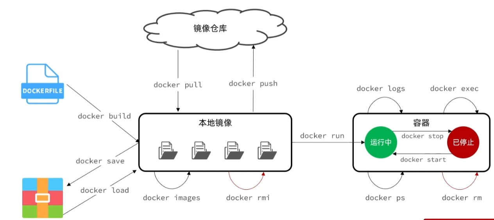

`官方安装指南（推荐）：https://docs.docker.com/engine/install/centos/`

## 卸载旧版docker

```sh
yum remove docker \
	docker-client \
	docker-client-latest \
	docker-common \
	docker-latest \
	docker-latest-logrotate \
	docker-logrotate \
	docker-engine
```

## 安装docker

### 安装yum工具

```sh
yum install -y yum-utils
```

### 配置yum源（阿里云）

```sh
# 添加 Docker 的阿里云镜像源
sudo yum-config-manager --add-repo https://mirrors.aliyun.com/docker-ce/linux/centos/docker-ce.repo
# 修改 docker-ce.repo 文件以使用阿里云的镜像
sudo sed -i 's+download.docker.com+mirrors.aliyun.com/docker-ce+' /etc/yum.repos.d/docker-ce.repo
# 更新缓存
sudo yum makecache fast
```

### 安装docker

```sh
yum install -y docker-ce docker-ce-cli containerd.io docker-buildx-plugin docker-compose-plugin
```

### 启动和校验

```sh
# 启动Docker
systemctl start docker

# 停止Docker
systemctl stop docker

# 重启
systemctl restart docker

# 设置开机自启
systemctl enable docker

# 执行docker ps命令，如果不报错，说明安装启动成功
docker ps
```

### 配置镜像源

```sh
# 创建目录
mkdir -p /etc/docker

# 复制内容，注意把其中的镜像加速地址改成你自己的
tee /etc/docker/daemon.json <<-'EOF'
{
    "registry-mirrors": [
      "https://docker.registry.cyou",
      "https://docker-cf.registry.cyou",
      "https://dockercf.jsdelivr.fyi",
      "https://docker.jsdelivr.fyi",
      "https://dockertest.jsdelivr.fyi",
      "https://mirror.aliyuncs.com",
      "https://dockerproxy.com",
      "https://mirror.baidubce.com",
      "https://docker.m.daocloud.io",
      "https://docker.nju.edu.cn",
      "https://docker.mirrors.sjtug.sjtu.edu.cn",
      "https://docker.mirrors.ustc.edu.cn",
      "https://mirror.iscas.ac.cn",
      "https://docker.rainbond.cc",
    ]
}
EOF

# 重新加载配置
systemctl daemon-reload

# 重启Docker【Job for docker.service failed because the control process exited with error code. See "systemctl status docker.service" and "journalctl -xe" for details.】
systemctl restart docker
```

## 基本命令

`官方文档：https://docs.docker.com/reference/`
`Dockerhub：https://hub.docker.com/`

```sh
docker pull		# 拉取镜像
docker push 	# 推送到镜像仓库

docker images	# 查看本地所有docker镜像
docker rmi		# 删除docker镜像

docker run		# 从本地镜像创建docker容器（没必要重复创建容器）

docker start	# 运行docker容器
docker stop		# 停止docker容器
docker ps		# 查看docker容器进程
docker rm		# 删除docker容器
docker logs		# 查看docker容器日志
docker exec		# 进入docker容器内部便于处理

docker bulid	# 通过dockerfile构建docker镜像
docker save		# 保存到本地
docker load		# 加载本地镜像
```

