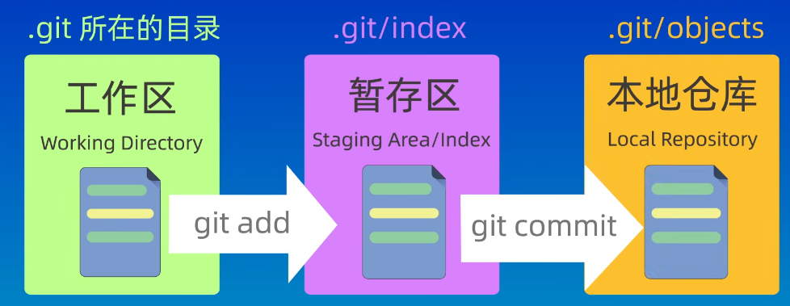
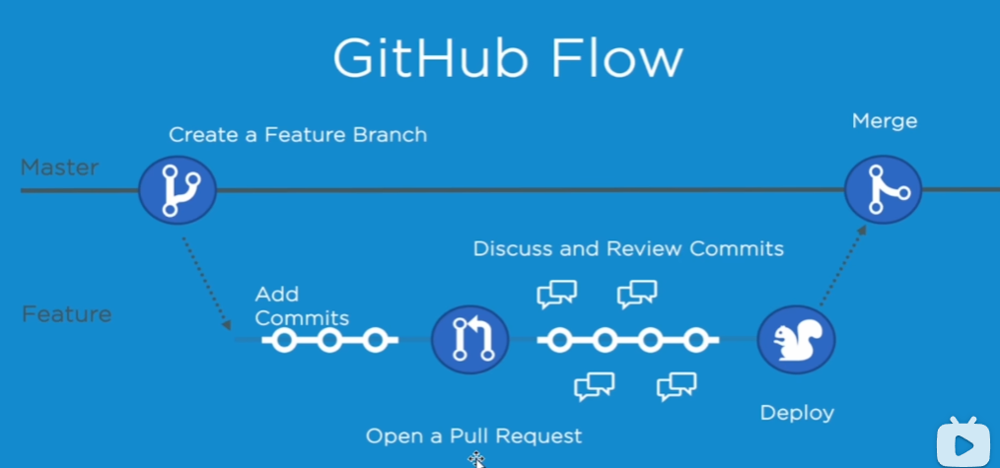

# Git

## git使用方式

- 命令行
- 图形化界面
- IDE插件/扩展

## 工作区域-文件状态

### 工作区域

- 工作区（work directory）：本地目录
- 暂存区（staging area/index）：临时目录，用于保存即将提交到git仓库的修改内容
- 本地仓库（local repository）：git仓库（隐藏文件夹）



### 文件状态

- 未跟踪（untrack）：git未跟踪
- 未修改（unmodified）：已跟踪未修改
- 已修改（modified）：已修改未添加暂存区
- 已暂存（staged）：已经添加到暂存区

**文件显示状态：**

- ??（untracked）：未跟踪
- M（modified）：已修改
- A（added）：已添加暂存
- D（deleted）：已删除
- R（renamed）：重命名
- U（updated）：已更新未合并（跟踪）

### 分支

`代码库中的不同版本，可以独立存在并有自己的提交记录。便于开发管理和主分支稳定`

```bash
git branch	# 查看所有分支
git log --graph --oneline --decorate --all	# 查看分支历史情况

git branch [分支名]	# 创建新的分支
git branch -d 分支名	# 删除指定分支（被合并后才能删除此分支）
git branch -D branch-name	# 强制删除指定分支

git chechout 分支名	# 切换到指定分支【即将用于检出文件到工作目录，或者切换分支的同时检出文件。】
git switch 分支名		# 切换到指定分支

git merge 目标分支名		# 合并：目标分支 -> 本分支
git rebase 目标分支名	# 变基：本分支 -> 目标分支
```

#### 合并分支冲突

- 待完善


## 基本命令

### 查看

```bash
git status	# 查看仓库的状态
git ls-files	# 查看暂存区内容
git log	[--oneline]		# 查看提交日志[简洁的提交记录]
git reflog	# 查看历史操作
```

### 初始化配置

- --global：全局配置，所有仓库生效
- --system：系统配置，对所有用户生效
- local（省略）：本地配置，只对本地仓库有效

```bash
git config --list	# 查看git配置信息
git config --global user.name "JZLS"	# 用户名全局配置（双引号不加也行）
git config --global user.email jizhilieshou@gmail.com	# 配置邮箱
git config --global credential.helper store	# 配置全局凭据存储方式
```

### 新建仓库

```bash
git init [仓库名]	# 创建仓库
git clone giturl	# 远程克隆仓库,giturl为仓库链接
```

### 添加暂存区、提交文件

```bash
git add	[文件]			# 更新暂存区文件

git rm [-r] [文件]				# 从工作区和暂存区同时删除（文件夹要加-r *）
git rm --cached [文件]	# 保留工作区文件，删除暂存区文件

git commit [-m "提交信息"]	# 提交暂存区文件[不指定会交互式提交文件]
```

### ssh配置

`便于利用rsa加密ssh连接并传输文件到远程仓库`

```bash
cd ~/.ssh
ssh-keygen -t rsa -b 4096	# 生成ssh密钥（-t：指定rsa协议；-b：指定大小4096）
#【输入：密钥的文件名称、密钥文件密码】
# id_rsa：私钥文件、id_rsa.pub：公钥文件
```

如果是新文件名的ssh密钥：

```bash
# 创建config文件并添加下面文字到文件[当我们访问github时指定使用ssh下的test文件名的密钥]
# github
Host github.com
HostName github.com
PreferredAuthentications publickey
IdentityFile ~/.ssh/test
```

### 关联-推送-拉取：远程仓库

```bash
git remote -v	# 查看本地仓库对应远程仓库的别名和地址

git remote add origin https://gitee.com/xvyang123/mark-down-file.git	# 关联一次就行

git branch -M main	# 指定分支名称为main【默认是main就可以省略掉】

git push -u origin main:main	# 如果本地和远程仓库分支都是main，省略掉:main即可
git push	# 推送
git pull	# 拉库
git fetch	# 拉取远程仓库，需要手动合并到本地仓库
```

- -u（--set-upstream）：设置上游（即远程仓库）的分支（使用 `-u` 选项时，默认记忆推送的本地分支和远程分支之间的关系）
- origin：远程仓库的默认名称
- main:main：指定将本地的 `main` 分支推送到远程的 `main` 分支

### 忽略文件

- .gitignore文件规则

```bash
# 忽略所有的.a文件
*.a
# 但跟踪所有的lib.a,即便你在前面忽略了，a文件
！lib.a
# 只忽略当前目录下的 TODO 文件，而不忽略subdir/T0D0
/T0D0
# 忽略任何目录下名为build的文件夹
build/
# 忽略doc/notes.txt,但不忽doc/server,/arch.txt
doc/*.txt
# 忽略doc/目录及其所有子目录下的.pdf文件
".gitignore" 17L，383
```

## 其他命令


### 回退版本

```bash
git reset --[soft][hard][mixed] 提交id/HEAD^	# ^、~都行
```

| 参数  | 解释                           |      |
| ----- | ------------------------------ | ---- |
| soft  | 保存工作区，保存暂存区【默认】 |      |
| mixed | 保存工作区，丢弃暂存区         |      |
| hard  | 丢弃工作区，丢弃暂存区         |      |

- HEAD^：表示上一个版本


### 比较差异

```bash
git diff	# 默认比较工作区和暂存区内容
git diff [HEAD]	[HEAD~2] [文件名带后缀]	# 比较版本之间的差异：一个参数（当前版本和指定版本）/两个参数（指定两个版本进行比较）/三个参数（指定两个版本之间指定文件的差异内容）
git diff --cached
```


## 分支管理-工作流模型

https://www.bilibili.com/video/BV1HM411377j?p=19

- gitflowm模型
- githuabflow模型



## 更新笔记流程

```bash
git add .	# 更新暂存区
git commit -m "更新描述"	# 提交暂存区文件
git push	# push到远程仓库
```

