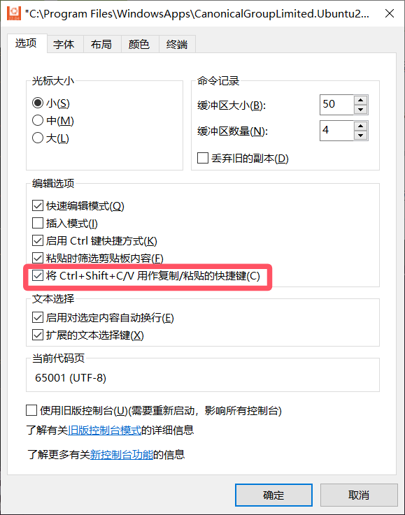

> WSL说明文档：https://learn.microsoft.com/zh-cn/windows/wsl/
>
> 最完美的系统：Windows10 + Wsl2 + Ubuntu + Vscode 
>
> **优势**
>
> 1. 使用各种Windows软件、Linux软件
> 2. 可使用Win或Linux访问和更改资源
> 3. 编程环境位于Ubuntu
> 4. 写作环境位于Windows

## Wsl更改

### wsl内核安装


```bash
wsl --install
```

### wsl2内核安装

微软WSL官网 [https://learn.microsoft.com/zh-cn/windows/wsl/install-manual#step-4---download-the-linux-kernel-update-package](https://link.zhihu.com/?target=https%3A//learn.microsoft.com/zh-cn/windows/wsl/install-manual%23step-4---download-the-linux-kernel-update-package) 

内核下载地址：[https://wslstorestorage.blob.core.windows.net/wslblob/wsl_update_x64.msi](https://link.zhihu.com/?target=https%3A//wslstorestorage.blob.core.windows.net/wslblob/wsl_update_x64.msi) 

下载后直接双击安装

### 设置wsl版本

```bash
wsl -l -v		# 正在运行的wsl版本
wsl --set-default-version 2		# 设置使用的wsl版本为wsl2
```

## Windows开启

`启动或关闭Windows功能`

- 适用于linux的windows子系统
- 虚拟机平台（wsl2基于此）

## Microsoft安装ubuntu

安装完配置一下用户

## 细节设置

